

# Il centro galattico

---

{width=50%}

---

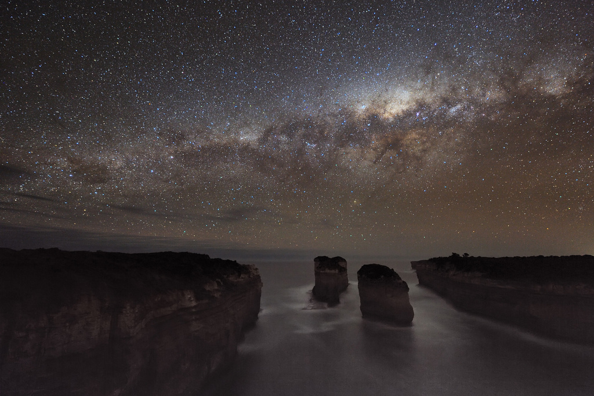

# Dwek et al., ApJ (1995)

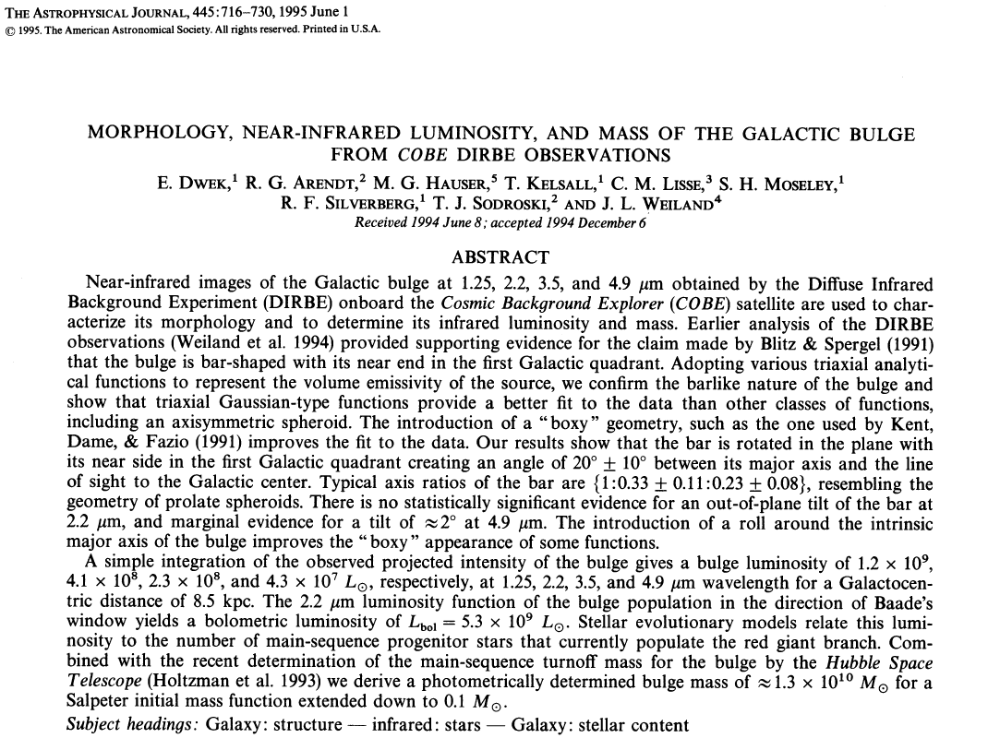{width=50%}

# Radianza spettrale (IR)

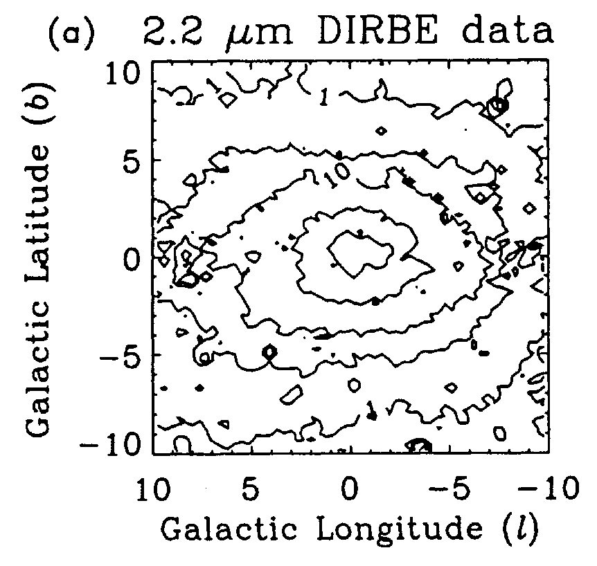{width=35%}

Misurata in MJy/sr (1 Jy = 10$^{-26}$ W/m$^2$/Hz, misura la densità di flusso).

# Emissività del *bulge*

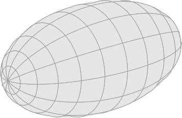

Gli autori assumono che l'emissività $\rho$ ($[\rho]
= \text{W\,m$^{-3}$}$) abbia la forma
$$
\rho(x, y, z) = \rho_0 \exp\bigl(r^2/2\bigr), \text{ con } r^2 = \frac{x^2 + y^2}{R_0^2} + \frac{z^2}{z_0^2},
$$
con gli assi $x, y, z$ liberi di ruotare nello spazio 3D.

# Intensità

-   L'intensità $I$ è l'emissività $\rho$ proiettata lungo la linea di
    vista $\mathbf{r}$ (con direzione data dalle coordinate $l, b$):

    $$
        I(l, b) = \frac1{4\pi} \int_0^\infty \rho\bigl(\mathbf{r}(s)\bigr)\,\text{d}s,\quad
        [I] = \text{W}\,\text{m}^{-2}\,\text{sr}^{-1}.
    $$

-   Risolvendo l'integrale e facendo un fit (assumendo $D =
    8.5\,\text{kpc}$):

    $$
    \begin{aligned}
        R_0 &= 0.91 \pm 0.01\,\text{kpc} \approx 1.9\times 10^{8}\,\text{AU}, \\
        z_0 &= 0.51 \pm 0.01\,\text{kpc} \approx 1.0\times 10^{8}\,\text{AU}, \\
        \rho_0 &= (5.41 \pm 0.05) \times 10^7 L_\odot\,\text{pc$^{-3}$}.
    \end{aligned}
    $$

# Profilo del modello

-   Gli autori hanno usato svariati modelli per il profilo di emissività:

    $$
    \begin{aligned}
        \rho &= \rho_0 \exp\bigl(-0.5 r^2 \bigr), \\
        \rho &= \rho_0 \exp(-r), \\
        \rho &= \rho_0 (1 + r)^{-4}, \\
        \rho &= \rho_0 r^{-1.8} \exp\bigl(-r^3 \bigr), \\
        &\ldots
    \end{aligned}
    $$

-   Due fit sono risultati i migliori: il modello Gaussiano a tre parametri ($\rho_0$, $R_0$, $z_0$) visto prima e il secondo elencato sopra.

# Esercizio sui dati di Dwek

# Scopo dell'esercizio

-   Vogliamo calcolare approssimativamente quante stelle sono presenti nel bulge galattico.

-   L'articolo di Dwek dà quest'informazione. Noi però la ricaveremo partendo dal grafico del flusso IR a 2.2 µm e stimando la luminosità tipica di una stella in questa regione.

# Densità di flusso nell'infrarosso

{width=30%}

Per stimare $L_\nu$ ($[L_\nu]=\text{W}$) usiamo $D = 8.5\,\text{kpc}$ e

$$
L_\nu = 4\pi D^2 F_\nu\,\Delta\nu.
$$

# Densità di flusso nell'infrarosso

{width=30%}

Ci serve quindi $F_\nu$ (densità di flusso,
      $[F_\nu]=\text{Jy}$), ma il grafico fornisce la radianza
      spettrale ($\text{MJy}/\text{sr}$)!

# Angoli solidi

Ricordiamo la definizione di radiante:
  

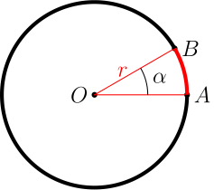

-   Il *radiante* è l'angolo $\alpha$ per cui $AB = r$,
    così che
    
    $$
    AB = \alpha r.
    $$
      
-   Una circonferenza ha un'ampiezza di $2\pi\,\text{rad}$.

# Angoli solidi

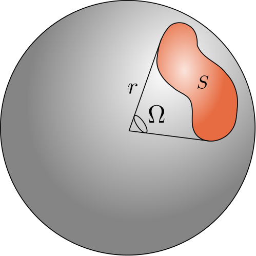{width=20%}

-   Lo steradiante è l'angolo $\Omega$ tale per cui $S = r^2$, così che
    $$
    S = \Omega r^2.
    $$

-   La sfera ha un'ampiezza di $4\pi\,\text{sterad}$.

# Angoli solidi

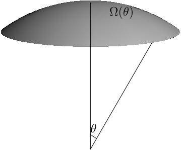{width=20%}

$$
\begin{aligned}
    \text{d}\Omega &= \sin\theta\,\text{d}\theta\,\text{d}\phi, \\
    \Omega(\theta) &= \int_0^\theta\int_0^{2\pi} \text{d}\Omega =
    2\pi(1 - \cos\theta).
\end{aligned}
$$

# Piccoli angoli

-   Se abbiamo a che fare con valori piccoli di $\theta$, la formula si riduce a

    $$
    \begin{aligned}
      \Omega(\theta) &\approx 2\pi\left(\frac12 \theta^2 +
        o(\theta^3)\right) = \\
      &= \pi \theta^2,
    \end{aligned}
    $$

    molto simile alla formula per l'area del cerchio ($\pi r^2$).

-   Possiamo quindi supporre che per una superficie ellittica con angoli
    $a$ e $b$ piccoli si abbia $\Omega(a, b) \approx \pi a b$.

# Piccoli angoli

-   In quali unità di misura vanno espressi gli angoli perché valga 
    $\Omega \approx \pi a b$?

-   Siccome la formula

    $$
    \cos\theta \overset{\theta \rightarrow 0}{=} \frac12 \theta^2 + o(\theta^3),
    $$

    vale se $\theta$ è in *radianti*, se vogliamo usare i gradi occorre usare

    $$
    \Omega \approx \frac{\pi^3}{180^2} a b.
    $$

# Densità di flusso nell'infrarosso

{width=25%}

-   Per stimare $L_\nu$ ($[L_\nu]=\text{W}$) usiamo $L_\nu = 4\pi D^2 F_\nu\,\Delta\nu$.

-   Ci serve quindi $F_\nu$ (densità di flusso, $[F_\nu]=\text{Jy}$), ma il grafico fornisce la radianza spettrale ($\text{MJy}/\text{sr}$)!

# {data-transition="none"}

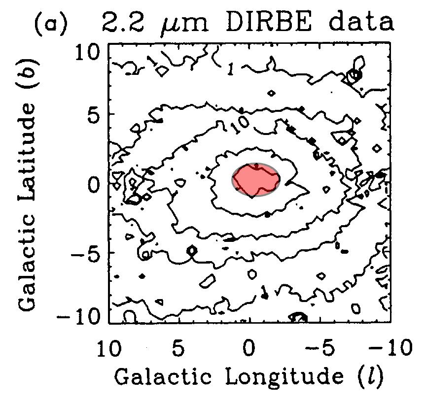{width=40%}

Ellisse di 3°×2°: 100 MJy/sr.

# {data-transition="none"}

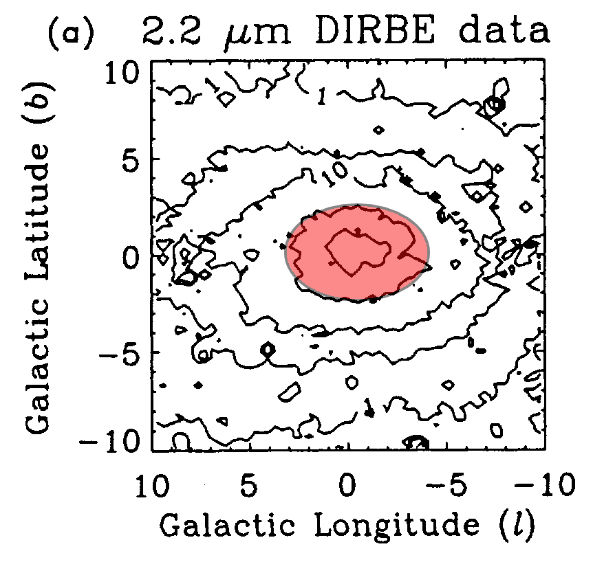{width=40%}

Ellisse di 5°×4°: 50 MJy/sr.

# {data-transition="none"}

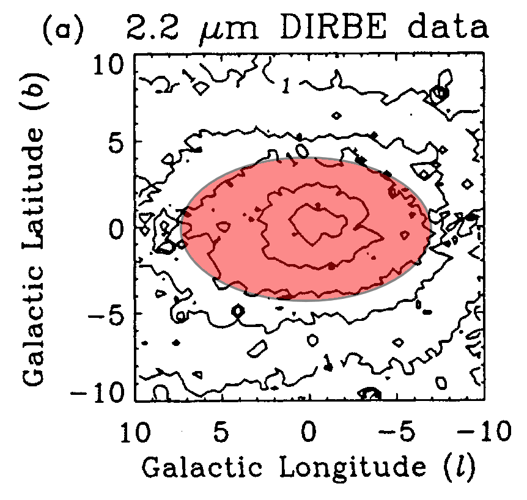{width=40%}

Ellisse di 13°×8°: 10 MJy/sr.

# {data-transition="none"}

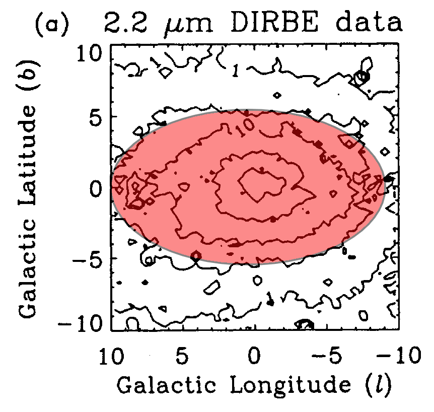{width=40%}

Ellisse di 17°×12°: 5 MJy/sr.

# {data-transition="none"}

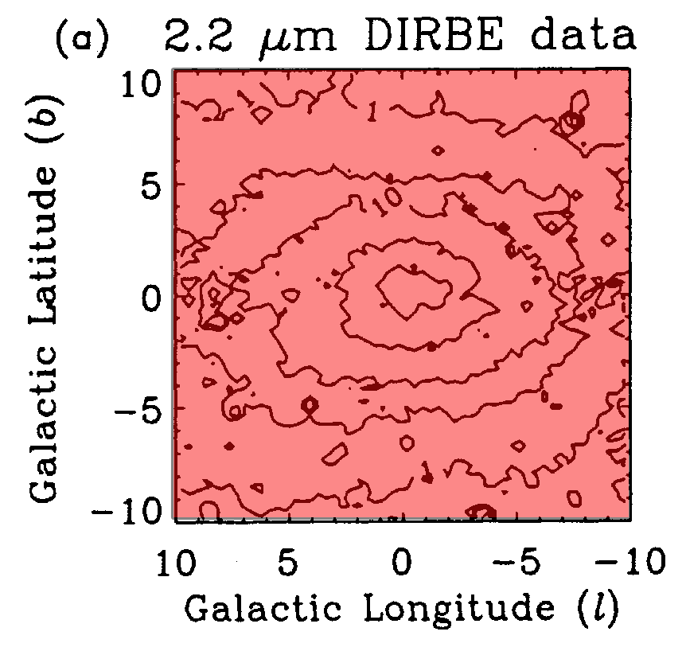{width=40%}

Rettangolo di 20°×20°: 1 MJy/sr.

# Densità di flusso

Abbiamo quindi identificato queste regioni:

| Superficie | Forma      | $2a$ | $2b$ | Flusso IR                  |
|------------|------------|------|------|----------------------------|
| $S_1$      | Ellisse    | 3°   | 2°   | $I_1 = 100\,\text{MJy/sr}$ |
| $S_2$      | Ellisse    | 5°   | 4°   | $I_2 = 50\,\text{MJy/sr}$  |
| $S_3$      | Ellisse    | 1°   | 8°   | $I_3 = 10\,\text{MJy/sr}$  |
| $S_4$      | Ellisse    | 1°   | 12°  | $I_4 = 5\,\text{MJy/sr}$   |
| $S_5$      | Rettangolo | 2°   | 20°  | $I_5 = 1\,\text{MJy/sr}$   |

# Densità di flusso totale

Nell'approssimazione che gli angoli siano piccoli ($20^\circ$ è
piccolo?!?), il flusso totale IR è
$$
\begin{aligned}
  F_\text{IR} \approx \frac{\pi^2}{180^2} \biggl(&\pi a_1 b_1 I_1 + \\
    &\bigl(\pi a_2 b_2 - \pi a_1 b_1\bigr) I_2 + \\
    &\bigl(\pi a_3 b_3 - \pi a_2 b_2\bigr) I_3 + \\
    &\bigl(\pi a_4 b_4 - \pi a_3 b_3\bigr) I_4 + \\
    &\bigl(a_5 b_5 - \pi a_4 b_4\bigr) I_5\biggr).
\end{aligned}
$$

# Densità di flusso totale

-   Sostituendo:
    
    $$
    F_\nu \approx 0.64\,\text{MJy} = 6.4 \times
    10^{-21}\,\text{W\,m$^{-2}$\,Hz$^{-1}$}.
    $$
    
    Ma questo valore è un po' più basso di quello riportato nell'articolo:
    
    $$
    F_\nu = 7.3\times 10^{-21}\,\text{W\,m$^{-2}$\,Hz$^{-1}$}.
    $$
    
-   Secondo voi, avremmo potuto aspettarci che il valore esatto fosse *maggiore* della nostra stima?

# Dal flusso alla luminosità

-   A 2.2\,$\mu$m la banda di DIRBE è

    $$
    \Delta\nu = 2.28\times 10^{13}\,\text{Hz}.
    $$

-   Quindi il flusso nella banda è

    $$
    F_\text{IR} = F_\nu\,\Delta\nu = 1.5\times 10^{-7}\,\text{W\,m$^{-2}$}.
    $$

-   Ma questo è il flusso nella banda di DIRBE, mentre per il nostro scopo serve il flusso su *tutto lo spettro*. Ci occorre quindi una correzione bolometrica, data dagli autori: $C = 14.5$.

# Luminosità

-   Dal flusso totale $F = F_\nu\,\Delta\nu$ e dalla correzione bolometrica $C$ ricaviamo che
    $$
    L = \bigl(4\pi D^2\bigr)\,\bigl(F_\nu\Delta\nu\bigr)\,C \approx 5.4\times 10^9\,L_\odot.
    $$

-   Se una stella tipica del bulge ha una luminosità $L \sim 400\,L_\odot$, allora il numero $N$ di stelle nel bulge Galattico è circa $$ N \approx 10^7. $$
