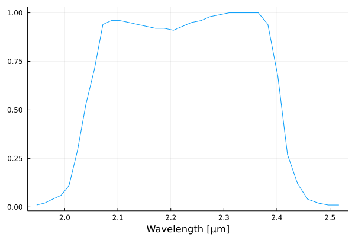

<iframe src="https://player.vimeo.com/video/632187442?h=3e91fe6ed4&amp;badge=0&amp;autopause=0&amp;player_id=0&amp;app_id=58479" width="1280" height="720" frameborder="0" allow="autoplay; fullscreen; picture-in-picture" allowfullscreen title="julia-recording-01 - Installation and blackbody.mkv"></iframe>

---

<center>{width=80%}</center>

# Calcolo approssimato

Definiamo una funzione \texttt{C} che calcoli la correzione bolometrica $C$ con la formula

$$
C \approx \frac{\sum_{i=0}^\infty B_{bb}(i \times \delta\nu, T)}{\sum_{i=i_1}^{i_2} B_{bb}(i \times \delta\nu, T)},
$$

```julia
function C(ν0, bwidth, T, δν)
    fullnu = 0.5e13:δν:1e15  # [0, ∞)
    partialnu = (ν0 - bwidth/2):δν:(ν0 + bwidth/2)
    sum(b.(fullnu, T)) / sum(b.(partialnu, T))
end
```

# Calcolo approssimato

Dobbiamo decidere il valore del passo $\delta\nu$; proviamo con una serie di valori via via più piccoli, e vediamo quando converge:

```julia
ν0, bwidth, T = c / 2.2e-6, 2.28e13, 3800
for δν in [1e13, 1e12, 1e11, 1e10, 1e9, 1e8]
    @printf("δν = %.0e Hz, T = %.1f K, C = %.2f\n",
            δν, T, C(ν0, bwidth, T, δν))
end
```

(Vedi il video).

---

<iframe src="https://player.vimeo.com/video/632189138?h=844ad3079a&amp;badge=0&amp;autopause=0&amp;player_id=0&amp;app_id=58479" width="1280" height="720" frameborder="0" allow="autoplay; fullscreen; picture-in-picture" allowfullscreen title="julia-recording-02 - Simple bolometric constant.mkv"></iframe>

# Risultati del calcolo

```
δν = 1e+13 Hz, T = 3800.0 K, C = 15.58
δν = 1e+12 Hz, T = 3800.0 K, C = 20.16
δν = 1e+11 Hz, T = 3800.0 K, C = 20.19
δν = 1e+10 Hz, T = 3800.0 K, C = 20.27
δν = 1e+09 Hz, T = 3800.0 K, C = 20.28
δν = 1e+08 Hz, T = 3800.0 K, C = 20.28
```

Converge senza dubbio, ma è abbastanza diverso dal valore $C = 14.5$ riportato nell'articolo!


# Migliorare la stima di $C$

Ci sono due spiegazioni possibili per la discrepanza nel valore di $C$ che abbiamo osservato:
  
#. La banda di DIRBE non è perfettamente rettangolare.

#. L'emissione delle stelle non segue esattamente una legge di
    corpo nero.

# Banda di DIRBE

Occorre avere la risposta in banda del canale a 2.2 µm di DIRBE, che si può scaricare qui:
  [lambda.gsfc.nasa.gov/product/cobe/c_spectral_res.cfm](https://lambda.gsfc.nasa.gov/product/cobe/c_spectral_res.cfm).


# Contenuto del file

```
$ head -n 20 DIRBE_SYSTEM_SPECTRAL_RESPONSE_TABLE.ASC
============================================================================
DIRBE SYSTEM SPECTRAL RESPONSE
Version:  Pass 3B data release, November 1996
          Only differs from the Pass 2B (1994) release in that wavelengths
          are now provided to three, rather than two, places after the
          decimal point.

This file tabulates normalized System Spectral Responses for the 10 DIRBE
photometric bands.
============================================================================


Wavelength                          DIRBE Band
  (um)    1      2      3      4      5      6      7      8      9      10
-----------------------------------------------------------------------------
  0.997   0.00   0.00   0.00   0.00   0.00   0.00   0.00   0.00   0.00   0.00
  1.005   0.00   0.00   0.00   0.00   0.00   0.00   0.00   0.00   0.00   0.00
  1.013   0.00   0.00   0.00   0.00   0.00   0.00   0.00   0.00   0.00   0.00
  1.020   0.00   0.00   0.00   0.00   0.00   0.00   0.00   0.00   0.00   0.00
  1.028   0.00   0.00   0.00   0.00   0.00   0.00   0.00   0.00   0.00   0.00
```

A noi interessa la banda n. 2, ossia la terza colonna.


# Banda di DIRBE

Facciamo un grafico della banda (ancora espressa in termini di $\lambda$!), per renderci conto di come è fatto il dato:

```julia
dirbe_bands = readdlm(
    "DIRBE_SYSTEM_SPECTRAL_RESPONSE_TABLE.ASC",
    skipstart=15,
)

# Convert from μm to m
dirbe_λ = dirbe_bands[:, 1] * 1e-6
dirbe_band = dirbe_bands[:, 3]

plot(dirbe_λ, dirbe_band,
     xlabel = "Wavelength [m]")
```

(Vedi il video).

---

<iframe src="https://player.vimeo.com/video/632190633?h=4b16990d2c&amp;badge=0&amp;autopause=0&amp;player_id=0&amp;app_id=58479" width="1280" height="720" frameborder="0" allow="autoplay; fullscreen; picture-in-picture" allowfullscreen title="julia-recording-03 - DIRBE band.mkv"></iframe>

---

<center>{width=80%}</center>


# Banda di DIRBE

Meglio aggiustare la scala; mascheriamo tutti i valori della banda uguali a zero.

```julia
# Maschera di booleani: vera solo se
# la banda è maggiore di zero
mask = dirbe_band .> 0

plot(dirbe_λ[mask] * 1e6, dirbe_band[mask],
    xlabel = "Wavelength [$\mu$m]")
```

(Vedi il video).

---

<iframe src="https://player.vimeo.com/video/632213391?h=1dde8edbfe&amp;badge=0&amp;autopause=0&amp;player_id=0&amp;app_id=58479" width="1280" height="720" frameborder="0" allow="autoplay; fullscreen; picture-in-picture" allowfullscreen title="julia-recording-04 - DIRBE band zoomed.mkv"></iframe>

---

<center>{width=80%}</center>


# Centro della banda

Calcoliamo il centro della banda di DIRBE, tramite la formula

$$
\lambda_0 = \frac{\int_0^\infty \lambda\times P_\lambda(\lambda)\,\text{d}\lambda}{\int_0^\infty P_\lambda(\lambda)\,\text{d}\lambda} \approx
\frac{\sum_{i=1}^N \lambda_i \times P_\lambda(\lambda_i)}{\sum_{i=1}^N P_\lambda(\lambda_i)},
$$

che corrisponde a una media pesata.


```julia
@printf(
  "Band center: %.2f μm\n",
  1e6 * sum(dirbe_λ .* dirbe_band) / sum(dirbe_band),
)
```

Il risultato è 2.22 µm, che è quanto ci aspettavamo.


# Spettro stellare

Dobbiamo anche avere un'idea più precisa dello spettro di emissione del centro galattico.

Il centro galattico appare rosso, e il fatto che sia povero di gas indica un'età avanzata. Questi indizi suggeriscono che le stelle siano giganti rosse; una gigante rossa M0 ha $T \approx 3800\,\text{K}$ e $L \approx 400 L_\odot$.

Per conoscere qual è lo spettro di una gigante rossa M0, dobbiamo fare affidamento a un catalogo di spettri stellari.

# Catalogo di spettri stellari

<center>{width=75%}</center>


# Spettro stellare

Gli spettri di Pickles sono disponibili al sito
[www.eso.org/sci/facilities/paranal/decommissioned/isaac/tools/lib.html](https://www.eso.org/sci/facilities/paranal/decommissioned/isaac/tools/lib.html).

Noi scegliamo uno spettro «M iii», il file è `ukm0iii.dat.gz`, che è compresso usando il programma `gzip`.


# Contenuto del file

Si può ispezionare il contenuto del file decomprimendolo con `gunzip` e visualizzando le prime righe con `head`:

```
$ cat ukm0iii.dat.gz | gunzip | head
#iRMS=0.01722689532 0
#    lk ukf_m0iii uks_m0iii        fh        fk         fm
#
 1150.0  0.000000  0.000000  0.000000  0.000000  0.000000
 1155.0  0.000000  0.000000  0.000000  0.000000  0.000000
 1160.0  0.000000  0.000000  0.000000  0.000000  0.000000
 1165.0  0.000000  0.000000  0.000000  0.000000  0.000000
 1170.0  0.000000  0.000000  0.000000  0.000000  0.000000
 1175.0  0.000000  0.000000  0.000000  0.000000  0.000000
 1180.0  0.000000  0.000000  0.000000  0.000000  0.000000
```

Lo spettro è espresso in funzione di $\lambda$, non di $\nu$!


# Lettura dello spettro stellare

Le lunghezze d'onda sono espresse in Å, così dobbiamo convertirle in metri. La densità di flusso è nella seconda colonna, ed è espressa in Jansky ($1\,\text{Jy} = 10^{-26}\,\text{W}/\text{m}^2/\text{Hz}$).

```julia
using DelimitedFiles
using GZip
spectrum = GZip.open("ukm0iii.dat.gz") do io
    readdlm(io, skipstart=3)
end
m0_λ_pts = spectrum[:, 1] * 1e-10
m0_flux_pts = spectrum[:, 2]

plot(m0_λ_pts, m0_flux_pts,
    xlabel = "Wavelength [Å]",
    ylabel = "Flux density [Jy]")
```

---

<center>{width=80%}</center>


# Confronto tra spettro e banda

Anche se le unità di misura sono diverse, è interessante fare un grafico dello spettro stellare e della banda insieme.

```julia
plot(m0_λ_pts * 1e6, m0_flux_pts,
    label = "M0 flux",
    xlim = (0, 3),
    xlabel = "Wavelength [μm]",
    ylabel = "Flux density [Jy]",
)
plot!(dirbe_λ * 1e6, dirbe_band,
    label = "DIRBE band")
```

La frequenza a 2.2 µm non è centratissima: DIRBE ha la [frequenza a 1.25 µm](tomasi-astro1-lezione-01a.html#/dwek-et-al.-apj-1995) che sarebbe più adatta…

---

<center>{width=80%}</center>


# Calcolo di $C$

In teoria saremmo pronti per calcolare la correzione bolometrica $C$:

$$
C = \frac{\int_0^\infty B(\nu)\,\text{d}\nu}{\int_0^\infty B(\nu)\,\text{d}\nu \times P_\nu(\nu)}
= \frac{\int_0^\infty F(\lambda)\,\text{d}\lambda}{\int_0^\infty F(\lambda)\,\text{d}\lambda \times P_\lambda(\lambda)},
$$

dove siamo passati da $B$ (densità spettrale) a $F$ (densità di flusso), e da $\nu$ a $\lambda$. Ovviamente dobbiamo però convertire gli integrali in somme:

$$
C \approx = \frac{\sum_i F(\lambda_i)\,\text{d}\lambda}{\sum_i F(\lambda_i)\,\text{d}\lambda \times P_\lambda(\lambda_i)}
$$


# Campionamento (1/4)

Non possiamo però applicare subito la formula per $C$.

C'è infatti un problema nel campionamento delle curve, evidente se si fa un ingrandimento del grafico precedente:

```julia
scatter(m0_λ_pts * 1e6, m0_flux_pts,
        xlim = (2.0, 2.2),
        label="M0 flux",
        xlabel="Wavelength [µm]",
        ylabel = "Flux density [Jy]",ù
        markersize=1)
scatter!(dirbe_λ * 1e6, dirbe_band,
         label="DIRBE band")
```

---

<center>{width=80%}</center>


# Campionamento (2/4)

Nella formula per $C$, dobbiamo valutare il prodotto $F(\lambda_i)\,\text{d}\lambda \times P_\lambda(\lambda_i)$ per gli stessi valori di $\lambda_i$:

$$
C \approx = \frac{\sum_i F(\lambda_i)\,\text{d}\lambda}{\sum_i F(\lambda_i)\,\text{d}\lambda \times P_\lambda(\lambda_i)}
$$

Ma qui ci sono dei valori di $\lambda_i$ per cui $P(\lambda_i)$ è ignoto!


# Campionamento (3/4)

Dobbiamo ricampionare la curva meno fitta ($P$) in modo che passi attraverso le stesse ascisse di $F$. Usiamo una libreria di Julia, [`Interpolations`](https://github.com/JuliaMath/Interpolations.jl), per implementare un'interpolazione lineare:

```julia
using Interpolations

# dirbe_band_interp: funzione con argomento λ
dirbe_band_interp = LinearInterpolation(
    dirbe_λ,
    dirbe_band,
    extrapolation_bc=Flat(),
)
```

(Vedi video).

---

<iframe src="https://player.vimeo.com/video/632196520?h=dcd2aaa910&amp;badge=0&amp;autopause=0&amp;player_id=0&amp;app_id=58479" width="1280" height="720" frameborder="0" allow="autoplay; fullscreen; picture-in-picture" allowfullscreen title="julia-recording-09 - Interpolation.mkv"></iframe>

# Campionamento (4/4)

Verifichiamo ora il funzionamento dell'interpolazione:

```julia
scatter(m0_λ_pts * 1e6, m0_flux_pts,
        label="M0 flux",
        xlim = (2.02, 2.07),
        xlabel = "Wavelength [µm]",
        ylabel = "Flux density [Jy]",
        markersize = 2,
)
scatter!(dirbe_λ * 1e6, dirbe_band,
         label="DIRBE band", markersize=8);
scatter!(m0_λ_pts * 1e6, dirbe_band_interp.(m0_λ_pts),
         label="DIRBE band (interpolated)",
         markersize=2)
```

(Vedi il video).

---

<iframe src="https://player.vimeo.com/video/632196520?h=dcd2aaa910&amp;badge=0&amp;autopause=0&amp;player_id=0&amp;app_id=58479" width="1280" height="720" frameborder="0" allow="autoplay; fullscreen; picture-in-picture" allowfullscreen title="julia-recording-09 - Interpolation.mkv"></iframe>

---

<center>{width=80%}</center>


# Calcolo di $C$

Per calcolare $C$, applichiamo la formula

$$
C \approx = \frac{\sum_i F(\lambda_i)\,\text{d}\lambda}{\sum_i F(\lambda_i)\,\text{d}\lambda \times P_\lambda(\lambda_i)}.
$$

```julia
C(flux, band) = sum(flux) / sum(flux .* band)
@printf(
    "Bolometric correction: %.2f\n",
    C(m0_flux_pts, dirbe_band_interp.(m0_λ_pts)),
)
```

Il risultato è

```
Bolometric correction: 14.55
```

in perfetto accordo con quanto usato da Dwek et al. (1995).

# Dipendenza dalle assunzioni

La prima stima che avevamo fornito per $C$ era basata sulla formula

$$
C \approx \frac{\int_0^\infty B_{bb}(\nu, T)\,\text{d}\nu}{\int_{\nu_0
    - \Delta\nu/2}^{\nu_0 + \Delta\nu/2} B_{bb}(\nu, T)\,\text{d}\nu} \approx 20.28,
$$

che usava un'approssimazione sia per la banda di DIRBE che per lo spettro stellare.

Qual è l'importanza relativa delle due assunzioni nel determinare la soluzione finale?


# Spettro realistico, banda ideale

Rifacciamo il calcolo usando la banda ideale ma lo spettro realistico:

```julia
tophat_band = zeros(length(m0_λ_pts))  # Vector of zeros

let (λ1, λ2) = (λ(ν0 + Δν/2), λ(ν0 - Δν/2))
    # In Julia you can write "a < x < b" instead of "(a < x) && (x < b)"
    tophat_band[λ1 .< m0_λ_pts .< λ2] .= 1 # Set to 1 the points within the interval
end

plot(m0_λ_pts * 1e6, tophat_band,
     label = "Top-hat band",
     xlabel = "Wavelength [µm]",
     legend = :topleft)
plot!(dirbe_λ[mask] * 1e6, dirbe_band[mask],
      label = "True DIRBE band")
```


---

<center>{width=80%}</center>


# Spettro realistico, banda ideale

Calcoliamo ora $C$ in questo caso:

```julia
@printf("C = %.2f\n", C(m0_flux_pts, tophat_band))
```

Il risultato è:

```
C = 13.99
```

che mostra che l'approssimazione della banda ideale conta molto poco!


# Spettro ideale, banda realistica

Consideriamo ora la seconda ipotesi: usiamo uno spettro di corpo nero e la banda effettiva di DIRBE.

Ci occorre la formula del corpo nero in funzione di $\lambda$:

$$
B(\lambda, T) = \frac{2hc^2}{\lambda^5} \frac1{e^{hc / \lambda kT} - 1}.
$$

che in Julia si implementa così:

```julia
bλ(λ, T) = (2h * c^2 / λ^5) / (exp(h*c / (λ*k*T)) - 1))
```


# Spettro ideale, banda realistica

Facciamo ora il calcolo:

```julia
@printf(
    "C = %.2f\n",
    C(bλ.(m0_λ_pts, T), dirbe_band_interp.(m0_λ_pts)),
)
```

Il risultato è:

```
C = 18.90
```

Quindi l'approssimazione dello spettro di corpo nero è decisamente grossolana per una stella di questo tipo!


# Avvisi

# Questionari per la didattica

Preoccupatevi di compilare con cura i questionari! Sono esaminati una volta all'anno dalla Commissione Paritetica Docenti-Studenti, e i risultati sono presi molto sul serio.

Dovrete dare una valutazione per il corso e per queste esercitazioni. Se potete, date un vostro giudizio (nei commenti liberi) sull'utilità di queste lezioni di approfondimento rispetto alle lezioni nel loro complesso, e mettetelo nei commenti generali del corso.
