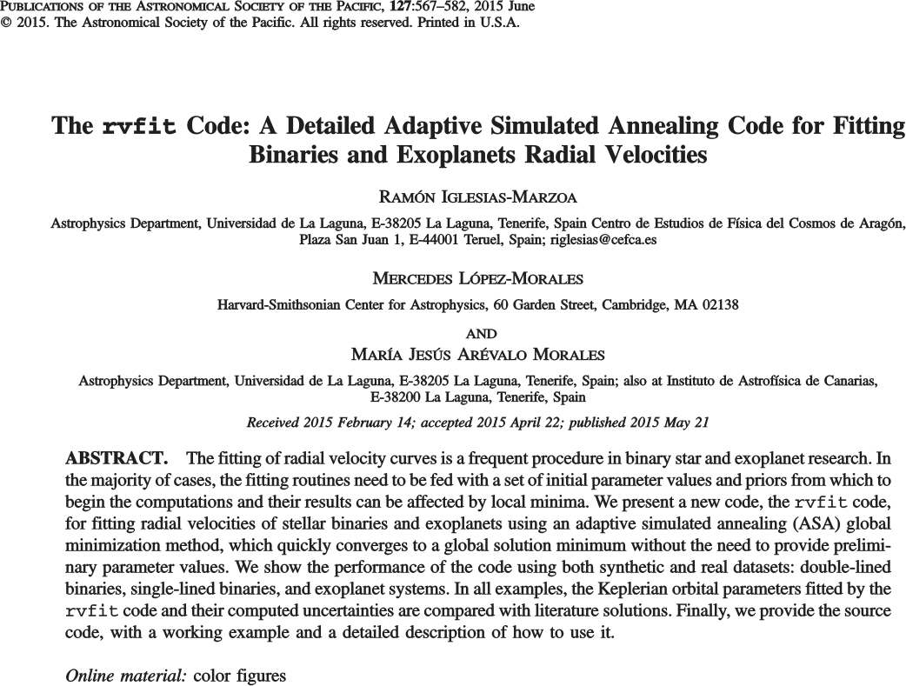

Il codice di Wilson & Devinney era stato scritto per [IBM System/360 Model 91](https://en.wikipedia.org/wiki/IBM_System/360_Model_91):

<center>{width=60%}</center>

<p style="text-align:right">Fonte: [Wikipedia](https://en.wikipedia.org/wiki/IBM_System/360_Model_91#/media/File:360-91-panel.jpg)</p>


# Il sistema CV Velorum

# Il sistema binario CV Velorum

-   È un sistema binario spettroscopico per il quale sono visibili anche eclissi. (Costellazione della Vela, nel cielo australe).

-   È un sistema molto interessante, studiato in più lavori. Quelli a cui facciamo riferimento noi sono:

    -   Andersen (A\&A 44, 1975, pagg.\ 355-362);
    -   Clausen \& Gr\o{}nbeck (A\&A 58, 1977, pagg.\ 131--137);
    -   Yakut et al.\ (A\&A 467, 2007, pagg.\ 647--655).


# Periodo dell'orbita

Il periodo è stato determinato da Andersen (1975) e Clausen \& Gr\o{}nbeck (1977). Noi facciamo riferimento a quest'ultimo.

<center>{width=60%}</center>


# Filtri e stelle calibratrici

<center>{width=50%}</center>

---

<center>{width=50%}</center>

# Tabella delle magnitudini

<center>{width=60%}</center>


---

<center>{width=40%}</center>

---

Cosa si può dedurre sul sistema binario CV Velorum dal grafico precedente a proposito delle due stelle che lo compongono e della loro orientazione nello spazio?


# Caratteristiche di CV Vel

-   Le due stelle hanno luminosità e raggio simile…
-   …quindi probabilmente il centro delle orbite coincide col centro di massa…
-   …quindi le due stelle hanno velocità orbitali uguali in modulo.
-   Clausen \& Grønbeck stimano il periodo col numero
    $$
    P = 6.889\ 494\,\text{d}.
    $$


# Spettroscopia di CV Velorum

Nel 2007 Yakut et al.\ hanno pubblicato un lavoro in cui si fa un'analisi spettroscopica di CV Velorum.

---

<center>{width=80%}</center>

---

<table>
    <tr>
        <td style="vertical-align:middle">{width=14000px}</td>
        <td style="vertical-align:middle">Determiniamo la velocità radiale massima $v_r$ dalla riga di SiIII e di HeI, assumendo che i grafici mostrino i due estremi delle oscillazioni Doppler delle righe.</td>
    </tr>
</table>


# Effetto Doppler

-   Quando la velocità radiale è massima ($\pm v_r$), le lunghezze d'onda sono:
    $$
    \begin{aligned}
      \lambda_1 &=& \frac{c + v_0 + v_r}c \lambda_0, \\
      \lambda_2 &=& \frac{c + v_0 - v_r}c \lambda_0,
    \end{aligned}
    $$
    
-   Da ciò segue che
    $$
    v_0 = \left(\frac{\left<\lambda_{1/2}\right>}{\lambda_0} - 1\right) c, \quad v_r = c \frac{\Delta \lambda}{2 \lambda_0}.
    $$


# Velocità radiale (SiIII)

$$
\begin{aligned}
v_0 &=& \left(\frac{4553.0\,\mathring{\mathrm{A}}}{4552.6\,\mathring{\mathrm{A}}}\right) c \approx 26.3\,\text{km\,s$^{-1}$},\\
v_r &=& c \frac{4555.0\,\mathring{\mathrm{A}} - 4551.0\,\mathring{\mathrm{A}}}{2 \times 4552.6\,\mathring{\mathrm{A}}} \approx
132\,\text{km\,s$^{-1}$}.
\end{aligned}
$$

# Velocità radiale (HeI)

$$
\begin{aligned}
v_0 &=& \left(\frac{6678.75\,\mathring{\mathrm{A}}}{6678.1\,\mathring{\mathrm{A}}}\right) c \approx 29.2\,\text{km\,s$^{-1}$},\\
v_r &=& c \frac{6681.5\,\mathring{\mathrm{A}} - 6676.0\,\mathring{\mathrm{A}}}{2 \times 6678.1\,\mathring{\mathrm{A}}} \approx
123\,\text{km\,s$^{-1}$}.
\end{aligned}
$$


# Velocità radiale

-  Il valor medio delle nostre stime di $v_r$ è
   $$
   \left<v_r\right> = 128\,\text{km\,s$^{-1}$}.
   $$

-  Yakut et al.\ citano $v_1 = 126\,\text{km\,s$^{-1}$}$ e $v_2 = 128\,\text{km\,s$^{-1}$}$.


# Velocità stimate da Yakut et al.

<center>{width=40%}</center>

(Perché i dati formano dei cluster?)


# Determinazione delle masse

-   Se $v_1 = v_2 = v_r$ e $i = 90^\circ$, allora
    $$
    M_1 + M_2 = \frac{P}{2\pi G} \bigl(2 v_r \bigr)^3
    $$

-   La massa totale è
    $$
    M_1 + M_2 = \frac{6.89\,\text{d}\,(2 \cdot
    128\,\text{km/s})^3}{2\pi\cdot6.67\times10^{-11}\text{N m$^2$/kg$^2$}} = 11.2\,M_\odot.
    $$

-   Se le due stelle sono simili, assumiamo che $M_1 \approx M_2 \approx 5.6\,M_\odot$.


# Parametri orbitali (Yakut et al.)

<center>{width=70%}</center>

(Notare le discrepanze in $V_0$, non ancora spiegate).


---

<table>
    <tr>
        <td>{width=80%}</td>
        <td style="vertical-align:middle">Quale stella ruota più velocemente?</td>
    </tr>
</table>


# Classe spettrale

<table>
    <tr>
        <td></td>
        <td style="vertical-align:middle">Sono stelle di tipo B ($T \approx 18\,000\,\text{K}$).</td>
    </tr>
</table>


# Il database [SIMBAD](http://simbad.u-strasbg.fr/simbad/)

<center>{width=50%}</center>


# Il database [SIMBAD](http://simbad.u-strasbg.fr/simbad/)

<center>{width=50%}</center>


# Il database [SIMBAD](http://simbad.u-strasbg.fr/simbad/)

<center>{width=50%}</center>


# Il database [SIMBAD](http://simbad.u-strasbg.fr/simbad/)

<center>{width=50%}</center>


# Yakut et al. (2014)

<center>{width=50%}</center>


# Come vanno di solito le cose


# Williams et al.\ (ApJ, 2013)

<center>{width=70%}</center>


# HDE 229232

<center>{width=85%}</center>


# HDE 308813

<center>{width=85%}</center>


# The [Astrophysics Source Code Library](http://ascl.net/)

<center>{width=45%}</center>


# The Astrophysics Source Code Library

<center>{width=45%}</center>


# `rvfit`

<center>{width=50%}</center>


# `rvfit`

Il programma `rvfit` sembra fare esattamente al caso nostro:

-   Accetta in input le velocità radiali;

-   Produce come output i parametri orbitali del sistema;

-   Non richiede di specificare le velocità radiali di entrambe le stelle.


# Il modello di `rvfit`

<center></center>


# Il codice sorgente di `rvfit`

-   Il programma è scritto usando IDL, che è un linguaggio di analisi dati un tempo molto usato in astronomia.

-   IDL è un programma a pagamento; sui computer del centro di calcolo era disponibile fino all'anno scorso, ma noi useremo un clone open-source, GNU Data Language.


# GNU Data Language ([GDL](https://github.com/gnudatalanguage/gdl))

<center>{width=50%}</center>


# `rvfit`

Il sito da cui scaricare il codice di [`rvfit`](http://www.cefca.es/people/~riglesias/rvfit.html) dice che occorre installare nella stessa directory altri pacchetti:

1.  [The IDL Astronomy User's Library](http://idlastro.gsfc.nasa.gov/);

2.  [The Coyote IDL Library](http://idlcoyote.com/).

3.  Il file [`pxperfect.pro`](http://www.physics.wisc.edu/~craigm/idl/down/pxperfect.pro).


# Usare GDL sotto Ubuntu Linux
  
-   Sotto Linux Ubuntu 18.04 si può installare tutto con

    ```
    sudo apt install gnudatalanguage plplot12-driver-xwin gdl-coyote astro-gdl
    ```
    
    (Per Ubuntu 20.04 e successivi le cose si fanno più complicate, perché `gdl-coyote` non è più fornito).

-   Dovete eseguire anche questo comando per rendere visibili le librerie necessarie a GDL:
  
    ```
    export BASE=/usr/share/gnudatalanguage
    export GDL_PATH=$BASE/astrolib:$BASE/coyote:$BASE/lib
    ```
  

# Usare `rvfit`

-   Nell'archivio di `rvfit` è disponibile un file PDF che ne spiega l'utilizzo.

-   Occorre preparare due file di dati:

    1.  Un file di testo che contiene il tempo di osservazione, la velocità radiale e l'errore sulla velocità dell'oggetto osservato;

    2.   Un file di configurazione, che specifica come vada condotta l'analisi.


# Usare `rvfit`

Williams non ha messo a disposizione i dati in formato elettronico. Dobbiamo quindi trascrivere a mano la tabella 1 dell'articolo:

<center>{width=20%}</center>

---

File `HDE308813.dat`:
            
```
2714.805 -0.6 1.7
2715.708 20.6 1.7
2715.840 31.2 1.8
2716.707 27.3 1.7
2716.866 20.7 1.9
2717.697 32.8 1.9
2717.801 16.3 1.8
2718.699 4.5 1.8
3017.743 -13.6 2.0
3018.753 -1.6 1.8
3019.735 16.2 2.0
3019.836 26.0 1.9
3020.718 23.6 1.9
3021.713 28.1 1.9
3021.816 29.6 1.9
3022.721 -3.7 1.9
3022.865 -4.7 1.9
3023.702 -18.5 2.0
3023.806 -11.2 1.9
3027.727 24.9 2.0
3028.704 16.4 2.0
3028.787 19.6 2.0
3029.744 -3.8 2.0
3030.694 -11.2 1.9
3030.776 -7.9 2.0
3031.712 -1.4 1.9
3032.636 10.0 1.9
3032.782 24.5 2.0
3033.713 34.9 1.9
3159.469 15.0 1.8
3160.463 26.8 1.8
3162.531 -1.9 1.8
3163.532 -20.8 1.9
```
            
(Omettiamo la costante 2.450.000 nei tempi).


# Usare `rvfit`

I sette parametri che `rvfit` è in grado di stimare sono i seguenti:

#.  Periodo orbitale $P$, in giorni;
#.  Tempo $T_P$ del periastro (massimo avvicinamento tra le due stelle), in tempo Giuliano eliocentrico (HJD);
#.  Eccentricità orbitale $e$ (0: orbite circolari);
#.  Inclinazione del periastro $\omega$, in gradi;
#.  Velocità del centro di massa $\gamma$, in km/s;
#.  Ampiezza della velocità radiale $K_1$;
#.  Ampiezza della velocità radiale $K_2$ (non usato nel nostro caso)


# Usare `rvfit`

Il file di parametri che usiamo ha questa forma:

```
rvfile1  = HDE308813.dat
rvfile2  =
fitparam = [1, 1, 1, 1, 1, 1, 0]
valparam = [ 0.0,  0.0,  0.0d, 0.0d,   0.0,   0.0,   0.0]
L        = [ 5.0, 2700,  0.0,  0.,   -10.0, -10.0, -10.0]
U        = [15.0, 3200,  1.0,  360.,  50.0,  50.0,  50.0]
```

`rvfile2` serve se si hanno misure della seconda stella, ma non è il nostro caso, quindi lo lasciamo vuoto. I quattro vettori di numeri specificano i parametri da fittare.


# Usare `rvfit`


```
rvfile1  = HDE308813.dat
rvfile2  =
fitparam = [1, 1, 1, 1, 1, 1, 0]
valparam = [ 0.0,  0.0,  0.0d, 0.0d,   0.0,   0.0,   0.0]
L        = [ 5.0, 2700,  0.0,  0.,   -10.0, -10.0, -10.0]
U        = [15.0, 3200,  1.0,  360.,  50.0,  50.0,  50.0]
```

Il primo vettore `fitparam` dice se un parametro deve essere calcolato oppure supposto noto. (Se la binaria è a eclisse, è meglio supporre noto il periodo, perché è facile calcolarlo con precisione). Nel caso in cui sia noto, va specificato in `valparam`.


# Usare `rvfit`

```
rvfile1  = HDE308813.dat
rvfile2  =
fitparam = [1, 1, 1, 1, 1, 1, 0]
valparam = [ 0.0,  0.0,  0.0d, 0.0d,   0.0,   0.0,   0.0]
L        = [ 5.0, 2700,  0.0,  0.,   -10.0, -10.0, -10.0]
U        = [15.0, 3200,  1.0,  360.,  50.0,  50.0,  50.0]
```

Il terzo e quarto vettore, `L` e `U`, specificano l'intervallo entro cui si possono far variare i parametri.


# Stima dei parametri

Siccome nel file dei parametri dobbiamo fissare gli intervalli di ogni parametro, è meglio dare un'occhiata ai dati. Si può usare Julia:
  
```julia
using DelimitedFiles
data = readdlm("HDE308813.dat")

using Plots
plot(data[:, 1], data[:, 2])
```


# Dati di Williams (2013)

<center>{width=40%}</center>


# Dati di Williams (2013)

<center>{width=40%}</center>

Quindi si può supporre $5\,\text{d} \le P \le 15\,\text{d}$, $2600 \leq T_P \leq 3200$, $-10\,\text{km/s} \leq \gamma, K_1 \leq 50\,\text{km/s}$.


# Uso di `rvfit` con i dati di HDE308813

Poniamo anche $0 \leq e \leq 1$, e $0 \leq \omega \leq 360^\circ$. Il file di parametri che useremo è quindi il seguente:

```
rvfile1  = HDE308813.dat
rvfile2  =
fitparam = [1, 1, 1, 1, 1, 1, 0]
valparam = [ 0.0,  0.0,  0.0d, 0.0d,   0.0,   0.0,   0.0]
L        = [ 1.0, 2700,  0.0,  0.,   -10.0, -10.0, -10.0]
U        = [20.0, 3200,  1.0,  360.,  50.0,  50.0,  50.0]
```

Salviamolo con nome `HDE308813-1.conf`.


# Esecuzione di `rvfit`

-   Avviamo `rvfit` usando GDL (o IDL):

    ```
    GDL> rvfit, configfile='HDE308813-1.conf', outfile='HDE308813-1.out', /physics
    ```

-   Dopo qualche secondo, il programma produrrà il risultato.

---

| Parametro | Valore                        |
|-----------|-------------------------------|
| $P$       | $6.3383\pm 0.0009\,\text{d}$  |
| $T_P$     | $2700.29\pm 0.15\,\text{HJD}$ |
| $e$       | $0.09\pm 0.02$                |
| $\omega$  | $145\pm 9^\circ$              |
| $\gamma$  | $8.4\pm 0.3\,\text{km/s}$     |
| $K_1$     | $22.0\pm 0.5\,\text{km/s}$    |


# Parametri di Williams (2013)

<center></center>

Attenzione: per Williams, $T_0$ non è il tempo del periastro ma della massima velocità radiale ($T_o \not= T_P$).


# `rvfit`

Se però leggiamo meglio Williams, notiamo che ha fatto un'assunzione importante:

<center></center>


# Miglioramento del fit

-   Se le orbite sono circolari, dobbiamo cambiare il file dei parametri così:

    ```
    rvfile1  = HDE308813.dat
    rvfile2  =
    fitparam = [1, 1, 0, 1, 1, 1, 0]
    valparam = [ 0.0,  0.0,  0.0d, 0.0d,   0.0,   0.0,   0.0]
    L        = [ 1.0, 2700,  0.0,  0.,   -10.0, -10.0, -10.0]
    U        = [20.0, 3200,  1.0,  360.,  50.0,  50.0,  50.0]
    ```

    Inoltre, i parametri $T_P$ e $\omega$ perdono significato.

-   Salviamo questa nuova versione con nome `HDE308813-2.conf`.


# Esecuzione di `rvfit`

-   Avviamo `rvfit` usando GDL (o IDL):

    ```
    GDL> rvfit, configfile='HDE308813-2.conf', outfile='HDE308813-2.out', /physics
    ```
    

-   Confrontiamo i nuovi risultati con i vecchi:

    |                 | Vecchio            | Nuovo              | Williams         |
    |-----------------|--------------------|--------------------|------------------|
    | $P$ [d]         | $6.3383\pm 0.0009$ | $6.3437\pm 0.0008$ | $6.340\pm 0.004$ |
    | $e$             | $0.09\pm 0.02$     | $0.0\pm 0.0$       | $0.0\pm 0.0$     |
    | $\gamma$ [km/s] | $8.4\pm 0.3$       | $7.4\pm 0.3$       | $8.5\pm 1.1$     |
    | $K_1$ [km/s]    | $22.0\pm 0.5$      | $23.1\pm 0.5$      | $22.2\pm 1.5$    |


# Grafici di `rvfit`

Con l'opzione `/physics`, `rvfit` ha generato anche due grafici con l'andamento delle velocità in funzione della fase:

<table>
    <tr>
        <td>`HDE308813-1.conf`</td>
        <td>`HDE308813-2.conf`</td>
    </tr>
    <tr>
        <td>{width=60%}</td>
        <td>{width=60%}</td>
    </tr>
</table>


# Video dell'analisi

Chi fosse interessato a riprodurre questi calcoli (auguri!) può guardare il [video](https://asciinema.org/a/213036), che contiene una registrazione
  dell'analisi fatta con GDL e Julia dei dati mostrati oggi.


# Andare oltre

[orvara: An Efficient Code to Fit Orbits Using Radial Velocity, Absolute, and/or Relative Astrometry](https://iopscience.iop.org/article/10.3847/1538-3881/ac042e)
