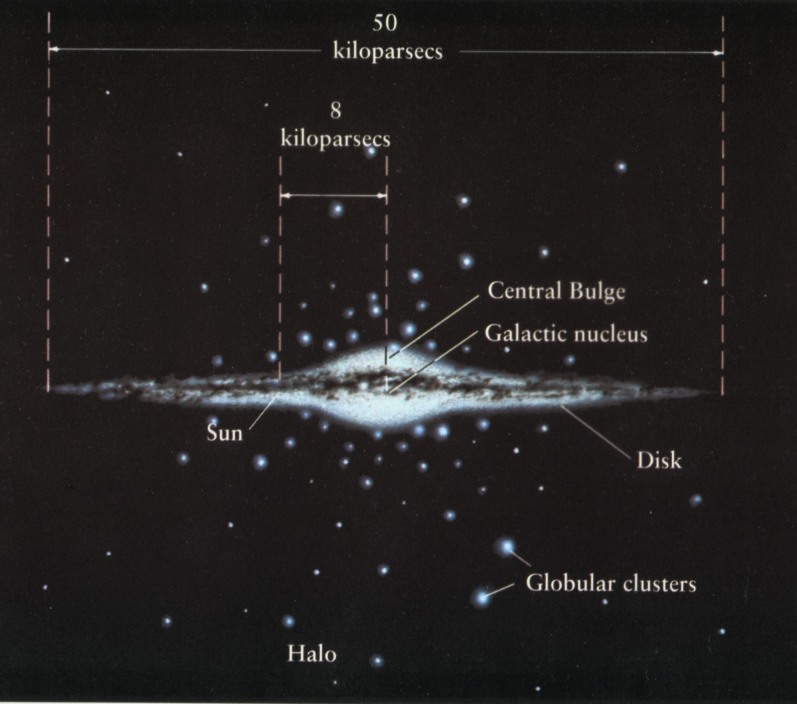
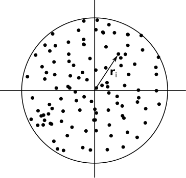
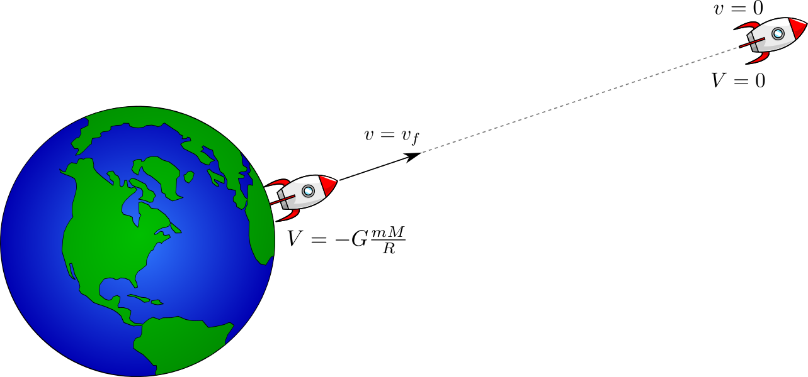

# Come si usa Ariel

Per ricevere le notifiche via email, occorre abilitarle *in tutte
  le sezioni del sito*.

# Valutazioni sulla didattica

-   Tre criticità evidenziate dagli studenti:

    #.   Parlo troppo in fretta!
    #.   Faccio intervenire poco.
    #.   Le slide sono a volte impaginate in modo strano.

-   Quest'anno ho cercato di implementare una soluzione per ciascun problema.

# La Via Lattea

# Struttura della Via Lattea

{width=640px}

# Masse e dimensioni

| Componente             | Massa              | Forma e dimensioni                                 |
|------------------------|--------------------|----------------------------------------------------|
| Alone stellare         | $10^9\,M_\odot$    | Sfera ($r > 20\,\text{kpc}$)                       |
| Disco (gas)            | $10^{10}\,M_\odot$ | Disco ($r = 25\,\text{kpc}$, $h=0.15\,\text{kpc}$) |
| Rigonfiamento centrale | $10^{10}\,M_\odot$ | Ellissoide ($6\times 2 \times 2 \,\text{kpc})$     |
| Disco (stelle)         | $10^{11}\,M_\odot$ | Disco ($r = 15\,\text{kpc}$, $h = 1\,\text{kpc}$)  |
| Alone materia oscura   | $10^{12}\,M_\odot$ | Sfera ($r >  60\,\text{kpc}$?)                     |

# Introduzione agli ammassi stellari

# NGC 290 (ammasso aperto)

{height=600px}

# M22 (ammasso globulare)

{height=600px}

---

|                      | Ammassi aperti                      | Ammassi globulari                       |
|----------------------|-------------------------------------|-----------------------------------------|
|                      | {height=60px} | {height=60px}        |
| # di stelle          | 10³–10⁴                             | 10⁴–10⁶                                 |
| Dimensioni           | 10 pc                               | 20–100 pc (core: 5 pc)                  |
| Gas e polvere?       | Sì                                  | No                                      |
| Nebulose planetarie? | No                                  | Sì                                      |
| # di ammassi noti    | 10³                                 | ~160                                    |
| Dove?                | Disco                               | Alone stellare (~1% della massa totale) |

# Termodinamica e astrofisica

{height=460px}

Essendo sistemi composti da molte particelle, possiamo pensare di
usare la termodinamica classica per descriverli?

# Termodinamica e astrofisica

-   **NO!**

-   La teoria del gas ideale funziona solo in sistemi privi di forze a lungo raggio.

-   Da questo punto di vista la gravità è un problema!

    > Properties of systems with long range interactions are still poorly understood despite being of importance in most areas of physics.

    ([*Dynamics and Thermodynamics of Systems with Long Range Interactions*](https://link.springer.com/book/10.1007/3-540-45835-2), Springer)

# Teorema del viriale

-   Esiste uno strumento adatto per la descrizione di sistemi gravitazionalmente legati: il *teorema del viriale*.
-   Consideriamo un sistema fisico di $N$ particelle confinato in un volume $V$ da forze interne.
-   Ogni particella si trova nel punto $P_i$, la forza risultante su di essa è $\vec F_i$, e $K_i$ è la sua energia cinetica.

# Medie temporali

-   Le quantità $P_i$, $\vec F_i$ e $K_i$ variano nel tempo
-   Siamo però interessati più al loro **valore medio** che alla loro evoluzione istante per istante.
-   Data una quantità $f = f(t)$ dipendente dal tempo, il valore di
    \[
    \left< f \right>_t = \lim_{\tau \rightarrow \infty} \frac1\tau \int_0^\tau f(t)\,\text{d}t
    \]
    è la media temporale di $f$.

# Definizione di «viriale»

-   Data un'origine del sistema di riferimento O, si dice «viriale» la quantità
    \[
    G \equiv \sum_{i=1}^N (P_i - O) \cdot \vec p_i = \sum_{i=1}^N \vec r_i \cdot \vec p_i,
    \]
    dove $\vec r_i = P_i - O$ è il vettore che punta verso la particella $i$-esima.

-   Se le particelle si trovano in un volume limitato $V$, allora
    1.  $G$ è una quantità limitata;
    2.  Dopo un certo tempo, $G$ tende a diventare costante.

# Limitatezza del viriale

-   Se il sistema è limitato in un volume $V$ e la sua energia è finita, allora esistono degli estremi superiori $P$ e $R$ per la quantità di moto $p_i$ e $r_i$.
-   Di conseguenza,
    \[
    \left| G \right| = \left|\sum_{i=1}^N \vec r_i \cdot \vec p_i\right| \leq \sum_{i=1}^N
    \left|\vec r_i\right| \cdot \left|\vec p_i\right| \leq N R P,
    \]
    e l'ipotesi è dimostrata.

# Variazione nel tempo del viriale

-   La variazione nel tempo del viriale ha media nulla:
    \[
    \begin{aligned}
      \left|\left< \dot G \right>_t\right| &=
      \left|\lim_{t\rightarrow\infty} \frac1\tau \int_0^\tau \dot
        G(t)\,\text{d}t\right| \\
      &= \left|\lim_{\tau\rightarrow\infty} \frac{G(\tau) -
          G(0)}\tau\right| \\
      &\leq \lim_{\tau\rightarrow\infty} \frac{2 N R P}\tau = 0.
    \end{aligned}
    \]
-   Dopo un certo *tempo di rilassamento*, $G$ diventa circa costante.

# Teorema del viriale

Il teorema del viriale dice che in un sistema limitato in un volume
$V$, passato il tempo di rilassamento, vale l'uguaglianza
\[
2\left<K\right>_t = - \left<\sum_{i=1}^N \vec r_i \cdot \vec
  F_i \right>_t,
\]
dove $K = \sum_{i=1}^N K_i$ è l'energia cinetica totale del sistema.

# Dimostrazione del teorema

Usando la proprietà $\left< \dot G \right>_t = 0$ si ottiene subito
la tesi:
\[
\begin{aligned}
  \left<\frac{\text{d}}{\text{d} t} \sum_{i=1}^N \vec r_i \cdot
      \vec p_i\right>_t &= 0, \\
  \left<2 \sum_{i=1}^N K_i + \sum_{i=1}^N \vec r_i \cdot
      \vec F_i\right>_t &= 0, \\
  2\left<\sum_{i=1}^N K_i\right>_t &= -\left<\sum_{i=1}^N \vec r_i \cdot
      \vec F_i\right>_t.
\end{aligned}
\]

# Caso di forze centrali

Dimostriamo ora che per forze con potenziale $U_i = k r_i^\alpha$
(«forze centrali») in sistemi sferici il teorema del viriale si riduce a:
\[
\alpha \left<U\right>_t = 2\left< K \right>_t,
\]
dove $U = \sum_{i=1}^N U_i$ è l'energia potenziale totale.

{height=300px}

---

\[
  \vec F_i
  = -\vec\nabla U_i(r_i)
  = - \partial_r U_i(r_i)\,\hat e_r
  = -\alpha\,k\,r_i^{\alpha - 1} \hat e_r,
\]
implica che
\[
  \begin{aligned}
    2\left< K \right>_t &= -\left<\sum_{i=1}^N \vec r_i \cdot \vec
      F_i \right>_t =\\
    &= \left<\sum_{i=1}^N \vec r_i \cdot \vec
      \nabla U_i(r_i) \right>_t =\\
    &= \left<\sum_{i=1}^N \alpha\,k\,r_i^\alpha \right>_t =
    \alpha \left<U_\mathrm{tot}\right>_t.
  \end{aligned}
\]

# Il viriale in sistemi gravitazionali

-   In un sistema di corpi di massa $m$ dove l'unica forza è quella gravitazionale, $U = k r^{-1}$ (con $k = -G m^2$), e quindi $\alpha = -1$:
    \[
      \left<U\right>_t = -2\left< K \right>_t.
    \]

-   In un sistema virializzato dominato dalla gravità, l'energia potenziale è *doppia* (in modulo) rispetto all'energia cinetica.

-   (In realtà la relazione $U \propto r^{-1}$ vale solo lontano dal centro, dove invece $U \propto M(r) / r \propto r^2$ e il moto è come quello di una molla).

# Sistemi “virializzati”

-   Un sistema per cui vale il teorema del viriale si dice “virializzato”

-   I sistemi virializzati dimostrano notevole simmetria, perché l'energia cinetica dei loro componenti si è distribuita statisticamente

-   È una condizione simile a quella dell'equilibrio termodinamico

-   La prossima animazione mostra un esempio 2D molto simpatico ed efficace

---

<iframe width="960" height="540" src="https://www.youtube.com/embed/C6eY6HMBa2Q?si=iDW_tZ2ul2aXUByf" title="YouTube video player" frameborder="0" allow="accelerometer; autoplay; clipboard-write; encrypted-media; gyroscope; picture-in-picture; web-share" allowfullscreen></iframe>

[Gravitational collapse of Spongebob](https://www.youtube.com/watch&v=C6eY6HMBa2Q)

# Livello di energia potenziale

-   Ricordate che l'energia potenziale è definita a meno di una costante additiva (deriva da un integrale indefinito).
-   Il teorema del viriale assume però una costante ben precisa per $U$: siccome abbiamo supposto che $U = k r^{-1}$, significa che assumiamo che l'energia potenziale di $i$ e $j$ tenda a zero se le due particelle vengono allontanate indefinitamente.

# Applicazioni del teorema (1/2)

-   Come esempio, stimiamo la temperatura media del Sole usando il teorema del viriale.
-   Il Sole è un sistema di volume sferico limitato, sicuramente rilassato, quindi il teorema è applicabile.

# Applicazioni del teorema (1/2)

L'energia potenziale gravitazionale del Sole (sfera di raggio $R$) è
\[
U = \frac35 G \frac{M^2}R,
\]
mentre l'energia cinetica totale è
\[
K = \sum_{i=1}^N \frac32 k T
\]
(assumiamo che la temperatura sia costante nell'interno).

# Applicazioni del teorema (1/2)

Usando il teorema del viriale
\[
2 \left< K \right>_t = -\left< U \right>_t
\]
otteniamo che la **temperatura viriale** è
\[
T = \frac15 \frac{G M_\odot^2}{N k R_\odot} \sim 10^6 \div 10^7\,\text{K}.
\]
Essa corrisponde circa alla temperatura del nucleo.

# Applicazioni del teorema (2/2)

-   Calcoliamo ora l'energia media di legame per nucleone in un nucleo atomico.
-   Anche in questo caso abbiamo un sistema di particelle ovviamente rilassato e confinato in un volume limitato, ma **non è classico**: proviamo comunque ad applicare il teorema del viriale.

# Applicazioni del teorema (2/2)

-   Un nucleo atomico ha raggio $R \sim 10^{-15}\,\text{m}$.
-   L'energia cinetica media classica $p^2/(2m)$ è stimabile dal principio di indeterminazione:
    \[
    \Delta p_x \Delta x \sim \frac\hbar2 \qquad\Rightarrow\qquad p_x \approx \frac{\hbar}{2R}.
    \]
-   Siccome $p^2 = p_x^2 + p_y^2 + p_z^2 \approx 3 p_x^2 \approx 3 \hbar^2/4 R^2$, allora
    \[
    K \approx A \frac{p^2}{2 m_p} \approx A \frac{3 \hbar^2}{8 R^2 m_p} \sim A \frac{\hbar^2}{R^2 m_p}.
    \]

# Applicazioni del teorema (2/2)

Nell'ipotesi che $U \propto r^\alpha$, e che $\left|\alpha\right|$
non sia troppo distante dall'unità, dal teorema del viriale vale che
$K \sim U$ (stesso ordine di grandezza), ossia
\[
A \frac{\hbar^2}{R^2 m_p} \sim U
\]

Noi siamo interessati all'energia di legame **per nucleone**,
ossia $U/A$:
\[
U/A \sim \frac{\hbar^2}{R^2 m_p} \sim 10\,\text{MeV/nucleone}.
\]

# Dinamica degli a.g.

-   Gli ammassi globulari sono a simmetria sferica, quindi virializzati.
-   Usando il teorema del viriale, calcoliamo le seguenti quantità per un ammasso tipico:
    #.   Velocità di fuga;
    #.   Velocità quadratica media;
    #.   Massa.

# Velocità di fuga

-   È sensato supporre che un ammasso globulare sia legato? Per rispondere a questo, dobbiamo stimare la velocità di fuga.
-   Se la velocità media delle stelle fosse maggiore della velocità di fuga, allora l'ammasso non potrebbe essere legato: «evaporerebbe» lasciando sfuggire le sue stelle nello spazio.

# Velocità di fuga

{height=460px}

Per stimare la velocità di fuga $v_f$ si impone la conservazione
dell'energia tra i due istanti mostrati in figura.

# Velocità di fuga

-   Nel caso di una stella posta inizialmente a una distanza $R$ dal
    centro di massa dell'ammasso, l'equazione di conservazione
    dell'energia diventa:
    \[
    \frac12 M_* v_f^2 - G \frac{M_*\, M_\text{GC}}R = 0,
    \]

-   Se $M_\text{GC} \sim 10^6\,M_\odot$ e $R \sim 10\,\text{pc}$, si ha che
    \[
      v_f = \sqrt{\frac{2 G M_\text{GC}}R} \sim 30\,\text{km/s}.
    \]

-   Notate che per una particella che sfugge l'energia totale è **nulla**.

# Velocità quadratica media

Vogliamo calcolare la velocità (quadratica) media delle stelle in un
ammasso globulare. Questa quantità è legata all'energia cinetica $K$:
\[
\begin{aligned}
  K &= \sum_{i=1}^N \frac12 M_* v_i^2 = \frac12 M_* N \frac1N
  \sum_{i=1}^N v_i^2 \\
  &= \frac12 M_\text{GC} v_\text{rms}^2
\end{aligned}
\]

# Velocità quadratica media
Di conseguenza, dal teorema del viriale
\[
2 \left< K \right>_t = -\left< U \right>_t = -\left< \frac35 \frac{G
    M_\text{GC}^2}R \right>_t
\]
abbiamo che
\[
  v_\text{rms} = \sqrt{\frac{3 G M_\text{GC}}{5 R}} \sim 15\,\text{km/s}.
\]

# Velocità di fuga e velocità quadratica media

Dal momento che
\[
\left(v_\text{rms} = \sqrt{\frac{3 G M_\text{GC}}{5 R}}\right) < \left(v_f = \sqrt{\frac{2 G M_\text{GC}}R}\right),
\]
ciò conferma l'ipotesi che l'ammasso globulare (e in generale
qualsiasi sistema gravitazionale virializzato) sia un sistema legato.

# Massa viriale degli a.g.

-   Calcoliamo ora la massa totale di un ammasso globulare da parametri
    osservativi.
-   L'energia potenziale e cinetica dell'ammasso è
    \[
    K = \frac12 M_\text{GC} \left<v^2\right>_t, \quad U = -\frac35
    \frac{G M_\text{GC}^2}R.
    \]
-   Dal fatto che $2 \left<K\right>_t + \left<U\right>_t = 0$ si ha
    che
    \[
    M = \frac5{3 G}\left<v^2\right>_t R.
    \]

# Massa viriale degli a.g.

Per il nostro ammasso tipico con $R = 5\,\text{pc}$ e $v =
15\,\text{km/s}$ abbiamo che
\[
M \sim 10^{39}\,\text{g} \approx 5\times 10^5\,M_\odot.
\]

Questo valore della massa è detto **massa viriale**.

---
title: "Lezione di Astronomia II – 1"
author: "Maurizio Tomasi ([maurizio.tomasi@unimi.it](mailto:maurizio.tomasi@unimi.it))"
date: "21 marzo 2024"
css:
- ./css/custom.css
...
