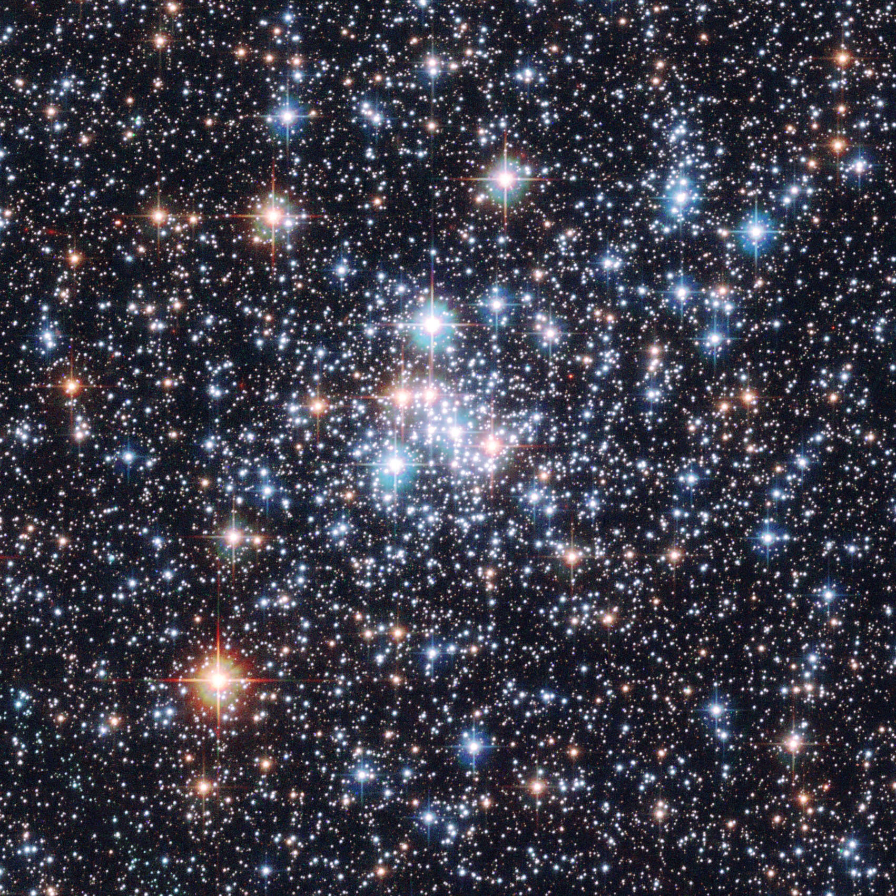
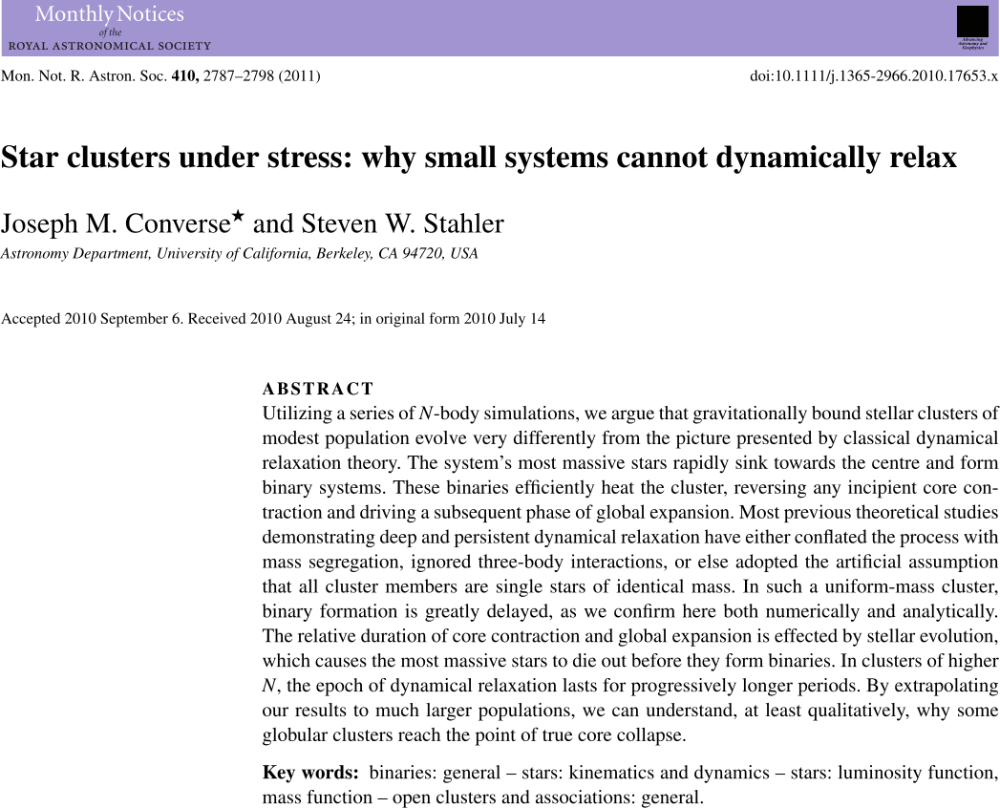

# Relaxation Time

# Relaxation Time

-   Let's now consider the time required for a cluster to become dynamically relaxed.

-   Initially, the stars in a cluster may *not* be relaxed: in this case, the fastest ones ($v > v_f$) escape from the cluster, and this "evaporation" changes the distribution of $v$.

-   Moreover, gravitational interactions cause a redistribution of energy, which leads the cluster towards a relaxed state.

---

<iframe width="960" height="540" src="https://www.youtube.com/embed/0EfKTg2_QXI?si=9GFEYvpflxoYmVg6" title="YouTube video player" frameborder="0" allow="accelerometer; autoplay; clipboard-write; encrypted-media; gyroscope; picture-in-picture; web-share" referrerpolicy="strict-origin-when-cross-origin" allowfullscreen></iframe>

[Gravitational collapse of Spongebob](https://www.youtube.com/watch?v=0EfKTg2_QXI)

# Relaxation Time

-   To quantify the relaxation time, we can assume that it is the time required for each star in the cluster to interact a certain number $N_\text{int}$ of times with its companions.
-   (This is analogous to how one studies an ideal gas reaching thermodynamic equilibrium).

# Relaxation Time

-   We can define an interaction between two stars as the condition
    in which the kinetic energy becomes equal to the potential energy between
    the two (why?):
    \[
    \frac12 M_* v^2 \sim G \frac{M_*^2}r.
    \]
-   This occurs when the distance between the two stars is
    \[
    r_c \sim 2 G \frac{M_*}{v^2}.
    \]
-   The value $r_c$ is called the **collisional radius**.

# Relaxation Time

-   How likely is a star to interact with others? It depends on how fast the star is moving and the density of its companions:

    
{height=300px}

-   In the volume $V = \pi r^2\,\Delta x$ there are $V n = (\pi r^2\,\Delta x)\,n$ stars (with $n$ being the number density).

# Relaxation Time

{height=180px}

If the distance traveled by the star is $\Delta x = v \Delta t$, then during the relaxation time $\Delta t_r$ the star interacts collisionally with the $N_\text{int}$ stars in the cylinder with base $r = r_c$:
\[
(\pi r_c^2\,v\,\Delta t_r)\,n = N_\text{int} \quad \Rightarrow \quad \Delta t_r = \frac{N_\text{int}}{\pi r_c^2\,v\,n}.
\]

# Relaxation Time

If we now set $N_\text{int} \approx 1$ and substitute the expression $r_c \sim 2 G \frac{M_*}{v^2}$ into
\[
\Delta t_r = \frac{N_\text{int}}{\pi r_c^2\,v\,n}
\]
we obtain:
\[
\Delta t_r = \frac{v^3}{4 \pi G^2 M_*^2\,n}.
\]

# Relaxation Time

The expression for $\Delta t_r$ can be greatly simplified. First, $n = N/\bigl(\frac43 \pi R^3\bigr)$; furthermore, we can use the virial theorem:
\[
\begin{aligned}
K &= -\frac12 U, \\
\frac12 N M_* v^2 &= \frac35 G \frac{(N M_*)^2}R, \\
G M_* N &\approx R v^2\quad\text{(assuming $\frac35
  \approx \frac12$)}.
\end{aligned}
\]

# Relaxation Time

Substituting the expressions for $n$ and $G M_* N$, we obtain
\[
\Delta t_r \approx \frac{N R}{3 v}.
\]
Therefore, the relaxation time is of the same order of magnitude as the time required to complete $N$ crossings of the cluster ($R/v$ is the time for *one* crossing), with $N$ being the number of stars.

# Relaxation Time

-   Our estimate leads to a value of $\Delta t_r$ equal to
    \[
    \Delta t_r \approx \frac13 \times
    \frac{10^6 \times 5\,\text{pc}}{16\,\text{km/s}} \approx 100\,\text{Gyr},
    \]

-   But this number is implausible! The universe is less than 14 billion years old, yet most globular clusters appear to be already relaxed.

# Relaxation Time

-   The problem is that the calculation only considers *short*-range interactions, while long-distance energy exchanges are also relevant.

-   We assumed that interaction occurs when the distance between two stars is less than the collision radius $r_c$ given by
    \[
      \frac12 M_* v^2 \sim G \frac{M_*^2}{r_c}.
    \]

-   But even at distances greater than $r_c$ there are energy exchanges, and we have neglected them.

# Average Distance Between Stars

-   Let's calculate the average distance $\lambda$ between two stars in the cluster:
    \[
      \lambda \sim \frac1{n^{1/3}} = {\left(\frac{4\pi}{3 N}\right)}^{\frac13}
      R_\text{core} \approx 2.4\times 10^{15}\,\text{m} = 6700\,\text{AU},
    \]
    if $R_\text{core} = 5\,\text{pc}$ and $N = 10^6$.
-   The collision radius, in the case $v = v_\text{rms} = 16\,\text{km/s}$, for a star $M_* = M_\odot/2$, is instead
    \[
      r_c = \frac{2 G M_*}{v^2} \approx 5.2 \times 10^{11}\,\text{m}
      \approx 750\,R_\odot = 0.3\,\text{AU}.
    \]

# Relaxation Time

The problem is that we have only considered short-range interactions, but the previous calculation tells us that they are very rare because the average distance between stars is 10⁴ times greater than the collisional radius.

# Long-Range Interactions

If a star cluster is virialized, then this is probably mainly determined by long-range interactions:

---

# Long-Range Interactions

-   We want to estimate the importance of long-range interactions. We will therefore measure the average deflection $\vec{\Delta v}_\perp$ caused by these interactions.
-   Obviously, successive interactions will have different values of $\Delta v_\perp$, both in magnitude and in direction. The resulting motion will be Brownian, such that
    \[
    \left< \vec{\Delta v}_\perp\right> = 0
    \]
    (Brownian motion has no preferential direction).

# Long-Range Interactions

-   However, we are not interested in characterizing the direction of $\Delta v_\perp$, only in understanding the order of magnitude of the velocity $\Delta v_\perp$. The most appropriate quantity is the *root mean square* $\left< \Delta v_\perp^2 \right>$.
-   It has the following properties:
    #.  It is related to the amount of energy the star acquires due to long-range interactions (because $K \propto v^2$);
    #.  It increases with time;
    #.  It becomes important when $\left< \Delta v_\perp^2 \right> \approx v^2$.

# Long-Range Interactions

What happens in an interaction where $r > r_c$?

Let's assume that the energy exchange occurs only along the red line, and that it introduces a perpendicular component $\Delta v_\perp$ to the velocity $v$.

# Long-Range Interactions

We can estimate the order of magnitude of $\Delta v_\perp$ using Newton's laws:
\[
M_* \frac{\Delta v_\perp}{\Delta t} = G \frac{M_*^2}{r^2},
\]
from which
\[
\Delta v_\perp = G \frac{M_*}{r^2/\Delta t} = G \frac{M_*}{r\,v}
\]
($\Delta t$ is the time taken to travel the red segment, which has length $\sim r$: therefore $r / \Delta t \approx v$).

# Long-Range Interactions

-   What are plausible values to use for $r$? We have already seen that in globular clusters short-range interactions ($r \leq r_c$) matter little; but obviously $r < R$ (with $R$ being the size of the cluster).

-   In general $r_c < r < R$.

-   Since $\Delta v_\perp$ is a function of $r$, we must calculate an «average» value of $\Delta v_\perp$.

# Long-Range Interactions

{height=120px}

We calculate the mean square value of $\Delta v_\perp$ (the star's
trajectory in the cluster can be approximated as Brownian motion):
\[
\begin{aligned}
  \left<(\Delta v_\perp)^2\right> &= \int_{r_c}^R (2\pi r\,\text{d}
  r)\,(v \Delta t)\,n\,\left(G\,\frac{M_*}{r\,v}\right)^2 = \\
  &= \frac{2\pi n G^2 M_*^2}{v}\,\Delta t\,\log\left(\frac{R}{r_c}\right).
\end{aligned}
\]

# Long-Range Interactions

-   We use the virial theorem with $N$ as the number of stars in the cluster (thus assuming $R$ and $v$ calculated on the already relaxed system):
    \[
    \log\frac{R}{r_c} = \log\frac{R v^2}{G M_*} \approx \log N.
    \]

-   Therefore
    \[
      \left<(\Delta v_\perp)^2\right> =
      \frac{2\pi n G^2 M_*^2}{v}\,\Delta t\,\log N.
    \]

# Long-Range Interactions

For large values of $\Delta t$, the component $\Delta v_\perp$
becomes important. After how long does $\Delta v_\perp \approx v$?

\[
\begin{aligned}
  \left<(\Delta v_\perp)^2\right> &\approx v^2 \\
  \frac{2\pi n G^2 M_*^2}{v}\,\Delta t\,\log N &\approx v^2 \\
  \Delta t &\approx \frac{v^3}{2\pi n G^2 M_*^2\,\log N}.
\end{aligned}
\]

# Long-Range Interactions

Using the usual substitutions
\[
n = \frac{N}{\frac43 \pi R^3}, \quad N M_* G \approx R v^2,
\]
the expression for $\Delta t$ becomes
\[
\Delta t \approx \frac{N}{\log N}\,\frac{R}{v}.
\]
Compared to our initial estimate $\Delta t_r \sim N R / v$, here
$\log N$ appears in the denominator. For a typical cluster, $\log N
\approx \log 10^6 \approx 14$.

# Relaxation Time

The exact calculation leads to the formula
\[
\Delta t_r \approx \frac1{12 \ln (N/2)}\,\frac{N R}v,
\]
from which we obtain
\[
\Delta t_r \approx \frac1{12 \ln (10^6/2)}\,\frac{10^6 \times
  5\,\text{pc}}{16\,\text{km/s}} \approx 2\,\text{Gyr},
\]
which is physically plausible, at last!

# Relaxation Time

-   The calculation carried out in this lecture is explained in exercise 1.14 of *Cosmology and Astrophysics through problems* (T. Padmanabhan, Cambridge University Press, 1996).

-   Chapter 10.7 of volume I of *Theoretical Astrophysics* (T. Padmanabhan, Cambridge U. P., 2000) contains the full derivation of the formula in the case of a plasma (the Coulomb potential depends on $r$ as the Newtonian one does).

# Age of globular clusters

{height=600px}

# Age of globular clusters

> The LF is a natural clock because the number of stars in a given luminosity bin decreases with time, since more massive stars evolve more rapidly than less massive ones. The fact that small differences in stellar masses correspond to large differences in evolutionary time explains the power of the LF clock…

# Age of globular clusters

{height=600px}

# Lifetime of GCs

-   The course's reference text (Kutner) claims that the lifetime of globular clusters is much longer than the age of the Universe ($\sim 200\,\mathrm{Gyr}$).

-   However, this excludes the perturbations that occur when globular clusters cross the Galactic disk, which can lead to their progressive destruction.

-   Furthermore, computer simulations (Zonoozi et al., 2011, Zonoozi et al., 2014) show that evaporation processes are up to an order of magnitude faster than estimated by our calculation.

# Open clusters

---

|                     | Open clusters                       | Globular clusters                |
|---------------------|-------------------------------------|----------------------------------|
|                     | {height=60px} | {height=60px} |
| # of stars          | 10³–10⁴                             | 10⁴–10⁶                          |
| Size                | 10 pc                               | 20–100 pc (core: 5 pc)           |
| Gas and dust?       | Yes                                 | No                               |
| Planetary nebulae?  | No                                  | Yes                              |
| # of known clusters | 10³                                 | ~160                             |
| Dove?               | Disco                               | Stellar halo (~1% of total mass) |

# M45

{height=500px}

In Taurus. $N \sim 500$, age $10^8$ yr, $R \sim 8$ ly, $D \sim 440$ ly.

# Open cluster population

-   To date, approximately 1,100 open clusters have been cataloged.
-   Most of them are in the galactic disk
-   At great distances, it is difficult to conduct a census due to dust in the galactic disk.
-   Open clusters, therefore, form a much larger population than globular clusters.

# Relaxation time for OCs

-   Most clusters have ages less than $10^9\,\text{yr}$.

-   From the formula
    \[
    \Delta t_r \approx \frac1{12\log\frac{N}2} \frac{N R^{3/2}}{\sqrt{G M_*}}
    \]
    we obtain for open clusters that $\Delta t_r \approx 10^8\div 10^9\,\text{yr}$: therefore a good portion of open clusters **are not relaxed**.

# Relaxation time for OCs

{height=500px}

# Relaxation time for OCs

> …[the] evolutionary status [of open clusters] is much less clear. Half of open clusters disintegrate within $2\times10^8\,\text{yr}$ after birth [\ldots], a span corresponding to at most a few initial relaxation times. Not surprisingly, there is little observational signature that relaxation has occurred.

(Converse and Stahler, MNRAS 410, 2011)

# Age of OCs

Why do open clusters have such short lifespans? Some reasons:

1.  In the galactic disk, there are many massive objects (giant molecular clouds) whose gravitational force can disrupt clusters;
2.  Their mass is not large enough to prevent "evaporation";
3.  Due to the differential rotation of the galactic plane (which we will see later), clusters are subject to tidal forces.

# Stellar populations

| Population I             | Population II                           |
|--------------------------|-----------------------------------------|
| Open clusters (and more) | Globular clusters (and more)            |
| Galactic plane           | Spherical halo                          |
| Gas and dust             | Neither gas nor dust (but planetary n.) |
| High metallicity         | Low metallicity                         |

---
title: "Astrofisica Generale II — 2"
author: Maurizio Tomasi ([maurizio.tomasi@unimi.it](mailto:maurizio.tomasi@unimi.it))
date: 14 marzo 2025
css:
- ./css/custom.css
...
