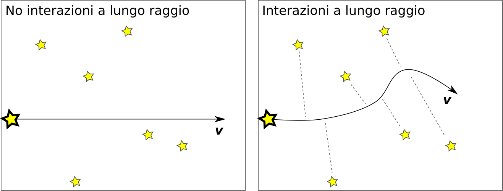
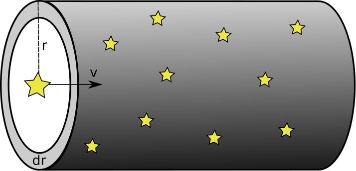
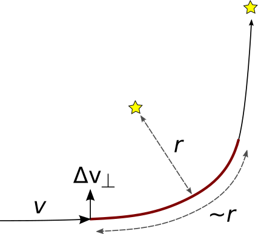
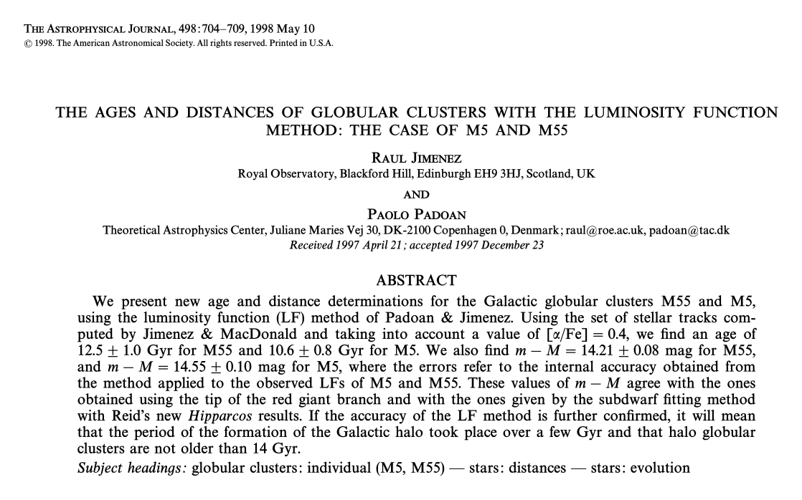
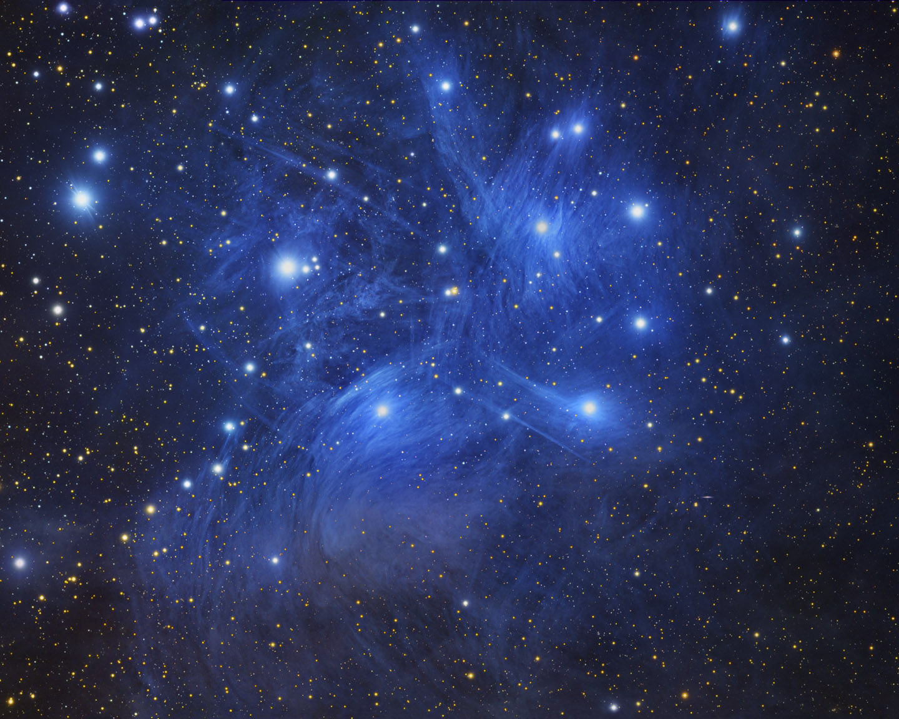

# Tempo di rilassamento

# Tempo di rilassamento

-   Veniamo ora al tempo necessario perché un ammasso diventi dinamicamente rilassato.

-   Inizialmente le stelle di un ammasso possono *non* essere rilassate: in tal caso le più veloci ($v > v_f$) escono dall'ammasso, e questa «evaporazione» cambia la distribuzione delle $v$.

-   In più, le interazioni gravitazionali provocano una ridistribuzione dell'energia, che porta l'ammasso verso lo stato rilassato.

# Tempo di rilassamento

-   Per quantificare il tempo di rilassamento, possiamo supporre che esso sia il tempo necessario affinché ciascuna delle stelle dell'ammasso interagiscano un certo numero $N$ di volte con le sue compagne.
-   (Questo è analogo al modo in cui si studia un gas ideale che sta raggiungendo l'equilibrio termodinamico).

# Tempo di rilassamento

-   Possiamo definire un'interazione tra due stelle come la condizione
    in cui l'energia cinetica diventa uguale all'energia potenziale tra
    le due (perché?):
    \[
    \frac12 M_* v^2 \sim G \frac{M_*^2}r.
    \]
-   Ciò avviene quando la distanza tra le due stelle è
    \[
    r_c \sim 2 G \frac{M_*}{v^2}.
    \]
-   Il valore $r_c$ è detto **raggio collisionale**.

# Tempo di rilassamento

-   Quanto è probabile che una stella interagisca con altre? Dipende da quanto velocemente la stella si muove e dalla densità delle sue compagne:

    
{height=300px}

-   Nel volume $V = \pi r^2\,\Delta x$ ci sono $V n = (\pi r^2\,\Delta x)\,n$ stelle (con $n$ densità numerica).

# Tempo di rilassamento

{height=180px}

Se la distanza percorsa dalla stella è $\Delta x = v \Delta t$, allora durante il tempo di rilassamento $\Delta t_r$ la stella interagisce collisionalmente con le $N_\text{int}$ stelle nel cilindro che ha base $r = r_c$:
\[
(\pi r_c^2\,v\,\Delta t_r)\,n = N_\text{int} \quad \Rightarrow \quad \Delta t_r = \frac{N_\text{int}}{\pi r_c^2\,v\,n}.
\]

# Tempo di rilassamento

Se ora poniamo $N_\text{int} \approx 1$ e sostituiamo l'espressione $r_c \sim 2 G \frac{M_*}{v^2}$ in
\[
\Delta t_r = \frac{N_\text{int}}{\pi r_c^2\,v\,n}
\]
otteniamo:
\[
\Delta t_r = \frac{v^3}{4 \pi G^2 M_*^2\,n}.
\]

# Tempo di rilassamento

L'espressione di $\Delta t_r$ può essere molto semplificata.
Innanzitutto, $n = N/\bigl(\frac43 \pi R^3\bigr)$; inoltre possiamo
usare il teorema del viriale:
\[
\begin{aligned}
K &= -\frac12 U, \\
\frac12 N M_* v^2 &= \frac35 G \frac{(N M_*)^2}R, \\
G M_* N &\approx R v^2\quad\text{(supponendo $\frac35
  \approx \frac12$)}.
\end{aligned}
\]

# Tempo di rilassamento

Sostituendo le espressioni di $n$ e $G M_* N$, otteniamo
\[
\Delta t_r \approx \frac{N R}{3 v},
\]
quindi il tempo di rilassamento è dello stesso ordine di grandezza
del tempo richiesto a compiere $N$ attraversamenti dell'ammasso
($R/v$ è il tempo per *un* attraversamento), con $N$ numero di stelle.

# Tempo di rilassamento

-   La nostra stima porta a un valore di $\Delta t_r$ pari a
    \[
    \Delta t_r \approx \frac13 \times
    \frac{10^6 \times 5\,\text{pc}}{16\,\text{km/s}} \approx 100\,\text{Gyr},
    \]

-   Ma questo numero è implausibile! L'universo ha meno di 14 miliardi di anni, eppure la maggior parte degli ammassi globulari sembra essere già rilassata.

# Tempo di rilassamento

-   Il problema è che nel calcolo solo le interazioni a *corto* raggio, mentre sono rilevanti anche gli scambi energetici a distanza.

-   Noi abbiamo supposto che si abbia interazione quando la distanza tra due stelle sia inferiore al raggio collisionale $r_c$ dato da
    \[
      \frac12 M_* v^2 \sim G \frac{M_*^2}{r_c}.
    \]

-   Ma anche a distanze maggiori di $r_c$ ci sono scambi energetici, e noi li abbiamo trascurati.

# Distanza media tra le stelle

-   Calcoliamo la distanza media $\lambda$ tra due stelle dell'ammasso. Essa è data da
    \[
      \lambda \sim \frac1{n^{1/3}} = {\left(\frac{4\pi}{3 N}\right)}^{\frac13}
      R_\text{core} \approx 2.4\times 10^{15}\,\text{m} = 6700\,\text{AU},
    \]
    se $R_\text{core} = 5\,\text{pc}$ e $N = 10^6$.
-   Il raggio collisionale, nel caso $v = v_\text{rms} = 16\,\text{km/s}$, per una stella $M_* = M_\odot/2$, è invece
    \[
      r_c = \frac{2 G M_*}{v^2} \approx 5.2 \times 10^{11}\,\text{m}
      \approx 750\,R_\odot = 0.3\,\text{AU}.
    \]

# Tempo di rilassamento

Il problema è che noi abbiamo considerato solo le interazioni a corto raggio, ma il conto precedente ci dice che sono rarissime, perché la distanza media tra le stelle è 10⁴ volte maggiore del raggio collisionale.

# Interazioni a lungo raggio

Se un a.g.\ è virializzato, allora ciò è probabilmente determinato
soprattutto dalle interazioni a lungo raggio:

---

# Interazioni a lungo raggio

-   Vogliamo stimare l'importanza delle interazioni a lungo raggio. Misureremo quindi la deflessione media $\vec{\Delta v}_\perp$ causata da queste interazioni.
-   Ovviamente interazioni successive avranno valori diversi di $\Delta v_\perp$, sia in modulo che in direzione e verso. Il moto risultante sarà di tipo Browniano, tale che
    \[
    \left< \vec{\Delta v}_\perp\right> = 0
    \]
    (il moto Browniano non ha una direzione preferenziale).

# Interazioni a lungo raggio

-   A noi non interessa però caratterizzare la direzione di $\Delta v_\perp$, solo capire l'ordine di grandezza della velocità $\Delta v_\perp$. La quantità più indicata è il *valore quadratico medio* $\left< \Delta v_\perp^2 \right>$.
-   Esso ha le seguenti proprietà:
    #.  È legato alla quantità di energia che acquista la stella a causa delle interazioni a lungo raggio (perché $K \propto v^2$);
    #.  Aumenta col passare del tempo;
    #.  Diventa importante quando $\left< \Delta v_\perp^2 \right> \approx v^2$.

# Interazioni a lungo raggio

Cosa avviene in una interazione dove $r > r_c$?

Supponiamo che lo scambio energetico avvenga solo lungo la linea rossa, e che esso introduca una componente perpendicolare $\Delta v_\perp$ nella velocità $v$.

# Interazioni a lungo raggio

Possiamo stimare l'ordine di grandezza di $\Delta v_\perp$ usando le leggi
di Newton:
\[
M_* \frac{\Delta v_\perp}{\Delta t} = G \frac{M_*^2}{r^2},
\]
da cui
\[
\Delta v_\perp = G \frac{M_*}{r^2/\Delta t} = G \frac{M_*}{r\,v}
\]
($\Delta t$ è il tempo necessario a percorrere il tratto rosso, che
è lungo $\sim r$: quindi $r / \Delta t \approx v$).

# Interazioni a lungo raggio

-   Quali sono i valori plausibili da usare per $r$? Abbiamo già visto che negli ammassi globulari le interazioni a corto raggio ($r \leq r_c$) contano poco; ma ovviamente $r < R$ (con $R$ dimensione dell'ammasso).

-   In generale $r_c < r < R$.

-   Siccome $\Delta v_\perp$ è funzione di $r$, dobbiamo calcolare un valore «medio» di $\Delta v_\perp$.

# Interazioni a lungo raggio

{height=120px}

Calcoliamo il valore quadratico medio di $\Delta v_\perp$ (la
traiettoria della stella nell'ammasso è assimilabile a un moto
Browniano):
\[
\begin{aligned}
  \left<(\Delta v_\perp)^2\right> &= \int_{r_c}^R (2\pi r\,\text{d}
  r)\,(v \Delta t)\,n\,\left(G\,\frac{M_*}{r\,v}\right)^2 = \\
  &= \frac{2\pi n G^2 M_*^2}{v}\,\Delta t\,\log\left(\frac{R}{r_c}\right).
\end{aligned}
\]

# Interazioni a lungo raggio

-   Usiamo il teorema del viriale con $N$ numero di stelle dell'ammasso (assumendo quindi $R$ e $v$ calcolati sul sistema già rilassato):
    \[
    \log\frac{R}{r_c} = \log\frac{R v^2}{G M_*} \approx \log N.
    \]

-   Quindi
    \[
      \left<(\Delta v_\perp)^2\right> =
      \frac{2\pi n G^2 M_*^2}{v}\,\Delta t\,\log N.
    \]

# Interazioni a lungo raggio

Per grandi valori di $\Delta t$, la componente $\Delta v_\perp$
diventa importante. Dopo quanto tempo $\Delta v_\perp \approx v$?

\[
\begin{aligned}
  \left<(\Delta v_\perp)^2\right> &\approx v^2 \\
  \frac{2\pi n G^2 M_*^2}{v}\,\Delta t\,\log N &\approx v^2 \\
  \Delta t &\approx \frac{v^3}{2\pi n G^2 M_*^2\,\log N}.
\end{aligned}
\]

# Interazioni a lungo raggio

Usando le solite sostituzioni
\[
n = \frac{N}{\frac43 \pi R^3}, \quad N M_* G \approx R v^2,
\]
l'espressione di $\Delta t$ diventa
\[
\Delta t \approx \frac{N}{\log N}\,\frac{R}{v}.
\]
Rispetto alla nostra stima iniziale $\Delta t_r \sim N R / v$, qui
compare $\log N$ al denominatore. Per un ammasso tipico, $\log N
\approx \log 10^6 \approx 14$.

# Tempo di rilassamento

Il calcolo esatto porta alla formula
\[
\Delta t_r \approx \frac1{12 \ln (N/2)}\,\frac{N R}v,
\]
da cui si ottiene che
\[
\Delta t_r \approx \frac1{12 \ln (10^6/2)}\,\frac{10^6 \times
  5\,\text{pc}}{16\,\text{km/s}} \approx 2\,\text{Gyr},
\]
stavolta fisicamente plausibile.

# Tempo di rilassamento

-   Il calcolo svolto in questa lezione è spiegato nell'esercizio 1.14 di *Cosmology and Astrophysics through problems* (T. Padmanabhan, Cambridge University Press, 1996).

-   Nel capitolo 10.7 del volume I di *Theoretical Astrophysics* (T. Padmanabhan, Cambridge U. P., 2000) c'è la derivazione esatta della formula nel caso di un plasma (il potenziale Coulombiano dipende da $r$ come quello Newtoniano).

# Età degli ammassi globulari

{height=600px}

# Età degli ammassi globulari

> The LF is a natural clock because the number of stars in a given luminosity bin decreases with time, since more massive stars evolve more rapidly than less massive ones. The fact that small differences in stellar masses correspond to large differences in evolutionary time explains the power of the LF clock…

# Età degli ammassi globulari

{height=600px}

# Tempo di vita degli a.g.

-   Il testo di riferimento del corso (Kutner) sostiene che il tempo di vita degli ammassi globulari sia molto superiore a quello dell'Universo ($\sim 200\,\mathrm{Gyr}$).

-   Però questo esclude le perturbazioni che avvengono quando gli ammassi globulari attraversano il disco Galattico, e che possono portare alla loro progressiva distruzione.

-   Inoltre simulazioni al computer (Zonoozi et al., 2011, Zonoozi et al., 2014) mostrano che i processi di evaporazione sono fino a un ordine di grandezza più rapidi di quanto stimato dal nostro calcolo.

# Ammassi aperti

---

|                      | Ammassi aperti                      | Ammassi globulari                       |
|----------------------|-------------------------------------|-----------------------------------------|
|                      | {height=60px} | {height=60px}        |
| # di stelle          | 10³–10⁴                             | 10⁴–10⁶                                 |
| Dimensioni           | 10 pc                               | 20–100 pc (core: 5 pc)                  |
| Gas e polvere?       | Sì                                  | No                                      |
| Nebulose planetarie? | No                                  | Sì                                      |
| # di ammassi noti    | 10³                                 | ~160                                    |
| Dove?                | Disco                               | Alone stellare (~1% della massa totale) |

# M45

{height=500px}

Nel Toro. $N \sim 500$, età $10^8$ yr, $R \sim 8$ ly, $D \sim 440$ ly.

# Popolazione di ammassi aperti

-   A tutt'oggi sono stati censiti circa 1 100 ammassi aperti
-   Nel disco galattico ne sono presenti probabilmente di più: a distanze maggiori è difficile fare un censimento a causa della polvere del disco galattico.
-   Gli ammassi aperti formano quindi una popolazione molto più numerosa di quella degli ammassi globulari.

# Diagramma HR di ammassi aperti

# Isocrone

  \footnotesize{\textit{New isochrones and age calibration}, Meynet,
    Mermilliod, Maeder. In: \textit{Astrophysical Ages and Dating
      Methods}, Vangioni-Flam \textit{et al.}\ (ed.), Editions
    Frontières (1989).}

# Tempo di rilassamento per a. aperti

-   Gli ammassi aperti M 67 e NGC 188 sono tra i più antichi che si conoscano: gran parte degli ammassi hanno un'età inferiore a $10^9\,\text{yr}$.

-   Dalla formula
    \[
    \Delta t_r \approx \frac1{12\log\frac{N}2} \frac{N R^{3/2}}{\sqrt{G M_*}}
    \]
    si ottiene per gli ammassi aperti che $\Delta t_r \approx 10^8\div 10^9\,\text{yr}$: quindi buona parte degli a.a. **non sono rilassati**.

# Tempo di rilassamento per a. aperti

{height=500px}

# Tempo di rilassamento per a. aperti

> …[the] evolutionary status [of open clusters] is much less clear. Half of open clusters disintegrate within $2\times10^8\,\text{yr}$ after birth [\ldots], a span corresponding to at most a few initial relaxation times. Not surprisingly, there is little observational signature that relaxation has occurred.

(Converse and Stahler, MNRAS 410, 2011)

# Età degli ammassi aperti

Perché gli ammassi aperti hanno vita così breve? Alcune ragioni:

#.  Nel disco galattico sono presenti molti oggetti massivi (nubi molecolari giganti) la cui forza gravitazionale può distruggere gli ammassi;
#.  La loro massa non è sufficientemente grande da impedire la «evaporazione»;
#.  A causa della rotazione differenziale del piano galattico (che vedremo in seguito), gli ammassi sono soggetti a forze di marea.

# Popolazioni stellari

| Popolazione I             | Popolazione II                          |
|---------------------------|-----------------------------------------|
| Ammassi aperti (non solo) | Ammassi globulari (non solo)            |
| Piano galattico           | Alone sferico                           |
| Gas e polvere             | Niente gas né polvere (ma nebulose pl.) |
| Alta metallicità          | Bassa metallicità                       |

---
title: Lezione di Astronomia II – 2
author: Maurizio Tomasi ([maurizio.tomasi@unimi.it](mailto:maurizio.tomasi@unimi.it))
date: 22 marzo 2024
css:
- ./css/custom.css
...
