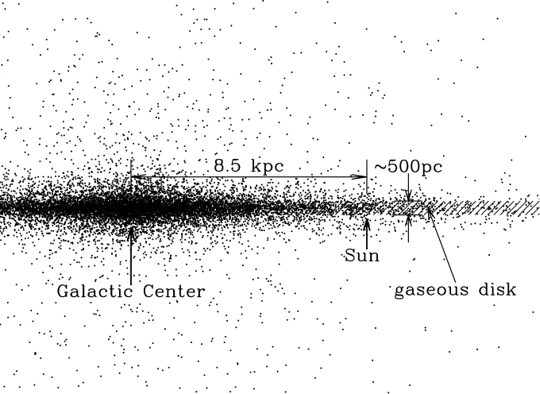

# Il mezzo interstellare (ISM)

# Il piano galattico

L'evidenza del mezzo interstellare (*interstellar medium*, ISM) è data dalla presenza di regioni opache sul piano galattico, con uno spessore di $\sim 100\div500$ pc.

{height=420px}

# Il disco gassoso

{height=520px}

<small>Adattato da B.\ Draine, *Physics of the interstellar and galactic medium*, Princeton University Press (2011).</small>

# Globuli e nubi

Il mezzo interstellare mostra addensamenti di materia la cui scala è
circa $\sim 1$ pc («globuli» e «nubi»).

{height=420px}

<small>Barnard 68 («Black cloud»)</small>

# Il mezzo interstellare

Ci sono due motivi per cui ISM è interessante:

#.  Contiene una parte importante della massa della Galassia ($10^{10}\,M_\odot$);
#.  È un luogo di formazione stellare:
    \[
      \begin{aligned}
        t_\text{O-star} &< 1\,\text{Gyr},\\
        t_\text{Via Lattea} \sim \max t_\text{gc} &\gtrsim
        10\,\text{Gyr}.
      \end{aligned}
    \]
    Quindi il fatto che oggi si osservino stelle O nella Via Lattea implica che la formazione stellare sia ancora in corso.

# Barioni nella Via Lattea

{height=520px}

<small>Adattato da B.\ Draine, *Physics of the interstellar and galactic medium*, Princeton University Press (2011).</small>

# Componenti dell'ISM

ISM comprende tutto ciò che nella Galassia sta tra le stelle. Esso è composto da:

#.   **Gas**;
#.   **Polveri**;
#.   Raggi cosmici;
#.   Radiazione e.m.\ (luce stellare, CMB, \ldots);
#.   Campo magnetico interstellare;
#.   Campo gravitazionale;
#.   Materia oscura.

Oggi ci occuperemo solo di **gas** e **polveri**.

# Il mezzo interstellare

Metodi di osservazione:

-   Polvere:
    #.  Oscuramento (in banda V);
    #.  Emissione diretta (UV, IR, mm\ldots).
-   Gas: emissione/assorbimento di righe.

# Riduzione del flusso

-   Il flusso di oggetti brillanti viene essere ridotto dall'ISM per **diffusione** e **assorbimento**:

    #.  La diffusione cambia la direzione di propagazione della radiazione

    #.  L'assorbimento aumenta la temperatura del mezzo interstellare

    I due fenomeni si indicano collettivamente col termine **estinzione**.

-   Il mezzo interstellare ha densità molto variabili: da 10⁻⁴ a 10⁺⁶ cm⁻³, ma si tratta comunque di valori bassissimi! (L'aria ha densità 10¹⁹ cm⁻³)

---

-   Un fotone che attraversa uno spessore $\mathrm{d}l$ di ISM ha una certa probabilità $p$ di interagire con le sue particelle, venendo estinto (diffuso/assorbito).

-   Se nello spessore ci sono $N = n(l) \times A \times \mathrm{d}l$ particelle, allora

    \[
    p = \frac{N\sigma_\lambda}A = \frac{n(l)\,A\,\mathrm{d}l\,\sigma_\lambda}A = n(l)\,\sigma_\lambda\,\mathrm{d}l.
    \]

    (supponendo che $\mathrm{d}l$ sia così piccolo che le particelle non si eclissino a vicenda).

# Equazione dell'estinzione

-   Data la probabilità $p$ di estinzione, la radianza spettrale $I_\lambda$ ($[I_\lambda] = \text{W/m$^2$/Hz/sr}$) in una banda $\lambda$ verrà ridotta a causa dell'estinzione:

    \[
    \mathrm{d}I_\lambda = - p \times I_\lambda = -n(l)\,\sigma_\lambda\,I_\lambda\,\mathrm{d}l.
    \]

-   Risolvendo l'equazione differenziale, si ottiene

    \[
      I_\lambda(l) = I_0\,\exp\left(-\int_0^l n(l')\,\mathrm{d}l'\,\sigma_\lambda\right) = I_0\,e^{-\tau_\lambda(l)},
    \]

    e quindi la radianza spettrale dipende dalla distanza se c'è estinzione!

# Densità colonnare

Si definisce **densità colonnare** la quantità

\[
N_\text{col} = \int_0^l n(l')\,\mathrm{d}l',
\]

e vale che $[N_\text{col}] = \text{cm}^{-2}$. Se $n(l)$ è costante, $N_\text{col} = n \times l$.

# Coefficiente di estinione

-   Il valore $\tau_\lambda(L) = N_\text{col}\,\sigma_\lambda$ è detto **coefficiente di estinzione**, ed è un numero puro.

-   L'estinzione è l'effetto combinato di assorbimento e diffusione. La loro importanza relativa dipende dalle proprietà fisiche dei grani e da $\lambda$.

-   Si definisce *albedo* $a_{\lambda,\text{diff}}$ la frazione dell'estinzione dovuta alla diffusione:
    \[
    I_\lambda(l) = I_0 \exp(-\tau_\lambda) = I_0 \exp\bigl(-\tau_\lambda (a_{\lambda,\text{diff}} + a_{\lambda,\text{ass}})\bigr),
    \]
    con
    \[
    a_{\lambda,\text{diff}} + a_{\lambda,\text{ass}} = 1.
    \]

# Nebulose a riflessione

Nelle **nebulose a riflessione** («reflection nebulae») si ha $a_{\lambda,\text{diff}} \sim 60\,\%$, e c'è una stella brillante nelle loro vicinanze (con spettro molto simile).

{height=400px}

<small>M78 (costellazione di Orione)</small>

# Estinzione e magnitudine

-   Passando da $I$ al flusso $b$ ($[b] = \text{W/m$^2$}$), se quello misurato è inferiore a causa dell'estinzione, vuol dire che la magnitudine **aumenta**:
    \[
    A_\lambda \equiv m'_\lambda - m_\lambda = 2.5\log_{10} \frac{b_0}{b_\lambda(l)} = 1.0857\,\tau_\lambda(l)
    \]

    ($A$ viene talvolta detto *assorbimento totale*).

-   Si può quindi usare l'approssimazione
    \[
    A_\lambda \approx \tau_\lambda(l).
    \]

# ISM e misura delle distanze

-   In presenza di estinzione $A$, in generale si ha che
    \[
    \begin{aligned}
      m'_\lambda &= m_\lambda + A_\lambda \\
      &= M_\lambda + 5 \log_{10}\frac{d}{10\,\text{pc}} + A_\lambda
    \end{aligned}
    \]
    (la presenza di $A_\lambda$ rende la stella più debole).

-   Quindi in presenza di estinzione non è più sufficiente conoscere $M_\lambda$ per ricavare $d$!

# Estinzione in funzione di $\lambda$

La scrittura $A_\lambda$ suggerisce che l'estinzione dipenda dalla lunghezza d'onda.

{height=500px}

# Estinzione in funzione di $\lambda$

-   Intorno al visibile, l'estinzione è più intensa se $\lambda$ è piccola (luce blu).

-   Questo comporta che il numero di stelle osservate aumenta nell'IR.

-   Inoltre, le stelle appaiono più rosse (*stellar reddening*). Vediamo come si quantifica l'impatto dell'arrossamento sull'osservazione del flusso di una stella.

# Eccesso di colore

-   Misuriamo l'indice di colore di una stella in due filtri, es.\ B e V:
    \[
    \begin{aligned}
      m_V &= M_V + 5\log_{10}\frac{d}{10\,\text{pc}} + A_V, \\
      m_B &= M_B + 5\log_{10}\frac{d}{10\,\text{pc}} + A_B.
    \end{aligned}
    \]

-   Dalla differenza tra le due equazioni ottengo che
    \[
    m_B - m_V = (M_B - M_V) + (A_B - A_V).
    \]

# Eccesso di colore

\[
m_B - m_V = (M_B - M_V) + (A_B - A_V).
\]

-   Il valore $m_B - m_V$ è misurato direttamente.

-   Il valore $M_B - M_V$ si stima dal tipo spettrale.

-   Il valore $A_B - A_V$ si può quindi ricavare facilmente, ed è chiamato **eccesso di colore**, o **arrossamento** («reddening», vedi Draine, *Physics of the interstellar and galactic medium*, pag. 238).

-   Di solito si scrive $E(B - V)$ anziché $A_B - A_V$ ($E$ sta per *Excess*).

# Eccesso di colore e $A_\lambda$

-   È ragionevole aspettarsi che in presenza di molto ISM aumenti sia $A_V$ che $E(B - V)$…

-   …e infatti si è osservato che il loro rapporto è circa costante:

    \[
    R \equiv \frac{A_V}{E(B - V)} \approx 3.1
    \]

    ($R$ è solitamente definito in termini di $B$ e $V$, quindi il nostro esempio calzava!).

# Valori di $R$

-   Dal fatto che il valore di $R$ è abbastanza noto, si può usare la conoscenza dell'arrossamento $E(B - V)$ per stimare $A_V$ (e quindi anche la distanza $d$!)

-   Il valore di $R$ è sempre dell'ordine di qualche unità, ma dipende dall'ambiente (es., le due Nubi di Magellano hanno $R$ diverso dalla Via Lattea)

-   Anche nella Via Lattea il valore di $R$ varia a seconda della direzione.

-   Tipicamente, $2.5 \lesssim R \lesssim 5$.

# Fisica dell'estinzione

# Fisica dell'estinzione

-   Ricordiamo la definizione di $A_\lambda$:
    \[
    A_\lambda = 2.5\log_{10} e^{\tau_\lambda} \approx \tau_\lambda.
    \]

-   Il valore $\tau_\lambda$ («coefficiente di estinzione) è uguale a
    \[
    \tau_\lambda = \sigma_\lambda N_\text{col},
    \]
    dove $N_\text{col}$ è la densità colonnare dell'ISM tra noi e l'oggetto osservato, $l$ lo spessore, e $\sigma_\lambda$ la sezione d'urto totale (assorbimento e diffusione) alla lunghezza d'onda $\lambda$.

-   Il valore di $\sigma_\lambda$ è legato alla fisica microscopica dell'ISM.

# Fisica dell'estinzione

-   Se $A \propto N_\text{col}$, ciò vuol dire che osservare nubi di polvere di diverse dimensioni/densità porta a valori diversi di $A$, anche se $\sigma$ è la stessa.

-   Se si vuole studiare la dipendenza dell'estinzione da $\lambda$, si usa la quantità (numero puro)
    \[
    f(\lambda) \equiv \frac{A_\lambda}{A_V},
    \]

    perché in questo modo la dipendenza dalla densità colonnare scompare: $f(\lambda) \approx \sigma_\lambda / \sigma_V$. ([Valeva lo stesso per $R$](tomasi-astro2-lezione-03.html#/eccesso-di-colore-e-a_lambda)).

# Fisica dell'estinzione

-   Dallo studio di $f(\lambda)$ si osserva che:

    #.  Nel visibile/IR, $f(\lambda) \propto 1/\lambda \propto \nu$ (la luce blu viene assorbita maggiormente);

    #.  C'è un picco nell'UV;

    #.  Si vedono strutture nello spettro dell'IR.

-   La forma di $f(\lambda)$ dipende comunque anche dalla direzione di osservazione (c'è polvere e polvere!), soprattutto nell'UV.

---

{height=660px}

Notare che sull'asse $x$ c'è $1/\lambda$ anziché $\lambda$.

# Esercizio per casa

Una stella di tipo B viene osservata con $m_B = 11.0\,\text{mag}$,
$m_V = 10.0\,\text{mag}$.

Se per una stella B, $M_V \approx -0.9$ e $M_B - M_V \approx -0.17$,
qual è il valore di $A_V$ e la sua distanza? (Supporre che $R = 3.1$).

[Soluzione: $A_V \approx 3.6$, $d \approx 280\,\text{pc}$].

# Fisica dell'estinzione

{height=560px}

# Fisica dell'estinzione

{height=500px}

# La polvere nel mezzo interstellare

# Polvere nel ISM

Ci chiediamo: qual è la dimensione tipica $r_g$ dei grani di polvere?

-   Se $r_g \gg \lambda$, vale l'ottica geometrica, e $A(\lambda)$ è costante;
-   Se $r_g \ll \lambda$, allora $\sigma \sim 0$ e dunque $A(\lambda)$ è piccolo e costante;
-   Se $r_g \sim \lambda$, allora la diffrazione è importante, e $A(\lambda)$ dipende fortemente da $\lambda$.

# Polvere nel ISM: dimensione dei grani

Esistono due tipi di grani di polvere:

#.  Grani grossi (µm–mm) generano uno spettro IR. Si osservano strutture spettrali a ~1÷10 µm, indicative di silicati (SiO, SiO₂) e ghiaccio (H₂O);
#.  Grani piccoli (1–10 nm) generano estinzione in UV, e sono aggregati di ~100 atomi (idrocarburi, carbonio, grafite).

# Polvere nel ISM: composizione

{height=450px}

<small>B.\ Draine, *Physics of the interstellar and galactic medium*, Princeton University Press (2011).</small>

# Forma dei grani di polvere

-   Indicazioni sulla forma dei grani vengono da misure di **polarizzazione**.

-   La luce delle stelle che attraversa lo ISM è polarizzata. Si suppone che questo dipenda dalla forma dei grani nel ISM, perché HI, HII ed He hanno simmetria sferica e non possono indurre polarizzazione.

-   La polarizzazione della luce di stelle sul piano galattico è maggiore se tra noi e la stella sono presenti polveri.

---

{height=660px}

<small>Harwit, *Astrophysical concepts* (4th edition), pag.\ 426, Springer (2006)</small>

---
title: "Lezione di Astronomia II – 3"
author: "Maurizio Tomasi ([maurizio.tomasi@unimi.it](mailto:maurizio.tomasi@unimi.it))"
date: "4 aprile 2024"
css:
- ./css/custom.css
...
