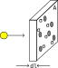
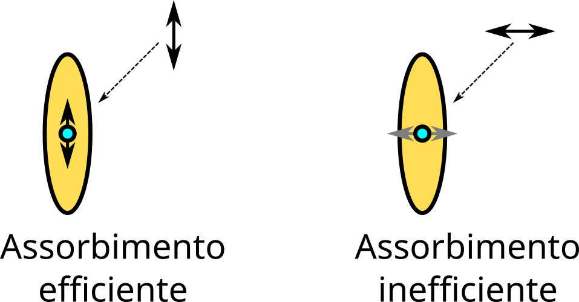

# The Interstellar Medium (ISM)

# The Galactic Plane

Evidence of the interstellar medium (ISM) is given by the presence of opaque regions on the galactic plane, with a thickness of $\sim 100\div500$ pc.

<center>{height=420px}</center>


# The Gaseous Disk

<center>{height=520px}</center>

<small>Adapted from B.\ Draine, *Physics of the interstellar and galactic medium*, Princeton University Press (2011).</small>

# Globules and nebulae

Il mezzo interstellare mostra addensamenti di materia la cui scala è circa $\sim 1$ pc («globuli» e «nubi»).

<center>{height=420px}</center>

<small>Barnard 68 («Black cloud»)</small>


# The Interstellar Medium

There are two reasons why the ISM is interesting:

1. It contains a significant portion of the Galaxy's mass ($10^{10}\,M_\odot$);
2. It is a site of star formation:
    \[
      \begin{aligned}
        t_\text{O-star} &< 1\,\text{Gyr},\\
        t_\text{Milky Way} \sim \max t_\text{gc} &\gtrsim
        10\,\text{Gyr}.
      \end{aligned}
    \]
    Therefore, the fact that we observe "O" stars in the Milky Way today implies that star formation is still ongoing.

# Baryons in the Mikly Way

<center>{height=520px}</center>

<small>Adapted from B.\ Draine, *Physics of the interstellar and galactic medium*, Princeton University Press (2011).</small>

# Components of the ISM

ISM includes everything in the Galaxy that lies between the stars. It is composed of:

1.  **Gas**;
2.  **Dust**;
3.  Cosmic rays;
4.  E.m. radiation (starlight, CMB, …);
5.  Interstellar magnetic field;
6.  Gravitational field;
7.  Dark matter.

Today we will only deal with **gas** and **dust**.


# The interstellar medium

Observation methods:

-   Dust:
    1.  Obscuration (in V band);
    2.  Direct emission (UV, IR, mm\ldots).
-   Gas: emission/absorption of lines.

# Flux Reduction

-   The flux of bright objects is reduced by the ISM through **scattering** and **absorption**:

    #.  Scattering changes the direction of propagation of the radiation

    #.  Absorption increases the temperature of the interstellar medium

    The two phenomena are collectively referred to as **extinction**.

-   The interstellar medium has highly variable densities: from 10⁻⁴ to 10⁺⁶ cm⁻³, but these are still very low values! (Air has a density of 10¹⁹ cm⁻³)

---

<center>

</center>

-   A photon traversing a thickness $\mathrm{d}l$ of ISM has a certain probability $p$ of interacting with its particles, being extinguished (scattered/absorbed).

-   If there are $N = n(l) \times A \times \mathrm{d}l$ particles in the thickness, then

    ```
    p = Nσλ / A = (n(l) A dl σλ) / A = n(l) σλ dl.
    ```

    (assuming that $\mathrm{d}l$ is so small that the particles do not eclipse each other).

# Extinction Equation

-   Given the probability $p$ of extinction, at a certain $\lambda$ the spectral radiance $I_\lambda$ ($[I_\lambda] = \text{W/m$^2$/Hz/sr}$) will be reduced due to extinction:

    ```
    dIλ = -p × Iλ = -n(l) σλ Iλ dl.
    ```

-   Solving the differential equation, we get

    ```
      Iλ(l) = I0 exp(-∫ n(l') dl' σλ) = I0 exp(-σλ ∫ n(l') dl') = I0 exp(-τλ(l)),
    ```

    and therefore the spectral radiance depends on the distance if there is extinction!


# Column Density

<center>

</center>

We define **column density** the quantity

\[
N_\text{col} = \int_0^l n(l')\,\mathrm{d}l',
\]
from which $[N_\text{col}] = \text{cm}^{-2}$. If $n(l)$ is constant, $N_\text{col} = n \times l$.


# Extinction Coefficient

-   The value $\tau_\lambda(L) = N_\text{col}\,\sigma_\lambda$ is called the **extinction coefficient**, and it is a dimensionless number.

-   Extinction is the combined effect of absorption and scattering. Their relative importance depends on the physical properties of the grains and on $\lambda$.

-   The *albedo* $a_{\lambda,\text{diff}}$ is defined as the fraction of extinction due to scattering:
    \[
    I_\lambda(l) = I_0 e^{-\tau_\lambda} = I_0 e^{-\tau_\lambda (a_{\lambda,\text{diff}} + a_{\lambda,\text{abs}})},
    \]
    with $a_{\lambda,\text{diff}} + a_{\lambda,\text{abs}} = 1$.


# Extinction and Magnitude

-   Switching from $I$ to flux $b$ ($[b] = \text{W/m$^2$}$), if the measured flux is lower due to extinction, it means that the magnitude **increases**:
    \[
    A_\lambda \equiv m'_\lambda - m_\lambda = 2.5\log_{10} \frac{b_0}{b_\lambda(l)} = 2.5\log_{10}e^{\tau_\lambda(l)} = 1.0857\,\tau_\lambda(l)
    \]

    ($A$ is sometimes called *total absorption*).

-   Therefore, the approximation
    \[
    A_\lambda \approx \tau_\lambda(l).
    \]
    can be used.

# ISM and Distance Measurement

-   In the presence of extinction $A$, in general we have
    \[
    \begin{aligned}
      m'_\lambda &= m_\lambda + A_\lambda \\
      &= M_\lambda + 5 \log_{10}\frac{d}{10\,\text{pc}} + A_\lambda
    \end{aligned}
    \]
    (the presence of $A_\lambda$ makes the star appear fainter).


-   Therefore, in the presence of extinction, knowing $M_\lambda$ is no longer sufficient to derive $d$!


# Extinction as a function of $\lambda$

The notation $A_\lambda$ suggests that extinction depends on wavelength.

<center>{height=500px}</center>


# Extinction as a function of $\lambda$

-   Around the visible spectrum, extinction is more intense if $\lambda$ is small (blue light).

-   This implies that the number of observed stars increases in the IR.

-   Furthermore, stars appear redder (*stellar reddening*). Let's see how the impact of reddening on the observation of a star's flux is quantified.


# Color Excess

-   We measure the color index of a star in two filters, e.g., B and V:
    \[
    \begin{aligned}
      m_V &= M_V + 5\log_{10}\frac{d}{10\,\text{pc}} + A_V, \\
      m_B &= M_B + 5\log_{10}\frac{d}{10\,\text{pc}} + A_B.
    \end{aligned}
    \]

-   From the difference between the two equations, we get
    \[
    m_B - m_V = (M_B - M_V) + (A_B - A_V).
    \]


# Color Excess

\[
m_B - m_V = (M_B - M_V) + (A_B - A_V).
\]

-   The value $m_B - m_V$ is measured directly.

-   The value $M_B - M_V$ is estimated from the spectral type.

-   The value $A_B - A_V$ can then be easily derived and is called **color excess**, or **reddening** (see Draine, *Physics of the interstellar and galactic medium*, p. 238).

-   Usually, $E(B - V)$ is written instead of $A_B - A_V$ ($E$ stands for *Excess*).


# Physics of Extinction

# Physics of Extinction
-   Recall the definition of $A_\lambda$:
    \[
    A_\lambda = 2.5\log_{10} e^{\tau_\lambda} \approx \tau_\lambda.
    \]

-   The *extinction coefficient* $\tau_\lambda$ is linked to the microscopic physics of the ISM:
    \[
    \tau_\lambda = \sigma_\lambda N_\text{col},
    \]
    where $N_\text{col}$ is the column density of the ISM between us and the observed object, $l$ is the thickness, and $\sigma_\lambda$ is the total cross section (absorption and scattering) at wavelength $\lambda$.


# Physics of Extinction

-   If $A \propto N_\text{col}$, this means that observing dust clouds of different sizes/densities leads to different values of $A$, even if $\sigma$ is the same.

-   If we want to study the dependence of extinction on $\lambda$, we use the (dimensionless) quantity
    \[
    f(\lambda) \equiv \frac{A_\lambda}{A_V} = \frac{\tau_\lambda}{\tau_V} = \frac{N_{\text{col}}\,\sigma_\lambda}{N_{\text{col}}\,\sigma_V} = \frac{\sigma_\lambda}{\sigma_V},
    \]

    and in this way the dependence on the column density disappears! ([The same was true for $R$](tomasi-astro2-lezione-03.html#/eccesso-di-colore-e-a_lambda)).


# Physics of Extinction

-   From the study of $f(\lambda)$ it is observed that:

    1.  In the visible/IR, $f(\lambda) \propto 1/\lambda \propto \nu$ (blue light is absorbed more);

    2.  There is a peak in the UV;

    3.  Structures are seen in the IR spectrum.

-   The shape of $f(\lambda)$ however also depends on the direction of observation (there's dust and dust!), especially in the UV.

---

<center>{height=660px}</center>
Note that the $x$ axis shows $1/\lambda$ instead of $\lambda$.

# Homework Exercise

A B-type star is observed with $m_B = 11.0\,\text{mag}$,
$m_V = 10.0\,\text{mag}$.


If for a B star, $M_V \approx -0.9$ and $M_B - M_V \approx -0.17$,
what is the value of $A_V$ and its distance? (Assume that $R = 3.1$).


[Solution: $A_V \approx 3.6$, $d \approx 280\,\text{pc}$].


# Dust in the Interstellar Medium

# Dust in the ISM

What is the typical size $r_g$ of dust grains?

-   If $r_g \gg \lambda$, geometric optics applies, and $A(\lambda)$ is constant;
-   If $r_g \ll \lambda$, then $\sigma \sim 0$ and therefore $A(\lambda)$ is small and constant;
-   If $r_g \sim \lambda$, then diffraction is important, and $A(\lambda)$ depends strongly on $\lambda$.


# Grain Size

Experimental evidence indicates that there are two types of dust grains:

1.  **Large grains** (µm–mm) generate an IR spectrum. Spectral structures are observed at ~1÷10 µm, indicative of silicates (SiO, SiO₂) and ice (H₂O);
2.  **Small grains** (1–10 nm) generate extinction in the UV, and are aggregates of ~100 atoms (hydrocarbons, carbon, graphite).


# Dust in the ISM: Composition

<center>{height=450px}</center>

<small>B.\ Draine, *Physics of the interstellar and galactic medium*, Princeton University Press (2011).</small>


# Shape of Dust Grains

-   Hints on the shape of the grains come from **polarization** measurements.

-   The light from stars passing through the ISM is polarized. This is assumed to depend on the shape of the grains in the ISM, because HI, HII and He have spherical symmetry and cannot induce polarization.

-   The polarization of starlight on the galactic plane is greater if dust is present between us and the star.

---

<center>{height=660px}</center>

<small>Harwit, *Astrophysical concepts* (4th edition), pag.\ 426, Springer (2006)</small>


# Dust Grain Shape

-   Starlight in the galactic disk is preferentially polarized **parallel** to the plane

-   But stars in the vicinity of the Sun do not emit light as polarized as that observed → it is the ISM that causes the polarization

-   Thus, dust grains must absorb photons more or less easily depending on their polarization angle


# Dust Grain Shape

The most likely shape of the grains is an ellipsoid: in this way the electrons are free to respond to the external field $\vec E$ more in some directions than in others.

<center>{height=320px}</center>

Polarization is observed mainly in the visible, while it is absent in the UV (geometric optics!)


# Observations on Polarization

-   Average polarization level: $1\,\%\div2\,\%$;
-   Weak dependence on $\lambda$;
-   Dependence on $A_V$:
    -   If $A_V$ is small, the polarization is always low;
    -   If $A_V$ is large, the polarization can be anything.

    (Therefore, the presence of dust is **necessary but not sufficient** for polarization).

---
title: "Astrofisica Generale II — 3"
author: "Maurizio Tomasi ([maurizio.tomasi@unimi.it](mailto:maurizio.tomasi@unimi.it))"
date: "20 marzo 2025"
css:
- ./css/custom.css
...
