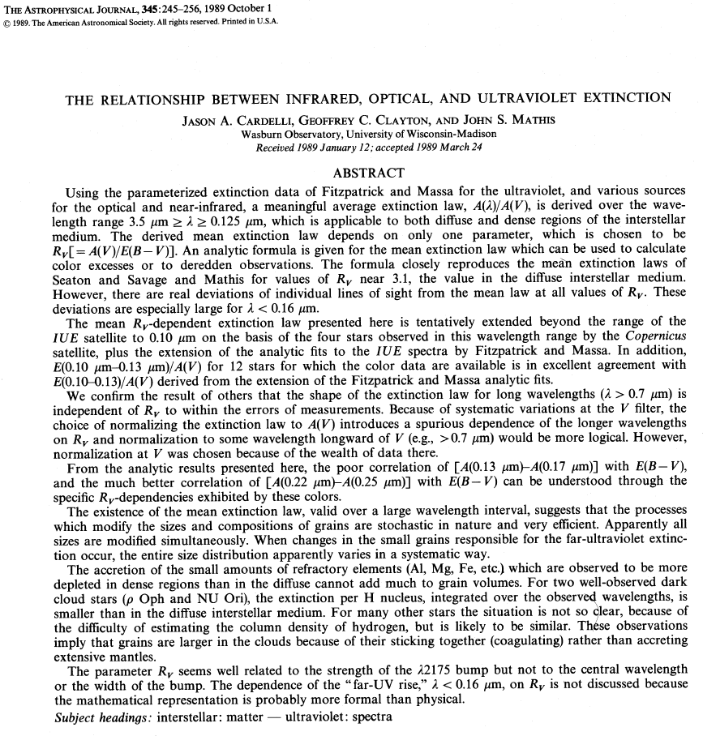
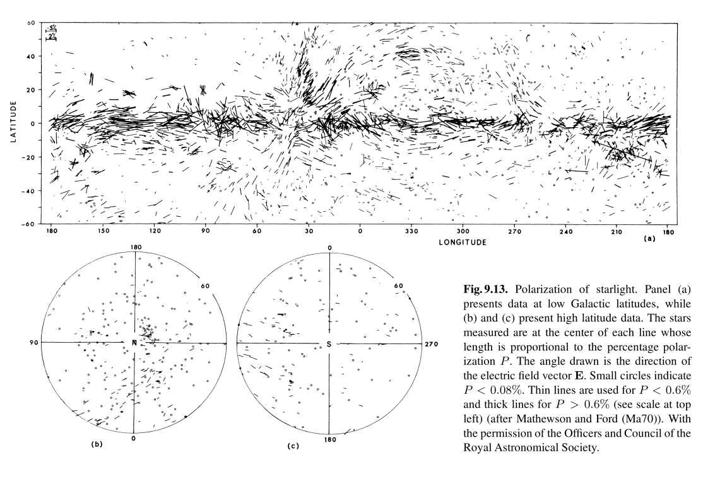

# Eccesso di colore

\[
m_V - m_B = (M_V - M_B) + (A_V - A_B).
\]

- Il valore $m_V - m_B$ è misurato direttamente.
- Il valore $M_V - M_B$ si stima dal tipo spettrale (le righe non sono influenzate dall'estinzione).
- Il valore $A_V - A_B$ si può quindi ricavare facilmente, ed è chiamato **eccesso di colore**, o **arrossamento** («reddening», vedi Draine, *Physics of the interstellar and galactic medium*, pag. 238).

# Assorbimento e diffusione

-   L'estinzione è l'effetto combinato di assorbimento e diffusione. La loro importanza relativa dipende dalle proprietà fisiche dei grani e da $\lambda$.

-   Si definisce *albedo* $a_{\lambda,\text{diff}}$ la frazione dell'estinzione dovuta alla diffusione:
    \[
    b(L) = b_0 \exp(-\tau) = b_0 \exp\bigl(-\tau (a_{\lambda,\text{diff}} + a_{\lambda,\text{ass}})\bigr),
    \]
    con
    \[
    a_{\lambda,\text{diff}} + a_{\lambda,\text{ass}} = 1.
    \]

# Nebulose a riflessione

Nelle **nebulose a riflessione** («reflection nebulae») si ha $a_{\lambda,\text{diff}} \sim 60\,\%$, e c'è una stella brillante nelle loro vicinanze (con spettro molto simile).

{height=400px}

<small>M78 (costellazione di Orione)</small>

# Fisica dell'estinzione

# Fisica dell'estinzione

-   Ricordiamo la definizione di A:
    \[
    A = 2.5\log_{10} e^\tau \approx \tau.
    \]

-   Il valore $\tau$ («coefficiente di estinzione) è uguale a
    \[
    \tau = \sigma n L,
    \]
    dove $L$ è lo spessore della nube, $n$ la densità numerica, e $\sigma$ la sezione d'urto totale (assorbimento e diffusione), nell'ipotesi che $\sigma$ sia piccola: quest'ultimo è il parametro che rivela la natura dell'estinzione!

# Fisica dell'estinzione

-   Si ha quindi che
    \[
    A \propto n\, L \equiv N_\text{col},
    \]
    dove $N_\text{col}$ è detta **densità colonnare**: l'estinzione è il risultato di un integrale lungo la linea di vista.

-   Vale che
    \[
    [N_\text{col}] = \text{cm}^{-2}.
    \]

# Fisica dell'estinzione

-   Se $A \propto N_\text{col}$, ciò vuol dire che osservare nubi di polvere di diverse dimensioni/densità porta a valori diversi di $A$, anche se $\sigma$ è la stessa.

-   Se si vuole studiare la dipendenza dell'estinzione da $\lambda$, si usa la quantità (numero puro)
    \[
    f(\lambda) \equiv \frac{A(\lambda)}{A_V},
    \]

    perché in questo modo la dipendenza dalla densità colonnare scompare: $f(\lambda) \approx \sigma(\lambda) / \sigma_V$.

# Fisica dell'estinzione

Dallo studio di $f(\lambda)$ si osserva che:

#.  Nel visibile/IR, $f(\lambda) \propto 1/\lambda \propto \nu$ (la luce blu viene assorbita maggiormente);
#.  C'è un picco nell'UV;
#.  Si vedono strutture nello spettro dell'IR.

La forma di $f(\lambda)$ dipende comunque anche dalla direzione di
osservazione (c'è polvere e polvere!), soprattutto nell'UV.

# Estinzione in funzione di $\lambda$

Si definisce **rapporto di estinzione** la quantità
\[
R_V \equiv \frac{A_V}{A_B - A_V} = \frac{A_V}{E(B - V)} \approx 3.1,
\]
ricavabile stimando $A_V$ dai conteggi di stelle per $A_V$ e $E(B - V)$ dagli indici di colore. Come $f(\lambda)$, anche $R_V$ non dipende dalla densità colonnare; è legato soprattutto alla dimensione dei grani di polvere.

Il valore $R_V \approx 3.1$ è tipico, ma come $f(\lambda)$ può mostrare variazioni significative a seconda della regione osservata.

---

{height=660px}

---

{height=660px}

# Estinzione in funzione di $\lambda$

Se si ha una stima ragionevole di $R$, noto $A_B - A_V$ (facile)
posso stimare $A_V$:
\[
A_V \approx 3.1 (A_B - A_V),
\]
che è comodo in quei casi in cui il metodo dei conteggi per stimare
direttamente $A_V$ è di difficile applicazione.

Tutto ciò è fattibile senza conoscere la distanza $d$ della stella!

# Esercizio per casa

Una stella di tipo B viene osservata con $m_B = 11.0\,\text{mag}$,
$m_V = 10.0\,\text{mag}$.

Se per una stella B, $M_V \approx -0.9$ e $M_B - M_V \approx -0.17$,
qual è il valore di $A_V$ e la sua distanza? (Supporre che $R = 3.1$).

[Soluzione: $A_V \approx 3.6$, $d \approx 280\,\text{pc}$].

# Fisica dell'estinzione

{height=560px}

# Fisica dell'estinzione

{height=560px}

# Fisica dell'estinzione

{height=500px}

Notare che sull'asse $x$ c'è $1/\lambda$ anziché $\lambda$: perché?

# La polvere nel mezzo interstellare

# Polvere nel ISM

Ci chiediamo: qual è la dimensione tipica $r_g$ dei grani di polvere?

-   Se $r_g \gg \lambda$, vale l'ottica geometrica, e $A(\lambda)$ è costante;
-   Se $r_g \ll \lambda$, allora $\sigma \sim 0$ e dunque $A(\lambda)$ è piccolo e costante;
-   Se $r_g \sim \lambda$, allora la diffrazione è importante, e $A(\lambda)$ dipende fortemente da $\lambda$.

# Polvere nel ISM: dimensione dei grani

Esistono due tipi di grani di polvere:

#.  Grani grossi (µm–mm) generano uno spettro IR. Si osservano strutture spettrali a ~1÷10 µm, indicative di silicati (SiO, SiO₂) e ghiaccio (H₂O);
#.  Grani piccoli (1–10 nm) generano estinzione in UV, e sono aggregati di ~100 atomi (idrocarburi, carbonio, grafite).

# Polvere nel ISM: composizione

{height=450px}

<small>B.\ Draine, *Physics of the interstellar and galactic medium*, Princeton University Press (2011).</small>

# Forma dei grani di polvere

-   Indicazioni sulla forma dei grani vengono da misure di **polarizzazione**.

-   La luce delle stelle che attraversa lo ISM è polarizzata. Si suppone che questo dipenda dalla forma dei grani nel ISM, perché HI, HII ed He hanno simmetria sferica e non possono indurre polarizzazione.

-   La polarizzazione della luce di stelle sul piano galattico è maggiore se tra noi e la stella sono presenti polveri.

---

{height=660px}

<small>Harwit, *Astrophysical concepts* (4th edition), pag.\ 426, Springer (2006)</small>
