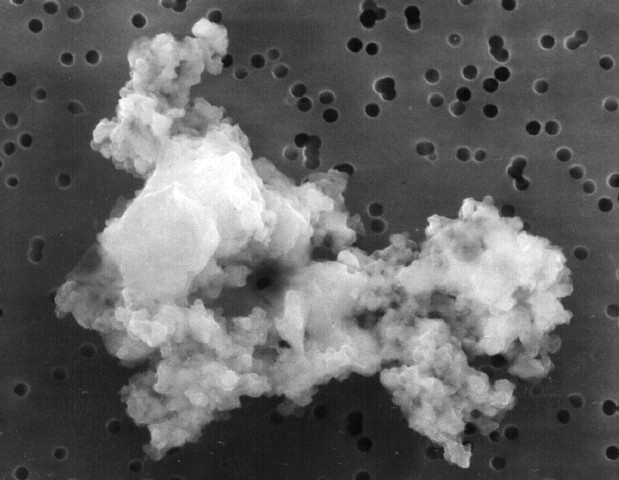

# Characteristics of Dust in the ISM

# Shape of Dust Grains

-   Yesterday we saw that polarization suggests that the grains do not have spherical symmetry

-   Can we get a more precise idea of their shape?


# Shape of Dust Grains

Interplanetary dust particles can be captured by
[aircraft flying in the upper atmosphere](https://en.wikipedia.org/wiki/Lockheed_U-2).

<table>
  <tr>
    <td>{height=400px}</td>
    <td>{height=400px}</td>
  </tr>
</table>


# Shape of Dust Grains

Dust grains (a) can collide with each other and aggregate into more complex structures (b).

<center></center>


# Electric Charge of Grains

-   The interaction of grains with electromagnetic fields indicates that they are not electrically neutral (but the ISM is globally!).

-   There are two mechanisms that allow charge to accumulate on the grains:

    #.  "Slow" free electrons attach to the grain surface;
    #.  Photoelectric effect caused by UV photons (not very important if $A_V$ is large, because in that case the dust shields the photons).

-   Let's now consider the first case.


# Electric Charge of Grains

<center>{height=360px}</center>

To attach to the grain, the kinetic energy of the electron must be greater than the Coulomb potential of the grain (with $r_g$ about 1µm). In this case, $T$ is the temperature of the grain cloud.


# Electric Charge of Grains

-   The calculation is not very different from the one for the [collision radius for globular clusters](tomasi-astro2-lezione-02.html#/tempo-di-rilassamento-3): we study when the potential energy is equal to the kinetic energy:

    ```
    \begin{aligned}
      \frac{N e^2}{4\pi\epsilon_0 r_g} &= \frac32 k_B T,\quad\text{from which} \\
      N &= 6\pi\epsilon_0 k_B T \frac{r_g}{e^2} \approx 1.
    \end{aligned}
    ```

-   The high-velocity tail in the Boltzmann distribution for free electrons leads to $N \sim 10$.


# Grain Temperature

-   Let's now estimate the average temperature of a *single* dust grain. We can assume that they are heated by nearby stars.

-   Suppose a grain is at a distance $d$ from a star with radius $R$ and temperature $T$, and that the star's luminosity is
    ```
    L = 4\pi R^2 \sigma T^4
    ```
    (spherically symmetric black body).

# Grain Temperature

-   The fraction of power hitting the grain is
    ```
    f = \frac{\pi r^2_g}{4\pi d^2} = \frac14\,\left(\frac{r_g}{d}\right)^2.
    ```

-   If the grain has albedo $a$, it absorbs a power
    ```
    P_\text{abs} = f\,L\,(1 - a) = (1 - a) r_g^2 \sigma T^4 \left(\frac{\pi R^2}{d^2}\right),
    ```
    where $\pi R^2/d^2 \equiv \Omega_*$ is the solid angle of the star as seen from the grain.


# Grain Temperature

-   To calculate the grain's temperature at thermal equilibrium, we must also consider the power released by the grain.

-   Let's assume it is spherical (horrible!), so that
    ```
      P_\text{rad} = 4\pi r_g^2 \sigma T_g^4,
    ```
    where we use the so-called **effective temperature** $T_g$, i.e., the temperature of a black body that would emit the same amount of energy as the grain.


# Grain Temperature

If the dust has reached the equilibrium temperature $T_g$, the emitted power must equal the absorbed power:
```
\begin{aligned}
  P_\text{rad} &= P_\text{abs} \\
  4\pi r_g^2 \sigma T_g^4 &= (1 - a) r_g^2 \sigma T^4
  \left(\frac{\pi R^2}{d^2}\right) \\
  T_g &= T (1 - a)^{1/4} \sqrt{\frac{R}{2d}}.
\end{aligned}
```


# Grain Temperature

-   The formula
    ```
    T_g = T (1 - a)^{1/4} \sqrt{\frac{R}{2d}}
    ```
    shows that the dust temperature does not depend on the size of the grains.

-   This is the temperature of a *single* dust grain, but we can assume that at equilibrium it coincides with the temperature of the radiation emitted by the entire cloud of grains.


# Grain Temperature

-   In star-forming regions, the distances between cloud and star are on the order of a few AU ($\sim 10^{11}\,\text{m}$), so $d/R \sim 10^3\div 10^4$ and therefore $T_g \sim 10^{-2} T_*$.

-   If $T_* = 10\,000\,\text{K}$, then
    ```
    T_g \sim 100\,\text{K}.
    ```

-   From Wien's law ($\lambda_\text{max} T = 0.29\,\text{cm\,K}$) we deduce that the peak of the emission is:

    1.  30 µm (IR) if $T = 100\,\text{K}$;
    2.  0.3 mm (sub-mm) if $T = 10\,\text{K}$.


# Interstellar Dust

<center>{height=560px}</center>

<small>Li, A. \& Draine, B. T. 2001, Astrophys. J., 554, 778–802</small>


# Observations from Space

<center>{height=540px}</center>

---

<center>{height=540px}</center>

IRAS (Infrared Astronomical Satellite), 25/1/1983: First IR survey (12, 25, 60, 100 µm) of the whole sky. Geocentric orbit ($h \approx 900\,\text{km}$).

---

<center>{height=540px}</center>
ISO (Infrared Space Observatory), 17/11/1995. Highly eccentric orbit (1000 km $\div$ 70 000 km).


# Eccentric orbits

- At apogee (maximum distance from Earth) the satellite moves very slowly: it is easier to make long observations
- The radiation belts are significant near perigee (minimum distance from Earth): ISO used to switch off its instruments for 7 hours each day.

<center>{height=400px}</center>

---

<center>{height=500px}</center>

Spitzer Space Telescope (USA), 25/8/2003. Heliocentric orbit ([IRrelevant astronomy](https://www.youtube.com/playlist?list=PL9C8F3F2E3FE9F137))

---

<center>{height=500px}</center>

Herschel (ESA), 14/5/2009. Heliocentric orbit around $L_2$ ($d = 1.5\times10^9\,\text{m}$).

---

<center>{height=500px}</center>

Planck (ESA), 14/5/2009. Heliocentric orbit around $L_2$ ($d = 1.5\times10^9\,\text{m}$). Mostly mm, but up to 350 µm.

---

<center>{height=660px}</center>


# Grain Properties: Summary

| Characteristic | Source                               | Result                                                    |
|-----------------|---------------------------------------|------------------------------------------------------------|
| Shape           | Star polarization, interplanetary dust | Asymmetric                                                |
| Size            | Trend of $A(\lambda)$                 | $\text{nm} < r_g < \mu\text{m}$                            |
| Composition    | Spectrum, shape of $A(\lambda)$      | Silicates, carbonates, ice, ferrite, hydrocarbons        |
| Electric charge | Star polarization, energy conservation | $N = \frac32 k_B T \frac{r_g}{e^2} \sim 10$                |
| Temperature     | Illumination from stars               | $T_g = T_* \sqrt{\frac{R}{2d}} \sim 10\div 100\,\text{K}$ |


# Grain Rotation and Anomalous Emission

# Grain Rotation

Why do grains tend to align their rotation axis?

<center>{height=400px}</center>

<small>Harwit, *Astrophysical concepts* (4th edition), Springer (2006)</small>

::: notes
a. *Paramagnetic relaxation*, explained in the next slide.
b. Collision with particles.
c. Collision with photons.
d. Angular momentum transfer from photons.
:::
# Grain Rotation

-   If the grain is paramagnetic, the Galactic field $\vec B_\text{Gal}$ induces a magnetic moment $\vec \mu_B \propto \vec B_\text{Gal}$ parallel to it, which causes a mechanical torque $\vec\tau = \vec\mu_B \times \vec B_\mathrm{Gal}$. Then:

    #.  If the grain rotates as in case *a* of the previous figure, the rotation leads $\vec B_\text{Gal}$ and $\vec \mu_B$ to misalign. To realign, $\vec \mu_B$ induces an opposing torque.

    #.  If the rotation axis is parallel to $\vec B_\text{Gal}$, there is no torque.

-   Therefore, the rotation axis tends to align with $\vec B_\text{Gal}$ (**paramagnetic relaxation**).


# Anomalous Emission

-   In 1995, Kogut *et al.* published a paper measuring the correlation between the sky emission at 140 µm (measured by COBE-DIRBE) and at 31.5 GHz (measured by COBE-DMR).

-   These studies sought to characterize the relative contribution of different emissions around the microwave region, in order to better isolate the CMB signal (which we will see in more detail in the last part of the course).

---

<center>
  <table>
    <tr>
      <td>{height=540px}</td>
      <td>{height=540px}</td>
    </tr>
  </table>
</center>

(The correlation is between the 31.5 GHz map and the 140 µm map).

# Emission types

<center>{height=540px}</center>

# Origin of the Correlation

-   The synchrotron signal is generated by cosmic rays, which should not be correlated with dust.

-   Yet this is what is observed! Three possibilities:

    #. Dust also emits at synchrotron frequencies;
    #. Cosmic rays also emit at dust frequencies;
    #. Something else (what?) emits at both synchrotron and dust frequencies.

# Rotating Grains

-   In 1998, A. Lazarian and B. T. Draine proposed that the grains of polycyclic aromatic hydrocarbons (PAHs) emit in the spectral region around 30 GHz, due to their rotation.

-   The physical model is simple, even if the details are extremely complicated!

# Rotating Grains

-   Suppose that the grains have an electric dipole moment $\vec \mu = q \vec r$ and that they are rotating with angular velocity $\omega$
-   We then expect them to emit photons with frequency $\nu = \omega/2\pi$.
-   If the grains are in thermal equilibrium, have angular momentum $L \gg h$ and are set in rotation mainly by collisions, then
    \[
    \frac12 I \left<\omega^2\right> \approx \frac32 k_B T, \qquad
    \text{with } I =
    \frac25 M a^2 = \frac8{15} \pi \rho a^5.
    \]

# Caveats

-   The assumption that all the collision energy is converted into rotational energy is an approximation: in reality it is estimated that part of the energy (10–20 %) is converted into vibrational modes.
-   The assumption that the angular momentum $L$ is much greater than $h$ allows the use of classical physics, where the angular momentum is not quantized: this is always true, because the smallest grains have $L/h \sim 70$.

# Rotating Grains

The solution can be written in this form:
\[
\begin{aligned}
  \nu = \frac{\sqrt{\left<\omega^2\right>}}{2\pi} =
  &32\,\text{GHz}\times\left(\frac{T}{100\,\text{K}}\right)^{1/2}\times \\
  &\times\left(\frac{2\,\text{g/cm}^3}\rho\right)^{1/2}\times\left(\frac{5\,\text{\AA}}a\right)^{5/2}.
\end{aligned}
\]

(Only grains with $a \lesssim 10\,\text{\AA}$ contribute to this emission, see Fig. 7 of Draine & Lazarian, 1998).
The predicted emission peak is around 30 GHz: encouraging!

# Rotating Grains

For a realistic model, other effects must also be taken into account:

#. Ion collisions (Coulomb forces);
#. Coupling between $\vec \mu$ and the electromagnetic field;
#. Absorption/emission of photons (due to their angular momentum);
#. H₂ formation;
#. Etc.


# Rotating Grains

-   A more detailed model predicts that
    \[
    \left<\omega^2\right> \lesssim 3 k_B \frac{T}I.
    \]
    The result is still that the predicted spectrum has an emission peak around a few tens of GHz.

-   Obviously, detailed models also estimate the **intensity**, in order to compare it with the measured one. (A complete model must therefore take into account the average surface of the grains, their emissivity, their shape, etc.)

---

<center>{height=640px}</center>

---

<center>{height=640px}</center>

---

<center>{height=640px}</center>

---

<center>{height=540px}</center>

See [*The continuing mistery of the Anomalous Microwave Emission*](https://www.youtube.com/watch?v=mkpuUoZf2F8), a 2015 talk by B. Draine.


# Anomalous Emission

<center>{height=520px}</center>

---
title: "Astrofisica Generale II — 4"
author: "Maurizio Tomasi ([maurizio.tomasi@unimi.it](mailto:maurizio.tomasi@unimi.it))"
date: "21 marzo 2025"
css:
- ./css/custom.css
...
