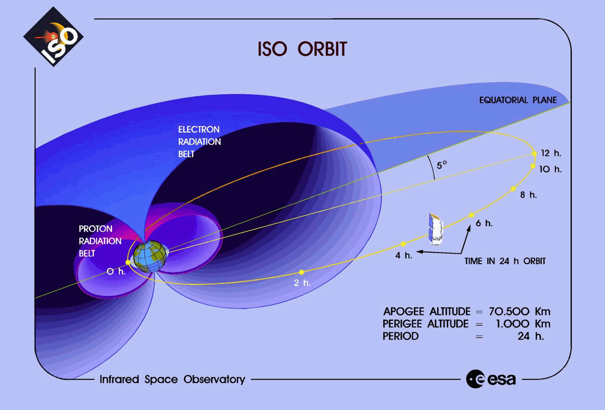

# La polvere nel mezzo interstellare

---

{height=660px}

<small>Harwit, *Astrophysical concepts* (4th edition), pag.\ 426, Springer (2006)</small>

# Forma dei grani di polvere

-   La luce delle stelle nel disco galattico è preferenzialmente polarizzata **parallelamente** al piano

-   Ma le stelle nelle vicinanze del Sole non emettono luce così polarizzata come quella che si osserva → è l'ISM che causa la polarizzazione

-   Questo implica che i grani di polvere devono assorbire più o meno facilmente i fotoni a seconda del loro angolo di polarizzazione

# Forma dei grani di polvere

La forma più probabile dei grani è un ellissoide: in questo modo gli elettroni sono liberi di rispondere al campo $\vec E$ esterno più in alcune direzioni che in altre.

{height=320px}

La polarizzazione si osserva soprattutto nel visibile, mentre è assente nell'UV (ottica geometrica!)

# Forma dei grani di polvere

I grani di polvere (a) possono collidere tra loro e aggregarsi in strutture più complesse (b).

# Forma dei grani di polvere

Particelle di polvere interplanetaria possono essere catturate da
[aerei che volano nell'alta atmosfera](https://en.wikipedia.org/wiki/Lockheed_U-2).

<table>
  <tr>
    <td>{height=400px}</td>
    <td>{height=400px}</td>
  </tr>
</table>

# Osservazioni sulla polarizzazione

-   Livello medio di polarizzazione: $1\,\%\div2\,\%$;
-   Debole dipendenza da $\lambda$;
-   Dipendenza da $A_V$:
    -   Se $A_V$ è piccolo, la polarizzazione è sempre bassa;
    -   Se $A_V$ è grande, la polarizzazione può essere qualunque.

    (Di conseguenza, la presenza di polvere è **necessaria ma non sufficiente** per avere polarizzazione).

# Carica elettrica dei grani

-   L'interazione dei grani con campi elettromagnetici indica che non sono elettricamente neutri (ma globalmente ISM sì!).

-   Ci sono due meccanismi che permettono di accumulare carica sui grani:

    #.  Elettroni liberi «lenti» si fissano sulla superficie del grano;
    #.  Effetto fotoelettrico causato da fotoni UV (poco importante se $A_V$ è grande, perché in tal caso la polvere scherma i fotoni).

-   Consideriamo ora il primo caso.

# Carica elettrica dei grani

{height=360px}

Per fissarsi al grano, l'energia cinetica dell'elettrone deve essere
maggiore del potenziale Coulombiano del grano (con
$r_g$ circa 1µm). In questo caso, $T$ è la temperatura della nube
di grani.

# Carica elettrica dei grani

Il conto non è molto diverso da quello del raggio collisionale per
gli ammassi globulari: studiamo quando l'energia potenziale è uguale
all'energia cinetica.

\[
\begin{aligned}
  \frac{N e^2}{4\pi\epsilon_0 r_g} &= \frac32 k_B T,\quad\text{da cui} \\
  N &= 6\pi\epsilon_0 k_B T \frac{r_g}{e^2} \approx 1.
\end{aligned}
\]

Ma la coda ad alta velocità nella distribuzione di Boltzmann per gli
$e$ liberi porta a $N \sim 10$.

# Temperatura dei grani

-   Stimiamo ora la temperatura media del *singolo* grano di polvere. Possiamo supporre che essi siano scaldati da stelle vicine.

-   Supponiamo che un grano sia a una distanza $d$ da una stella con raggio $R$ e temperatura $T$, e che la luminosità della stella sia
    \[
    L = 4\pi R^2 \sigma T^4
    \]
    (corpo nero a simmetria sferica).

# Temperatura dei grani

-   La frazione di potenza che colpisce il grano è
    \[
    f = \frac{\pi r^2_g}{4\pi d^2} = \frac14\,\left(\frac{r_g}{d}\right)^2.
    \]

-   Se il grano ha albedo $a$, assorbe una potenza
    \[
    P_\text{abs} = f\,L\,(1 - a) = (1 - a) r_g^2 \sigma T^4 \left(\frac{\pi R^2}{d^2}\right),
    \]
    dove $\pi R^2/d^2 \equiv \Omega_*$ è l'angolo solido della stella visto dal grano.

# Temperatura dei grani

-   Per calcolare la temperatura del grano all'equilibrio termico, dobbiamo considerare anche la potenza rilasciata dal grano

-   Assumiamo che sia sferico (orrore!), così che
    \[
      P_\text{rad} = 4\pi r_g^2 \sigma T_g^4,
    \]
    dove usiamo la cosiddetta **temperatura effettiva** $T_g$, ossia la temperatura di un corpo nero che emetterebbe la stessa quantità di energia del grano.

# Temperatura dei grani

Se la polvere ha raggiunto la temperatura $T_g$ di equilibrio, la potenza emessa deve uguagliare quella assorbita:
\[
\begin{aligned}
  P_\text{rad} &= P_\text{abs} \\
  4\pi r_g^2 \sigma T_g^4 &= (1 - a) r_g^2 \sigma T^4
  \left(\frac{\pi R^2}{d^2}\right) \\
  T_g &= T (1 - a)^{1/4} \sqrt{\frac{R}{2d}}.
\end{aligned}
\]

# Temperatura dei grani

-   La formula
    \[
    T_g = T (1 - a)^{1/4} \sqrt{\frac{R}{2d}}
    \]
    mostra che la temperatura della polvere non dipende dalla dimensione dei grani.

-   Questa è la temperatura del **singolo** grano di polvere, ma possiamo assumere che all'equilibrio coincida con la temperatura della radiazione emessa dall'intera nube di grani.

# Temperatura dei grani

-   Nelle regioni di formazione stellare, le distanze tra nube e stella sono dell'ordine di qualche AU ($\sim 10^{11}\,\text{m}$), così $d/R \sim 10^3\div 10^4$ e quindi $T_g \sim 10^{-2} T_*$.

-   Se $T_* = 10\,000\,\text{K}$, allora
    \[
    T_g \sim 100\,\text{K}.
    \]

-   Dalla legge di Wien ($\lambda_\text{max} T = 0.29\,\text{cm\,K}$) si deduce che il picco dell'emissione è:

    #.  30 µm (IR) se $T = 100\,\text{K}$;
    #.  0.3 mm (sub-mm) se $T = 10\,\text{K}$.

# Polvere interstellare

{height=560px}

<small>Li, A. \& Draine, B. T. 2001, Astrophys. J., 554, 778–802</small>

# Osservazioni dallo spazio

{height=540px}

---

{height=540px}

IRAS (Infrared Astronomical Satellite), 25/1/1983: Prima survey in IR (12, 25, 60 e 100 µm) dell'intero cielo. Orbita geocentrica ($h \approx 900\,\text{km}$).

---

{height=540px}

ISO (Infrared Space Observatory), 17/11/1995. Orbita molto eccentrica (1000 km $\div$ 70 000 km).

# Uso di orbite eccentriche

- All'apogeo (massima distanza dalla Terra) il satellite si muove molto lentamente: più facile fare lunghe osservazioni
- Le fasce di radiazione sono importanti vicino al perigeo (minima distanza dalla Terra): ISO spegneva gli strumenti 7 ore ogni giorno.

{height=400px}

---

{height=500px}

Spitzer Space Telescope (USA), 25/8/2003. Orbita eliocentrica ([IRrelevant astronomy](http://coolcosmos.ipac.caltech.edu/videos/irrelevant/))

---

{height=500px}

Herschel (ESA), 14/5/2009. Orbita eliocentrica su $L_2$ ($d = 1.5\times10^9\,\text{m}$).

---

{height=500px}

Planck (ESA), 14/5/2009. Orbita eliocentrica su $L_2$ ($d = 1.5\times10^9\,\text{m}$). Principalmente mm, ma canali fino a 350 µm.

---

{height=660px}

# Proprietà dei grani: riassunto

| Caratteristica   | Fonte                                          | Risultato                                                 |
|------------------|------------------------------------------------|-----------------------------------------------------------|
| Forma            | Polarizzazione stelle, polvere interplanetaria | Asimmetrica                                               |
| Dimensione       | Andamento di $A(\lambda)$                      | $\text{nm} < r_g < \mu\text{m}$                           |
| Composizione     | Spettro, forma di $A(\lambda)$                 | Silicati, carbonati, ghiaccio, ferrite, idrocarburi       |
| Carica elettrica | Polarizzazione stelle, conservazione energia   | $N = \frac32 k_B T \frac{r_g}{e^2} \sim 10$               |
| Temperatura      | Illuminazione da stelle                        | $T_g = T_* \sqrt{\frac{R}{2d}} \sim 10\div 100\,\text{K}$ |

# Rotazione dei grani ed emissione anomala

# Rotazione dei grani

Perché i grani tendono ad allineare il loro asse di rotazione?

{height=400px}

<small>Harwit, *Astrophysical concepts* (4th edition), Springer (2006)</small>

::: notes
a.  *Rilassamento paramagnetico*, si spiega nella slide successiva.
b.  Urto con particelle.
c.  Urto con fotoni.
d.  Trasferimento di momento angolare da fotoni.
:::

# Rotazione dei grani

-   Se il grano è paramagnetico, il campo Galattico $\vec B_\text{Gal}$ induce un momento magnetico $\vec \mu_B \propto \vec B_\text{Gal}$ parallelo a questo, che causa un momento meccanico $\vec\tau = \vec\mu_B \times \vec B_\mathrm{Gal}$. Allora:

    #.  Se il grano ruota come nel caso *a* della fig. precedente, la rotazione porta $\vec B_\text{Gal}$ e $\vec \mu_B$ a disallinearsi. Per riallinearsi, $\vec \mu_B$ induce un momento torcente in opposizione.

    #.  Se l'asse di rotazione è parallelo a $\vec B_\text{Gal}$, non c'è momento torcente.

-   Quindi l'asse di rotazione tende ad allinearsi con $\vec B_\text{Gal}$ (**rilassamento paramagnetico**).

# Emissione anomala

-   Nel 1995, Kogut *et al.* pubblicarono un articolo in cui si misurava la correlazione tra l'emissione del cielo a 140 µm (misurata da COBE-DIRBE) e a 31.5 GHz (misurata da COBE-DMR).

-   Questi studi cercavano di caratterizzare il contributo relativo di diverse emissioni intorno alla regione delle microonde, in modo da isolare meglio il segnale della CMB (che vedremo meglio nell'ultima parte del corso).

---

  <table>
    <tr>
      <td>{height=540px}</td>
      <td>{height=540px}</td>
    </tr>
  </table>

(La correlazione si ha tra la mappa a 31.5 GHz e la mappa a 140 µm).

# Tipi di emissione

{height=540px}

# Origine della correlazione

-   Il segnale di sincrotrone viene generato dai raggi cosmici, che non dovrebbero essere correlati con la polvere.

-   Eppure questo è ciò che si osserva! Tre possibilità:

    #. La polvere emette anche alle frequenze del sincrotrone;
    #. I raggi cosmici emettono anche alle frequenze della polvere;
    #. Qualcos'altro (cosa?) emette sia alle frequenze del sincrotrone che della polvere.

# Grani in rotazione

-   Una spiegazione proposta nel 1998 da A. Lazarian e B. T. Draine è che siano i grani degli idrocarburi aromatici policiclici (PAH) a emettere nella regione spettrale intorno ai 30 GHz, a causa della loro rotazione.

-   Il modello fisico è semplice, anche se i dettagli sono estremamente complicati!

# Grani in rotazione

-   Supponiamo che i grani abbiano un momento elettrico di dipolo $\vec \mu = q \vec r$ e che siano in rotazione con velocità angolare $\omega$
-   Ci aspettiamo allora che emettano fotoni con frequenza $\nu = \omega/2\pi$.
-   Se i grani sono in equilibrio termico, abbiano momento angolare $L \gg h$ e siano messi in rotazione principalmente da urti, allora
    \[
    \frac12 I \left<\omega^2\right> \approx \frac32 k_B T, \qquad
    \text{con } I =
    \frac25 M a^2 = \frac8{15} \pi \rho a^5.
    \]

# Avvertenze

-   L'ipotesi che tutta l'energia dell'urto sia convertita in energia rotazionale è un'approssimazione: in realtà si stima che parte dell'energia (10–20 %) venga convertita in modi vibrazionali.
-   L'ipotesi che il momento angolare $L$ sia molto maggiore di $h$ consente di usare la fisica classica, dove il momento angolare non è quantizzato: questo è sempre vero, perché i grani più piccoli hanno $L/h \sim 70$.

# Grani in rotazione

La soluzione si può scrivere in questa forma:
\[
\begin{aligned}
  \nu = \frac{\sqrt{\left<\omega^2\right>}}{2\pi} =
  &32\,\text{GHz}\times\left(\frac{T}{100\,\text{K}}\right)^{1/2}\times \\
  &\times\left(\frac{2\,\text{g/cm}^3}\rho\right)^{1/2}\times\left(\frac{5\,\text{\AA}}a\right)^{5/2}.
\end{aligned}
\]

(Ci sono evidenze che dicono che solo i grani piccoli, con $a \lesssim 10\,\text{\AA}$, contribuiscono a questa emissione).
Il fatto che il picco di emissione previsto sia intorno ai 30 GHz mostra che
questa è la strada giusta!

(Vedi Fig. 7 di Draine \& Lazarian (1998) per capire perché solo i grani piccoli contribuiscono alla AME).

# Grani in rotazione

Per avere un modello realistico, bisogna anche tenere conto di altri effetti:

#.  Collisioni con ioni (forze Coulombiane);
#.  Accoppiamento tra $\vec \mu$ e e il campo elettromagnetico;
#.  Assorbimento/emissione di fotoni (a causa del loro momento angolare);
#.  Formazione di H₂;
#.  Etc.

# Grani in rotazione

-   Un modello più dettagliato prevede che
    \[
    \left<\omega^2\right> \lesssim 3 k_B \frac{T}I.
    \]
    Il risultato è comunque che lo spettro previsto ha un picco di emissione intorno a qualche decina di GHz.

-   Ovviamente, i modelli dettagliati stimano anche l'**intensità**, in modo da paragonarla con quella misurata. (Un modello completo deve quindi tenere conto della superficie media dei grani, della loro emissività, della loro forma, etc.)

---

{height=640px}

---

{height=640px}

---

{height=640px}

---

{height=540px}

[*The continuing mistery of the Anomalous Microwave Emission*](https://www.youtube.com/watch?v=mkpuUoZf2F8) è un seminario tenuto da B. Draine nel 2015, molto chiaro ed interessante.

# Emissione anomala

{height=520px}

---
title: "Lezione di Astronomia II – 4"
author: "Maurizio Tomasi ([maurizio.tomasi@unimi.it](mailto:maurizio.tomasi@unimi.it))"
date: "5 aprile 2024"
css:
- ./css/custom.css
...
