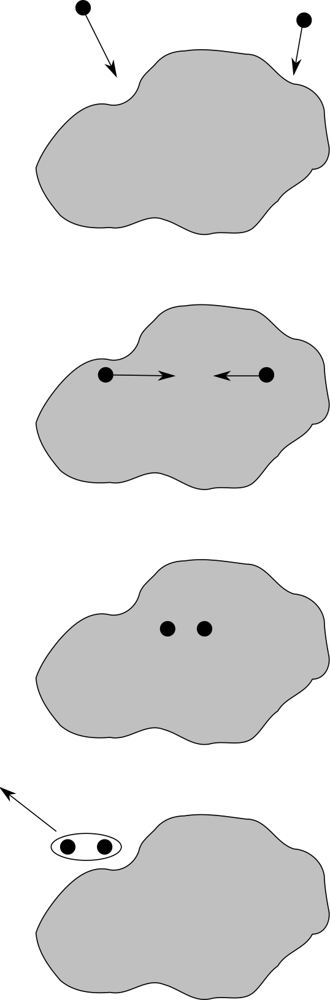
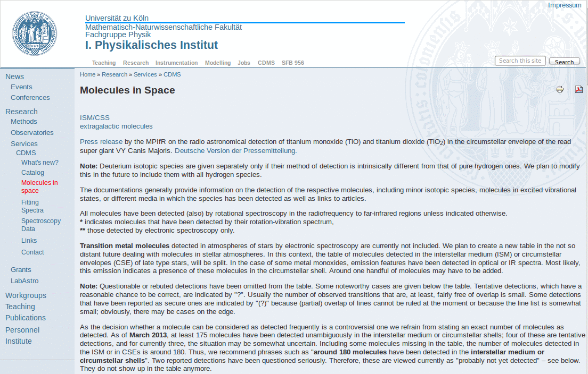
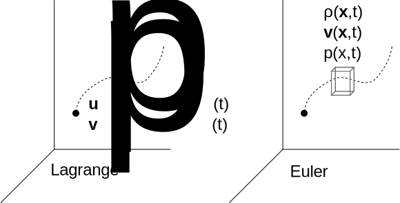

# Interstellar Gas (ISG)

# Interstellar Gas (ISG)

In the 1930s, astronomers observed stellar spectra with weird optical absorption lines:

1. In binary systems, they do not show the Doppler effect;

2. They are more pronounced for more distant stars;

3. They are much narrower than stellar ones (→ $T \sim 100\,\text{K}$).

# Interstellar Gas (ISG)

-   Interstellar H is not observed in the visible spectrum: if $T$ is low, Balmer’s lines are too weak!

-   The observed elements are Ca and Na, but also molecules: CH, CN, CH⁺. The latter imply a low gas density ($n < 10^3\,\text{cm}^{-3}$) and a low temperature:

    -   Charged molecules like CH⁺ neutralize quickly in laboratory conditions;

    -   CH and CN are highly reactive.

::: notes

To excite a Balmer line, ~1 eV is required, but the energies involved for $T \sim 100$ K are 100 times lower.

:::

# HI in ISG

-   It is reasonable to expect that H, even if not detectable in the visible spectrum, is the predominant component of the ISG. It can be revealed by measuring the 21 cm line.

-   This line is generated by the transition between the state of the HI atom with $e$/$p$ spins parallel to the state with antiparallel spins. The two states have an energy difference of
    \[
    \Delta E = 5.9\times 10^{-6}\,\text{eV},
    \]
    and the transition probability is $A = (11\,\text{Myr})^{-1}$ so that $N = N_0 e^{A t}$.

# Triplet/singlet states

The spin-parallel state ($s = 1$) is such that
\[
S = \sqrt2 \hbar,\quad S_z =
\begin{cases}
  +\hbar/2, \\
  0, \\
  -\hbar/2
\end{cases}
\qquad \text{(triplet),}
\]
while for the anti-parallel state ($s = 0$)
\[
S = 0,\quad S_z = 0 \qquad\text{(singlet)}.
\]

# HI in ISG

{height=240px}

The temperature associated with this radiation is
\[
T_{21\,\text{cm}} \sim \frac{\Delta E}{k_B} = \frac{5.9\times
  10^{-6}\,\text{eV}}{8.62\times 10^{-5}\,\text{eV/K}} \approx 0.07\,\text{K}.
\]
The CMB (2.7 K) is enough to populate the state with parallel spins!

::: notes

Question for the students: if CMB is $2.7\,\mathrm{K}\gg0.07\,\mathrm{K}$, does this mean that all the HI atoms are in the triplet state?

:::

---

-   If we assume that the gas is in thermal equilibrium and that the kinetic gas theory is valid (so we ignore the CMB and the fact that HI is not point-like), then we can use Maxwell’s distribution:
    \[
    \frac{N_\text{tr}}{N_\text{sing}} = \frac{g_\text{tr}}{g_\text{sing}}
    e^{-\Delta E/k_B T} = 3 e^{-\Delta E/k_B T}.
    \]

-   But if $k_B T \gg \Delta E$, then
    \[
    \frac{N_\text{tr}}{N_\text{sing}} = 3 e^{-\Delta E/k_B T} \approx 3.
    \]

-   At the typical temperature of the Universe (≥ 2.7 K), there are three triplet atoms every singlet atom.

# Importance of the 21 cm Line

-   The existence of this line was predicted in the '40 and revealed on March, 25th 1951 by Edwin Purcell’s team (Harvard Univ., Nobel 1953).

-   The characteristics of the line are:

    #.  Visible both in emission and absorption;
    #.  Insensitive to the presence of dust.

# Importance of the 21 cm Line

The 21-cm line has a wide range of applications:

-   Fundamental for the study of gas in the ISM;
-   Being insensitive to dust, it allows studying the structure of the Galaxy;
-   Galaxy rotation and local motions can be reconstructed from Doppler measurements on the line;
-   Study of ISM magnetic fields from the Zeeman effect on the line;
-   …and much more.

# Numerical Example

Suppose that a cloud of neutral H is located at a distance $d = 30\,\text{pc}$. The flux at 21 cm in emission, integrated over the solid angle, is
\[
f = 4.5\times 10^{-15}\,\text{erg\,cm$^{-2}$\,s$^{-1}$}.
\]

What is the mass of the hydrogen in the cloud?

# Solution

From the observed flux we can derive the total luminosity:
\[
L_\text{21\,cm} = 4\pi d^2 f = 4.85\times 10^{26}\,\text{erg\,s$^{-1}$}.
\]

# Solution

We expect the following formula to hold:
\[
L_\text{21\,cm} \approx \frac34 N_H\,A\,h\nu,
\]
where $A = \tau^{-1} = (11\,\text{Myr})^{-1}$ is the transition probability and the factor $3/4$ takes into account the population in the two spin states. Therefore
\[
N_H \approx 2.4 \times 10^{58}, \qquad M_H = N_H \times m_p \approx 20\,M_\odot.
\]

\note{It is an *emission* line, therefore it is a triplet→singlet transition, and the factor is 3/4.}

# Pioneer 10 (1972)

An interesting context in which the 21 cm line played an important role is the famous plaque installed on the Pioneer 10 probe, launched in 1972 by NASA to study Jupiter.

{height=400px}

::: notes

The mission observed Jupiter in 1973, after which it moved away from the Sun, crossing the orbit of Saturn in 1976, that of Uranus in 1979, and that of Neptune in 1983. The mission was declared complete in 1997, but the satellite continued to transmit until 2003 (although the signal was no longer decipherable), when the distance from Earth was 80 AU.

:::

---

{height=700px}

::: notes

At the top left is the hyperfine transition of hydrogen. The small vertical line below the transition represents the number 1 in binary. To the right of the woman, between the two brackets indicating height, is the number 8 in binary.  The average height of the woman is 8×21 cm = 168 cm. The 15 rays emanating from the Sun represent 15 pulsars. The binary numbers indicate the period (in units of the frequency of the 21 cm line): since these periods change over time, this allows the launch epoch to be deduced. The length of the lines indicates the relative distance. 15 were chosen instead of 3 (sufficient for triangulation) because where the plaque arrives, not all of them might be visible. The ticks below the planets indicate their relative distance from the Sun, in units of 1/10 the Mercury-Sun distance.

:::

# HI in ISM

| Quantity                                              | Estimate                                                   |
|-------------------------------------------------------|------------------------------------------------------------|
| Temperature                                           | 10÷100 K                                                      |
| Cloud size                                            | 10÷100 pc                                                  |
| HI density (cloud)                                    | 1÷10 cm⁻³                                                  |
| HI density (Galaxy)                                   | 0.1 cm⁻³                                                   |
| Speed                                                 | $v_\text{rms} \sim \sqrt{k_B T/m_p} \sim 10^3\,\text{m/s}$ |

# Gas and Dust

-   A correlation is observed between the HI column density (21 cm line) and dust (extinction measurements) → These components are mixed in the ISM.

-   The correlation ceases for high values of $A_V$. Why?

    
{height=240px}

    1. Does dust attenuate at 21 cm? No, insufficient $n$.
    2. Do H₂ molecules form?

# Gas and Dust

-   The H₂ molecule is very difficult to detect because it does not emit the equivalent of the 21 cm line. Furthermore, it does not have a permanent dipole.

-   Molecules like CO have a permanent dipole, and since the rotational energy is quantized,
    \[
    E_r = \frac{(I\omega)^2}{2I} = \frac{L^2}{2I} = \frac{\hbar^2 J(J+1)}{2I}.
    \]

-   If there is a permanent dipole, the selection rule ΔJ = −1 applies. A transition between rotational energy levels of CO therefore generates lines (ν > 115 GHz).

# Gas and Dust

-   However, H₂ has **no permanent dipole**, so it does not emit lines

-   H₂ has a weak quadrupole with selection rule ΔJ = −2 that generates weak emission around 10 µm (covered by dust emission 🙁)

-   It’s easier to study the emission of less abundant molecules with stronger lines (CO, CH, OH, CS, C₃H₂…).

::: notes

The shape of a quadrupole can be briefly shown, and explain why the charge distribution of H₂ resembles a quadrupole.

:::

# Gas and Dust

-   Does the loss of correlation between $N_H$ and $A_V$ tell us then that part of the ISM hydrogen is in molecular form?

-   The densities involved would seem to advise against it: it is difficult to produce H₂ because (again!) of its symmetry.

# Gas and Dust

-   To join two H atoms together, it is necessary to bind them in an excited state, and then de-excite the system by radiating energy. But H₂ **has no dipole moment**, so it does not radiate!

-   To produce H₂ it is first necessary that H⁻ is formed:
    \[
    \begin{aligned}
      \text{H} + e^- &\rightarrow \text{H}^- + h\nu, \\
      \text{H}^- + \text{H} &\rightarrow \text{H}_2 + e^- + \text{kinetic energy}
    \end{aligned}
    \]

-   But it is difficult to have H⁻ in a cloud: it is slow to form and fast to destroy (by collisions with protons, photons or other positive ions).

# Dust and H₂ Molecules

-   Dust can act as a catalyst.  Nuclei are captured by grains and, after a random walk, they settle in sites from which they no longer move.

-   Thus it is easier to make nuclei and electrons react with each other. To produce H₂, the kinetic energy produced is 4.5 eV, sufficient to expel the molecule from the grain (and give it angular momentum...).

---

{height=580px}

# Molecular Clouds

-   In the interstellar medium (ISM), we can observe clouds composed of molecules.

-   They are characterized by low temperatures ($\sim 10\,\text{K}$) and high densities ($n \sim 10^3\,\text{cm}^{-3}$).

# Molecules found in the ISM

{height=480px}

[www.astro.uni-koeln.de/cdms/molecules](http://www.astro.uni-koeln.de/cdms/molecules)

---

{height=620px}

VY Canis Majoris (giant star, $R \sim 2000\,R_\odot$) seen by Herschel

::: notes

It is a red hypergiant, among the largest known (1000 times the solar radius!), and is immersed in a molecular cloud. The lines we observe are therefore due both to the star and to the cloud that surrounds it.

:::

# What about HII?

-   We have analyzed the presence in the galaxy of atomic hydrogen (HI) and molecular hydrogen (H₂).

-   The case of HII is equally interesting; however, we will discuss it in the context of star formation.

# Star Formation

# Star Formation

Under what conditions does a gas cloud induce the formation of a star?

Let's assume that the cloud is spherical and has uniform density.  Gas and dust are present within it. For collapse to occur, the system needs to "de-virialize":
\[
\begin{aligned}
  -U &\gtrsim 2 K, \\
  \frac35 \frac{G M^2}R &\gtrsim 2\frac12\,\frac{M}m k_B T.
\end{aligned}
\]

::: notes

Qui si dovrebbe usare il teorema del viriale in una forma più generale, che tenga anche conto della pressione del fluido (v. libro di Draine). Noi usiamo per semplicità l'espressione del viriale ricavata a lezione, dove l'unica forza in gioco è quella di gravità.

:::

# Star Formation

But $M$ and $R$ are related to the density $\rho$ of the cloud (assumed constant):
\[
M = \frac43 \pi R^3 \rho,
\]
therefore
\[
R > \sqrt{\frac{15 k_B T}{4\pi G m \rho}} \equiv R_J'.
\]

(We use the notation $R_J'$ because shortly we will derive the true value of $R_J$ obtained by Jeans).

# Star Formation

-   The previous calculation is quite different from the one tackled by James Jeans (1877–1946), who did not use the virial theorem.

-   We will now redo his calculations, repeating every passage…

-   …and we will re-make a mistake he made!

-   Let's start by introducing the equations of fluid dynamics.

# Fluid Physics

{height=360px}

-   In the **Lagrangian** point of view, we describe the trajectory of the particle (analogously to Newton's laws).
-   In the **Eulerian** point of view (the most convenient), we focus on points in space and their neighborhood.

# Newton's Equation

Since we know how to describe the motion of particles using
Newtonian physics, we start from the Lagrangian point of view:
\[
\vec{F}_p = m\,\vec{a}_p = m\,\dot{\vec{v}}_p,
\]
and express $\vec{v}_p$ in terms of Eulerian quantities:
\[
\vec{v}_p(t) \approx \vec{v}\bigl(\vec{u}_p(t), t\bigr).
\]

---

If we calculate the derivative of the product, we get
\[
\begin{aligned}
  \dot{\vec{v}}_p &=
  \frac{\text{d}}{\text{d}t}\vec{v}\bigl(\vec{u}_p(t), t\bigr) =
  \frac{\text{d}}{\text{d}t}\vec{v}\bigl(u_{px}(t), u_{py}(t), u_{pz}(t), t\bigr) =\\
  &= \partial_t\vec{v} + (\vec{v} \cdot \vec\nabla) \vec{v},
\end{aligned}
\]
where we exploit the fact that $\partial_t \vec{u}_p(t) = \vec{v}_p(t) \approx
\vec{v}\bigl(\vec{u}_p(t), t\bigr)$ and that
\[
(\vec{v} \cdot \vec\nabla) \vec{v} =
\begin{pmatrix}
  v_x \partial_x v_x + v_y \partial_y v_x + v_z \partial_z v_x \\
  v_x \partial_x v_y + v_y \partial_y v_y + v_z \partial_z v_y \\
  v_x \partial_x v_z + v_y \partial_y v_z + v_z \partial_z v_z
\end{pmatrix}.
\]

# Material Derivative

-   The *material derivative* is the expression
    \[
    \dot{\vec{v}}_p = \partial_t\vec{v} + (\vec{v} \cdot \vec\nabla) \vec{v}
    \]

-   It states that the change in velocity of a fluid particle is caused by two terms:

    #.  a variation in time of $\vec{v}$ within the small volume element;

    #.  a velocity difference between the volume element where the particle is located at time $t$ and the one it has "jumped" to at time $t + \text{d}t$.

---

-   Let's now turn the unknowns in Newton's equation into the Eulerian quantities $\rho$ and $\vec{v}$ appear. We are no longer interested in one particle, but in a collection of $N$ particles.

-   Therefore, we sum the $N$ equations for those $N$ particles that are in the same small volume element:
    \[
    \begin{aligned}
        \sum_{i=1}^N \vec{F}_p^{(i)} &= \sum_{i=1}^N m^{(i)} \dot{\vec v}_p(t) = \sum_{i=1}^N m^{(i)} \bigl(\partial_t\vec{v} +
      (\vec{v} \cdot \vec\nabla) \vec{v}\bigr) = \\
      &= \bigl(\partial_t\vec{v} + (\vec{v} \cdot \vec\nabla) \vec{v}\bigr) \sum_{i=1}^N m^{(i)}.
    \end{aligned}
    \]

---

We now substitute the masses $m^{(i)}$ with the density $\rho$:
\[
\begin{aligned}
  \sum_{i=1}^N \vec{F}_p^{(i)} &= \left(\sum_{i=1}^N m^{(i)}\right) \bigl(\partial_t\vec{v} +
  (\vec{v} \cdot \vec\nabla) \vec{v}\bigr), \\
  \vec{F}_\text{tot} &= \rho\,\text{d} V \bigl(\partial_t\vec{v} +
  (\vec{v} \cdot \vec\nabla) \vec{v}\bigr),
\end{aligned}
\]
with $\text{d}V$ being the volume of the small element and $\vec{F}_\text{tot}$ the total force acting on the small volume; note that all internal action/reaction forces cancel out.

# Force Terms

-   We now need to derive an expression for the term $\vec{F}_p$. In the context of cloud collapse, there are two components:

    #.  Pressure forces;
    #.  Gravitational forces.

    These are the same forces we considered in the derivation of the virial equation $U = -2K$.

-   Let's address them separately.

# Pressure Forces

{height=240px}

Let's consider only the force $F_\text{pressure}$ exerted on the small volume along the
$x$ direction. If the forces are normal to the faces (perfect fluid), then
\[
\begin{aligned}
  F_\text{pressure} &= \bigl(p(x) - p(x + \text{d}x)\bigr)\,\text{d}A \\
  &= -\partial_x p(x)\,\text{d}x\,\text{d}A = -\partial_x p(x)\,\text{d}V.
\end{aligned}
\]

::: notes

If the fluid is not perfect, instead of the gradient of a scalar, there is the divergence of a tensor. This is used, for example, to study the propagation of seismic waves (the Earth's crust is considered as a fluid with very high viscosity), see Sabadini's book.

:::

# Pressure forces

If we now consider motion in three dimensions instead of just along the $x$ axis, the result generalizes trivially:
\[
\vec{F}_\text{pressure} = -\vec\nabla p\,\text{d}V.
\]

# Gravitational force

In the case of gravity, it is easy to express the force in terms of the
potential $\phi$:
\[
\vec{F}_\text{grav} = -m\,\vec\nabla\phi,
\]
where (Poisson's law)
\[
\nabla^2 \phi = 4\pi G \rho
\]
and obviously $m = \rho\,\text{d}V$.

# Momentum conservation

The momentum conservation equation in the case of a cloud is
therefore
\[
\begin{aligned}
  \rho\,\text{d}V\,\bigl(\partial_t\vec{v} + (\vec{v} \cdot
  \vec\nabla) \vec{v}\bigr) &= \vec{F}_\text{pressure} +
  \vec{F}_\text{grav} = \\
  &= -\vec\nabla p\,\text{d}V - \vec\nabla\phi\,\rho\,\text{d}V,
\end{aligned}
\]
which can be rewritten as the system of 3 equations
\[
\partial_t\vec{v} + (\vec{v} \cdot \vec\nabla) \vec{v} =
-\frac{\vec\nabla p}\rho - \vec\nabla\phi
\]
(a special case of the *Navier-Stokes equations*).

# Other equations

-   With the previous vector equation and Gauss's law we have 4 equations but 6 unknowns ($v_x$, $v_y$, $v_z$, $p$, $\rho$, $\phi$).

-   We also use the mass conservation equation:
    \[
    \dot\rho + \vec{\nabla}\bigl(\rho\,\vec{v}\bigr) = 0
    \]
    and the relationship between pressure and density
    \[
    p = \rho c_S^2,
    \]
    where $c_S$ is the speed of sound (for small oscillations and isothermality).

# Exercises

-   Derive an expression for the pressure $p(h)$ of seawater as a function of depth $h$. Assume that the sea is at rest, that $\rho$ is constant, and that the force of gravity is $F = m g$.

-   What pressure do you estimate at the bottom of the Mariana Trench ($h = 11\,\text{km}$)? (The measured value is $\sim 1\,000\,\text{bar}$).

::: notes

The exercise is solved by setting $\vec v = 0$ in the first equation, setting $\phi = gy$ and writing the gradients as one-dimensional derivatives in $y$.

:::

# Exercises

-   Do the same for the Earth’s atmosphere. In this case you cannot assume that $\rho$ is constant: use the relationship $p = c_S^2 \rho$. The expected result is
    \[
    p(h) = p_0 \exp(-h/h_0),
    \] if $h$ increases with height.

-   Which value do you estimate for $h_0$ for the Earth’s atmosphere?

---
title: "Astrofisica Generale II — 5"
author: Maurizio Tomasi ([maurizio.tomasi@unimi.it](mailto:maurizio.tomasi@unimi.it))
date: "27 Marzo 2025"
css:
- ./css/custom.css
...
