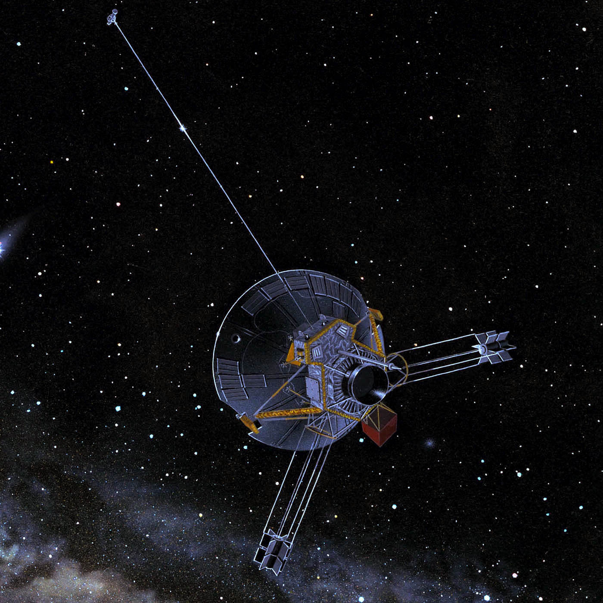
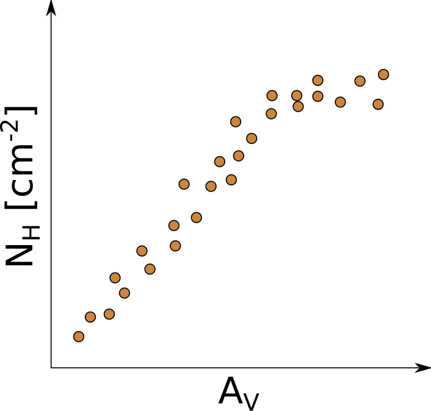

# Il gas interstellare (ISG)

# Gas interstellare (ISG)

Intorno al 1930 si sono notati spettri stellari con righe di
assorbimento (nell'ottico) dalle strane proprietà:

#.  In sistemi binari, non mostrano effetto Doppler;
#.  Sono più marcate per stelle più lontane;
#.  Molto più strette di quelle stellari (si deduce che $T \sim 100\,\text{K}$).

# Gas interstellare (ISG)

-   Non si osserva H insterstellare nel visibile: se $T$ è bassa, le righe di Balmer sono troppo deboli!

-   Gli elementi osservati sono Ca e Na, ma anche molecole: CH, CN, CH⁺. Queste ultime implicano una bassa densità del gas ($n < 10^3\,\text{cm}^{-3}$) e una bassa temperatura:

    -   Molecole cariche come CH⁺ in condizioni di laboratorio si neutralizzano subito;

    -   CH e CN sono fortemente reattive.

::: notes

Per eccitare una riga di Balmer occorre ~1 eV, ma le energie in gioco per $T \sim 100$ K sono 100 volte inferiori.

:::

# HI nell'ISG

-   È lecito aspettarsi che H, anche se non rilevabile nel visibile, sia la componente predominante del ISG. Si può rivelare mediante la misura della riga a 21 cm.

-   Questa riga è generata dalla transizione tra lo stato dell'atomo HI con spin $e$/$p$ paralleli allo stato con spin antiparalleli. I due stati hanno una differenza energetica di
    \[
    \Delta E = 5.9\times 10^{-6}\,\text{eV},
    \]
    e la probabilità di transizione è $A = (11\,\text{Myr})^{-1}$ così che $N = N_0 e^{A t}$.

# HI nell'ISG

{height=240px}

La temperatura associata a questa radiazione è
\[
T_{21\,\text{cm}} \sim \frac{\Delta E}{k_B} = \frac{5.9\times
  10^{-6}\,\text{eV}}{8.62\times 10^{-5}\,\text{eV/K}} \approx 0.07\,\text{K}.
\]
Basta la CMB (2.7 K) a popolare lo stato a spin parallelo!

::: notes

Domanda per gli studenti: se la CMB è $2.7\,\mathrm{K}\gg0.07\,\mathrm{K}$, vuol dire che tutti gli
  atomi HI sono nello stato di tripletto?

:::

# Fatti sulla riga a 21 cm

Lo stato a spin paralleli ($s = 1$) è caratterizzato da
\[
S = \sqrt2 \hbar,\quad S_z =
\begin{cases}
  +\hbar/2, \\
  0, \\
  -\hbar/2
\end{cases}
\qquad \text{(tripletto),}
\]
quello a spin antiparalleli ($s = 0$) da
\[
S = 0,\quad S_z = 0 \qquad\text{(singoletto)}.
\]

---

-   Assumiamo che il gas sia in equilibrio termico e che valga la teoria cinetica dei gas (ignoriamo quindi la CMB e il fatto che HI non sia puntiforme!). Si ha allora la distribuzione di Maxwell:
    \[
    \frac{N_\text{tr}}{N_\text{sing}} = \frac{g_\text{tr}}{g_\text{sing}}
    e^{-\Delta E/k_B T} = 3 e^{-\Delta E/k_B T}.
    \]

-   Ma se $k_B T \gg \Delta E$, allora
    \[
    \frac{N_\text{tr}}{N_\text{sing}} = 3 e^{-\Delta E/k_B T} \approx 3.
    \]

-   Alle temperature presenti nell'Universo (≥ 2.7 K), per ogni atomo nello stato di singoletto ce ne sono tre in quello di tripletto.

# Importanza della riga a 21 cm

-   L'esistenza di questa riga era stata prevista negli anni '40, e fu rivelata il 25 Marzo 1951 dal gruppo di Edwin Purcell (Harvard Univ., Nobel 1953).

-   Le caratteristiche della riga sono:

    #.  Visibile sia in assorbimento che in emissione;
    #.  Insensibile alla presenza di polvere.

# Importanza della riga a 21 cm

I campi di utilizzo della riga a 21 cm sono disparati:

-   Fondamentale per lo studio del gas nel ISM;
-   Essendo insensibile alla polvere, permette di studiare la struttura della Galassia;
-   Rotazione della Galassia e moti locali ricostruibili da misure Doppler sulla riga;
-   Studio di campi magnetici del ISM dall'effetto Zeeman sulla riga;
-   …e molto altro.

# Esempio numerico

Supponiamo che una nube di H neutro si trovi a una distanza $d = 30\,\text{pc}$. Il flusso a 21 cm in emissione, integrato sull'angolo solido, è
\[
f = 4.5\times 10^{-15}\,\text{erg\,cm$^{-2}$\,s$^{-1}$}.
\]

Qual è la massa dell'idrogeno nella nube?

# Svolgimento esercizio

Dal flusso osservato possiamo ricavare la luminosità totale:
\[
L_\text{21\,cm} = 4\pi d^2 f = 4.85\times 10^{26}\,\text{erg\,s$^{-1}$}.
\]

# Svolgimento esercizio

Ci aspettiamo che valga la formula
\[
L_\text{21\,cm} \approx \frac34 N_H\,A\,h\nu,
\]
dove $A = \tau^{-1} = (11\,\text{Myr})^{-1}$ è la probabilità di
transizione e il fattore $3/4$ tiene conto della popolazione nei due
stati di spin. Quindi
\[
N_H \approx 2.4 \times 10^{58}, \qquad M_H = N_H \times m_p \approx 20\,M_\odot.
\]

\note{È una riga di *emissione*, quindi si va dallo stato di
  tripletto allo stato di singoletto, e il fattore è 3/4.}

# Pioneer 10 (1972)

Un contesto interessante in cui la riga a 21 cm ha giocato un
ruolo importante è la famosa targa installata sulla sonda Pioneer
10, lanciata nel 1972 dalla NASA per studiare Giove.

{height=400px}

::: notes

La missione osservò Giove nel 1973, dopodiché si allontanò dal
Sole incrociando l'orbita di Saturno nel 1976, quella di Urano
nel 1979 e quella di Nettuno nel 1983. La missione venne dichiarata
completata nel 1997, ma il satellite continuò a trasmettere fino al
2003 (sebbene il segnale non fosse più decifrabile), quando la
distanza dalla Terra era di 80 AU.

:::

---

{height=700px}

::: notes

In alto a sinistra c'è la transizione iperfine dell'idrogeno. La
piccola lineetta verticale sotto la transizione indica la cifra 1 in
binario. A destra della donna, tra le due parentesi che indicano
l'altezza, c'è la cifra 8 in binario. L'altezza media della donna è
8×21 cm = 168 cm.. I 15 raggi che partono dal Sole sono 15 pulsar. I
numeri binari indicano il periodo (in unità della frequenza della riga
a 21 cm): dato che questi periodi cambiano col tempo, questo permette
di dedurre l'epoca del lancio. La lunghezza delle righe indica la
distanza relativa. Ne sono state scelte 15 anziché 3 (sufficienti per
triangolare) perché dove arriverà la placca potrebbero non essere
visibili tutte. Le tacche sotto i pianeti indicano la loro distanza
relativa dal Sole, in unità di 1/10 della distanza Mercurio–Sole.

:::

# HI nell'ISM

| Quantità                         | Stima                                                      |
|----------------------------------|------------------------------------------------------------|
| Temperatura                      | 100 K                                                      |
| Dimensione nubi                  | 10÷100 pc                                                  |
| Densità HI (nube)                | 1÷10 cm⁻³                                                  |
| Densità HI (Galassia)            | 0.1 cm⁻³                                                   |
| Velocità                         | $v_\text{rms} \sim \sqrt{k_B T/m_p} \sim 10^3\,\text{m/s}$ |

# Gas e polveri

Si osserva correlazione tra la densità colonnare di HI (riga 21 cm) e la polvere (misure di estinzione), quindi queste componenti sono mescolate nell'ISM.

{height=240px}

La correlazione cessa per alti valori di $A_V$. Perché?

#.  La polvere attenua a 21 cm? No, $n$ insuff.
#.  Si formano molecole di H₂?

# Gas e polveri

-   La molecola H₂ è molto difficile da rivelare, perché non emette l'equivalente della riga a 21 cm. Inoltre, non ha un dipolo permanente.

-   Molecole come CO hanno un dipolo permanente, e siccome l'energia rotazionale è quantizzata,
    \[
    E_r = \frac{(I\omega)^2}{2I} = \frac{L^2}{2I} = \frac{\hbar^2 J(J+1)}{2I}.
    \]

# Gas e polveri

-   Se si ha dipolo permanente, vale la regola di selezione ΔJ = −1. Una transizione tra livelli energetici rotazionali del CO quindi genera righe (ν > 115 GHz).

-   **Ma ciò non vale per H₂**, che ha solo un debole quadrupolo con regola di selezione ΔJ = −2.

-   Questo genera una debole emissione intorno a 10 µm, coperta però dalle polveri.

-   È più facile studiare l'emissione di altre molecole, meno abbondanti ma con righe più forti (CO, CH, OH, CS, C₃H₂…).

::: notes

Si può mostrare brevemente la forma di un quadrupolo, e spiegare perché la distribuzione delle cariche di H₂ ricordi un quadrupolo.

:::

# Gas e polveri

-   La perdita di correlazione tra $N_H$ e $A_V$ ci dice quindi che parte dell'idrogeno del ISM è in forma molecolare?

-   Le densità in gioco sembrerebbero sconsigliarlo: è difficile produrre H₂ a causa (ancora!) della sua simmetria.

# Gas e polveri

-   Per unire tra loro due H occorre legarli in uno stato eccitato, e poi diseccitare il sistema irradiando energia. Ma H₂ **non ha momento di dipolo**, quindi non irradia!

-   Per produrre H₂ occorre dapprima che si formi H⁻:
    \[
    \begin{aligned}
      \text{H} + e^- &\rightarrow \text{H}^- + h\nu, \\
      \text{H}^- + \text{H} &\rightarrow \text{H}_2 + e^- + \text{energia cinetica}
    \end{aligned}
    \]

-   Ma è difficile avere H⁻ in una nube: è lento da formare e veloce da distruggere (per urti con protoni, fotoni o altri ioni positivi).

# Polvere e molecole H₂

-   La polvere può fungere da catalizzatore. I nuclei vengono catturati da grani e, dopo un random-walk, si collocano in siti da dove non si spostano più.

-   Così è più facile far regire tra loro nuclei ed elettroni. Per produrre H₂, l'energia cinetica prodotta è 4.5 eV, sufficiente per espellere la molecola dal grano (e cedergli momento angolare\ldots).

---

{height=580px}

# Nubi molecolari

-   Nel mezzo ISM si possono osservare nubi composte da molecole.

-   Sono caratterizzate da basse temperature ($\sim 10\,\text{K}$) e alte densità ($n \sim 10^3\,\text{cm}^{-3}$).

# Molecole trovate nel ISM

{height=480px}

[www.astro.uni-koeln.de/cdms/molecules](http://www.astro.uni-koeln.de/cdms/molecules)

---

{height=620px}

VY Canis Majoris (stella gigante, $R \sim 2000\,R_\odot$) vista da Herschel

::: notes

È una ipergigante rossa, tra le più grandi che si conoscano (1000 volte il raggio solare!), ed è immersa in una nube molecolare. Le righe che osserviamo sono quindi sia dovute alla stella che alla nube che la circonda.

:::

# E il caso di HII?

-   Abbiamo analizzato la presenza nella galassia di idrogeno atomico (HI) e di idrogeno molecolare (H₂).

-   Il caso di HII è altrettanto interessante; lo tratteremo però nel contesto della formazione stellare.

# Formazione stellare

# Formazione stellare

In quali condizioni una nube di gas induce la formazione di una stella?

Supponiamo che la nube sia di forma sferica e abbia densità omogenea. In essa sono compresenti gas e polveri. Perché ci sia collasso occorre che il sistema si «de-virializzi»:
\[
\begin{aligned}
  -U &\gtrsim 2 K, \\
  \frac35 \frac{G M^2}R &\gtrsim 2\frac12\,\frac{M}m k_B T.
\end{aligned}
\]

::: notes

Qui si dovrebbe usare il teorema del viriale in una forma più generale, che tenga anche conto della pressione del fluido (v. libro di Draine). Noi usiamo per semplicità l'espressione del viriale ricavata a lezione, dove l'unica forza in gioco è quella di gravità.

:::

# Formazione stellare

Ma $M$ e $R$ sono legati alla densità $\rho$ della nube (supposta costante):
\[
M = \frac43 \pi R^3 \rho,
\]
quindi
\[
R > \sqrt{\frac{15 k_B T}{4\pi G m \rho}} \equiv R_J'.
\]

(Usiamo la notazione $R_J'$ perché tra poco deriveremo il vero valore di $R_J$ ricavato da Jeans).

# Formazione stellare

-   Il calcolo precedente è abbastanza diverso da quello affrontato da James Jeans (1877–1946), che non ha usato il teorema del viriale.

-   Rifaremo ora i suoi calcoli, ed evidenzieremo anche un problema logico nella sua trattazione.

-   Iniziamo con l'introdurre le equazioni della fluidodinamica.

# Fisica dei fluidi

{height=360px}

-   Nel punto di vista di **Lagrange** descriviamo la traiettoria della particella (analogamente alle leggi di Newton).
-   Nel punto di vista di **Eulero** (il più comodo) ci concentriamo sui punti dello spazio.

# L'equazione di Newton

Siccome sappiamo descrivere il moto delle particelle usando la
fisica di Newton, partiamo dal punto di vista Lagrangiano:
\[
\vec{F}_p = m\,\vec{a}_p = m\,\dot{\vec{v}}_p,
\]
ed esprimiamo $\vec{v}_p$ in termini delle quantità Euleriane:
\[
\vec{v}_p(t) = \vec{v}\bigl(\vec{u}_p(t), t\bigr).
\]

---

Calcolando la derivata del prodotto, si ottiene
\[
\begin{aligned}
  \dot{\vec{v}}_p &=
  \frac{\text{d}}{\text{d}t}\vec{v}\bigl(\vec{u}_p(t), t\bigr) =
  \frac{\text{d}}{\text{d}t}\vec{v}\bigl(u_{px}(t), u_{py}(t), u_{pz}(t), t\bigr) =\\
  &= \partial_t\vec{v} + (\vec{v} \cdot \vec\nabla) \vec{v},
\end{aligned}
\]
dove usiamo il fatto che $\partial_t \vec{u}_p(t) = \vec{v}_p(t) =
\vec{v}\bigl(\vec{u}_p(t), t\bigr)$ e la scrittura
\[
(\vec{v} \cdot \vec\nabla) \vec{v} =
\begin{pmatrix}
  v_x \partial_x v_x + v_y \partial_y v_x + v_z \partial_z v_x \\
  v_x \partial_x v_y + v_y \partial_y v_y + v_z \partial_z v_y \\
  v_x \partial_x v_z + v_y \partial_y v_z + v_z \partial_z v_z
\end{pmatrix}.
\]

# Derivata materiale

-   Si dice *derivata materiale* l'espressione
    \[
    \dot{\vec{v}}_p = \partial_t\vec{v} + (\vec{v} \cdot \vec\nabla) \vec{v}
    \]

-   Essa dice che la variazione della velocità di una particella del fluido può essere causata da:

    #.  una variazione temporale del campo $\vec{v}$ nel cubetto (termine $\partial_t\vec{v}$);

    #.  una differenza di velocità tra il cubetto in cui si trova la particella al tempo $t$ e quello in cui è «saltata» al tempo $t + \text{d}t$ (termine $(\vec{v} \cdot \vec\nabla) \vec{v}$).

---

-   Trasformiamo ora l'equazione di Newton in modo che compaiano le quantità Euleriane $\rho$ e $\vec{v}$, ma passando dall'equazione che descrive *una* particella a quella che descrive $N$ particelle.

-   Sommiamo quindi le equazioni di Newton di ciascuna delle N particelle in un cubetto:
    \[
    \begin{aligned}
        \sum_{i=1}^N \vec{F}_p^{(i)} &= \sum_{i=1}^N m^{(i)} \dot{\vec v}_p(t) = \sum_{i=1}^N m^{(i)} \bigl(\partial_t\vec{v} +
      (\vec{v} \cdot \vec\nabla) \vec{v}\bigr) = \\
      &= \bigl(\partial_t\vec{v} + (\vec{v} \cdot \vec\nabla) \vec{v}\bigr) \sum_{i=1}^N m^{(i)}.
    \end{aligned}
    \]

---

Se assumiamo che le masse $m^{(i)}$ delle particelle siano tutte
identiche, allora
\[
\begin{aligned}
  \sum_{i=1}^N \vec{F}_p^{(i)} &= \left(\sum_{i=1}^N m^{(i)}\right) \bigl(\partial_t\vec{v} +
  (\vec{v} \cdot \vec\nabla) \vec{v}\bigr), \\
  \vec{F}_\text{tot} &= \rho\,\text{d} V \bigl(\partial_t\vec{v} +
  (\vec{v} \cdot \vec\nabla) \vec{v}\bigr),
\end{aligned}
\]
con $\text{d}V$ volume del cubetto e $\vec{F}_\text{tot}$ forza totale agente sul cubetto; notate che tutte le forze interne di azione/reazione si cancellano.

# Termini della forza

-   Dobbiamo ora ricavare un'espressione per il termine $\vec{F}_p$. Nel contesto del collasso di una nube, ci sono due componenti:

    #.  Forze di pressione;
    #.  Forze gravitazionali.

    Queste sono le medesime forze che abbiamo considerato nella derivazione dell'equazione del viriale $U = -2K$.

-   Affrontiamole separatamente.

# Forze di pressione

{height=240px}

Consideriamo solo la forza $F_\text{pressione}$ esercitata sul cubetto lungo la
direzione $x$. Se le forze sono normali alle facce (fluido perfetto), allora
\[
\begin{aligned}
  F_\text{pressione} &= \bigl(p(x) - p(x + \text{d}x)\bigr)\,\text{d}A \\
  &= -\partial_x p(x)\,\text{d}x\,\text{d}A = -\partial_x p(x)\,\text{d}V.
\end{aligned}
\]

::: notes

Se il fluido non è perfetto, al posto del gradiente di uno scalare c'è la divergenza di un tensore. Questo viene usato ad esempio per studiare la propagazione di onde sismiche (si considera la crosta terrestre come un fluido ad altissima viscosità), vedi il libro di Sabadini.

:::

# Forze di pressione

Se ora consideriamo il moto in tre dimensioni anziché solo lungo l'asse $x$, il risultato si generalizza banalmente:
\[
\vec{F}_\text{pressione} = -\vec\nabla p\,\text{d}V.
\]

# Forza di gravità

Nel caso della gravità, è facile esprimere la forza in termini del
potenziale $\phi$:
\[
\vec{F}_\text{grav} = -m\,\vec\nabla\phi,
\]
dove (legge di Poisson)
\[
\nabla^2 \phi = 4\pi G \rho
\]
ed ovviamente $m = \rho\,\text{d}V$.

# Conservazione del momento

L'equazione di conservazione del momento nel caso di una nube è
quindi
\[
\begin{aligned}
  \rho\,\text{d}V\,\bigl(\partial_t\vec{v} + (\vec{v} \cdot
  \vec\nabla) \vec{v}\bigr) &= \vec{F}_\text{pressione} +
  \vec{F}_\text{grav} = \\
  &= -\vec\nabla p\,\text{d}V - \vec\nabla\phi\,\rho\,\text{d}V,
\end{aligned}
\]
che si riscrive come il sistema di 3 equazioni
\[
\partial_t\vec{v} + (\vec{v} \cdot \vec\nabla) \vec{v} =
-\frac{\vec\nabla p}\rho - \vec\nabla\phi
\]
(caso particolare delle *equazioni di Navier-Stokes*).

# Altre equazioni

-   Con l'equazione vettoriale precedente e la legge di Gauss abbiamo 4 equazioni ma 6 incognite ($v_x$, $v_y$, $v_z$, $p$, $\rho$, $\phi$).

-   Usiamo anche l'equazione di conservazione della massa:
    \[
    \dot\rho + \vec{\nabla}\bigl(\rho\,\vec{v}\bigr) = 0
    \]
    e la relazione tra pressione e densità
    \[
    p = \rho c_S^2,
    \]
    dove $c_S$ è la velocità del suono (per piccole oscillazioni e isotermia).

# Esercizi

-   Ricavate un'espressione per la pressione $p(h)$ dell'acqua del mare in funzione della profondità $h$. Supponete che il mare sia in quiete, che $\rho$ sia costante, e che la forza di gravità sia $F = m g$.

-   Che pressione stimate ci sia sul fondo della fossa delle Marianne ($h = 11\,\text{km}$)? (Il valore misurato è $\sim 1\,000\,\text{bar}$).

::: notes

L'esercizio si risolve imponendo $\vec v = 0$ nella prima equazione, imponendo $\phi = gy$ e scrivendo i gradienti come derivate monodimensionali in $y$.

:::

# Esercizi

-   Fate lo stesso nel caso dell'atmosfera. In questo caso non si può più considerare $\rho$ costante: usate la relazione $p = c_S^2 \rho$. Dovreste ottenere il risultato
    \[
    p(h) = p_0 \exp(-h/h_0),
    \] se $h$ cresce con l'altezza.

-   Che valore stimate per $h_0$ nel caso dell'atmosfera terrestre?

---
title: "Astrofisica Generale II — 5"
author: Maurizio Tomasi ([maurizio.tomasi@unimi.it](mailto:maurizio.tomasi@unimi.it))
date: "11 Aprile 2025"
css:
- ./css/custom.css
...
