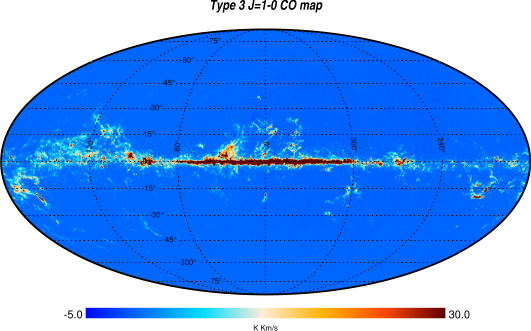
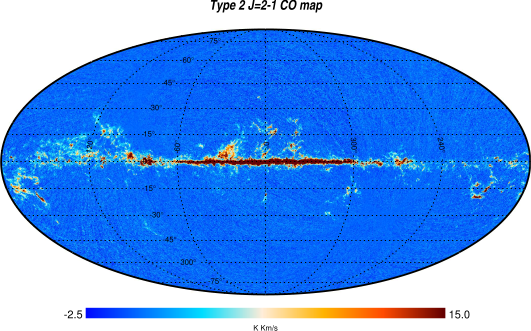
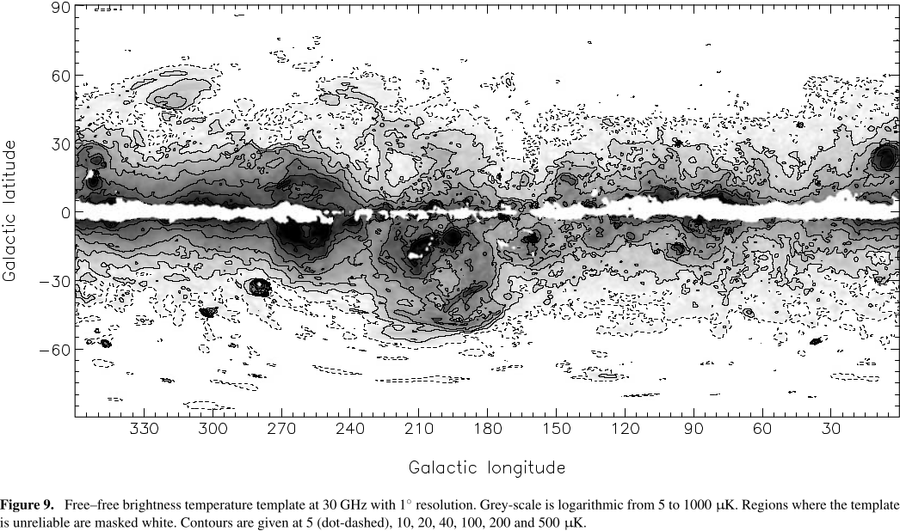

# Jeans’ Collapse

These are the equations used by Jeans:
\[
\begin{aligned}
  \dot\rho + \vec{\nabla}\bigl(\rho\,\vec{v}\bigr) &=
  0\quad&\text{(mass conservation)} \\
  \dot{\vec{v}} + (\vec{v}\cdot\nabla)\vec{v} &=
  -\frac1{\rho} \vec{\nabla}p - \vec{\nabla}\phi
  &\text{(Newton's law)} \\
  p &= \rho c_s^2&\text{(speed of sound)} \\
  \nabla^2\phi &= 4\pi G \rho&\text{(gravitation)}.
\end{aligned}
\]

The unknowns $\rho$, $\vec{v}$, $p$ and $\phi$ are functions of the
point $\vec{r}$ and time $t$. For a monoatomic ideal gas,
$c_s = \sqrt{\gamma\frac{k_B T}{m}}$, with $\gamma = \frac53$.

# Jeans’ Derivation

-   The system of equations is very complex to solve without some simplification.

-   We linearize the system, substituting
    \[
    \begin{aligned}
      \rho(\vec{r}, t) &= \textcolor{#682673}{\rho_0} + \textcolor{#267342}{\rho_1}(\vec{r}, t), \\
      p(\vec{r}, t) &= \textcolor{#682673}{p_0} + \textcolor{#267342}{p_1}(\vec{r}, t), \\
      \vec{v}(\vec{r}, t) &= \textcolor{#682673}{\vec{v}_0} + \textcolor{#267342}{\vec{v}_1}(\vec{r}, t) = 0 + \vec{v}_1(\vec{r}, t), \\
      \phi(\vec{r}, t) &= \textcolor{#682673}{\phi_0} + \textcolor{#267342}{\phi_1}(\vec{r}, t).
    \end{aligned}
    \]
    The terms $\textcolor{#682673}{\rho_0}$, $\textcolor{#682673}{p_0}$, $\textcolor{#682673}{\vec{v}_0}$ and $\textcolor{#682673}{\phi_0}$ are constant, and
    $\textcolor{#682673}{\rho_0} \gg \textcolor{#267342}{\rho_1}$, $\textcolor{#682673}{p_0} \gg \textcolor{#267342}{p_1}$, etc.

# Jeans’ Derivation

Ignoring higher-order terms, we have that, for example, the term $-\vec{\nabla} p/\rho$ becomes
\[
\begin{aligned}
  -\frac1\rho\vec{\nabla} p &= -\frac{\vec{\nabla}\textcolor{#267342}{p_1}}{\textcolor{#682673}{\rho_0} +
    \textcolor{#267342}{\rho_1}} \approx -\frac{\vec{\nabla}\textcolor{#267342}{p_1}}{\textcolor{#682673}{\rho_0}} \left(1 -
    \frac{\textcolor{#267342}{\rho_1}}{\textcolor{#682673}{\rho_0}}\right) = \\
  &= -\frac{\vec{\nabla}\textcolor{#267342}{p_1}}{\textcolor{#682673}{\rho_0}}
  + \frac{\textcolor{#267342}{\rho_1}}{\textcolor{#682673}{\rho_0}^2}\vec{\nabla} \textcolor{#267342}{p_1} \approx -\frac{\vec{\nabla}\textcolor{#267342}{p_1}}{\textcolor{#682673}{\rho_0}}.
\end{aligned}
\]
The remaining terms are simpler.

# Jeans’ derivation

-   Applying a divergence to the so-called «Newton's law» and substituting, we obtain
    \[
    \ddot{\textcolor{#267342}{\rho_1}} - c_s^2 \nabla^2\textcolor{#267342}{\rho_1} + 4\pi G \textcolor{#267342}{\rho_1} \textcolor{#682673}{\rho_0} = 0.
    \]

-   The equation is complex to solve, but it is linear: if $\rho_A$ and $\rho_B$ are two solutions, then $\alpha \rho_A + \beta \rho_B$ is also a solution.

# Jeans’ derivation

We exploit the linearity of the equation to solve it using Fourier analysis. We therefore decompose the unknown into plane waves:
\[
\textcolor{#267342}{\rho_1}(\vec{r}, t) = \iiint_{\mathbb{R}^3}\text{d}\vec{k}\int_\mathbb{R}\text{d}\omega\,\tilde{\textcolor{#267342}{\rho_1}} (\vec{k}, \omega)\,e^{i(\vec{k}\cdot\vec{r} - \omega t)}.
\]

The function $\tilde{\textcolor{#267342}{\rho_1}}(\vec{k}, \omega)$ is the Fourier transform of $\textcolor{#267342}{\rho_1}(\vec{r}, t)$; therefore differential operations on $\textcolor{#267342}{\rho_1}$ become algebraic on $\tilde{\textcolor{#267342}{\rho_1}}$:
\[
\nabla^2 \textcolor{#267342}{\rho_1} \rightarrow k^2 \cdot \tilde{\textcolor{#267342}{\rho_1}}, \qquad
\partial_t \textcolor{#267342}{\rho_1} \rightarrow \omega \cdot \tilde{\textcolor{#267342}{\rho_1}}.
\]

# Jeans’ derivation

Recalling that
\[
\left\|\vec{k}\right\| = \frac{2\pi}\lambda, \quad \omega = 2\pi\nu,
\]
the value of $\lambda$ that appears in the expression of $\textcolor{#267342}{\rho_1}$ corresponds each time to a different scale of the perturbations in the image:

{height=240px}

# Jeans’ derivation

Therefore, applying the Fourier transform to the equation of $\textcolor{#267342}{\rho_1}$, we obtain
\[
\omega^2 \cdot \tilde{\textcolor{#267342}{\rho_1}} = \bigl(k^2 c_s^2 - 4\pi G \textcolor{#682673}{\rho_0}\bigr)\cdot \tilde{\textcolor{#267342}{\rho_1}},
\]
that is
  \[
\omega^2 = k^2 c_s^2 - 4\pi G \textcolor{#682673}{\rho_0},
\]
which is called the **dispersion relation** and links $\omega$ and $k$ (i.e., $\lambda$ and $\nu$).

# Jeans’ derivation

-   The solution is
    \[
    \omega = \pm c_s \sqrt{k^2 - k_J^2},\quad k_J^2 \equiv \frac{4\pi G \textcolor{#682673}{\rho_0}}{c_s^2}.
    \]
    (in the absence of gravity, $k_J = 0$ and $\omega = \pm c_S \,k$: the speed of sound is always $c_s$).

-   From the study of this equation, we deduce how the system evolves over time.

# Jeans’ derivation

If $k_J^2 < k^2$ then the pressure wave propagates in the medium (acoustic wave) with a phase velocity given by
\[
v_f = \lambda\nu = \frac\omega{k} = c_s \sqrt{1 - \left(\frac{k_J}k\right)^2},
\]
lower than the speed of sound $c_s$ because $k_J \not= 0$ (it is the term due to gravity). Gravity therefore «slows down» the propagation of the wave in the medium.

# Jeans’ derivation

If $k_J^2 > k^2$ then $\omega$ is imaginary, and $\textcolor{#267342}{\rho_1}(\vec{r}, t) = A_g e^{i(\vec{k}\cdot\vec{r} - \omega t)}$ diverges as $e^{t/\tau_J}$ (collapse), with
\[
\tau_J = \frac1{k_J c_s} = \frac1{\sqrt{4\pi G \textcolor{#682673}{\rho_0}}} =
  \frac{2.3\times 10^4\,\text{yr}}{\sqrt{n_H/10^6\,\text{cm}^{-3}}},
\]
if $k\ll k_J$; a result similar to the *free-fall* time:
\[
\tau_\text{ff} = \sqrt{\frac{3\pi}{32 G\textcolor{#682673}{\rho_0}}} =
  \frac{4.4\times 10^4\,\text{yr}}{\sqrt{n_H/10^6\,\text{cm}^{-3}}}.
\]

# Jeans’ derivation

Since the collapse occurs if $k_J^2 > k^2$, that is
\[
\frac{4\pi G \textcolor{#682673}{\rho_0}}{c_s^2} > \left(\frac{2\pi}{\lambda}\right)^2,
\]
we then obtain the expression for $R_J$:
\[
\lambda > c_s \sqrt{\frac\pi{G \textcolor{#682673}{\rho_0}}} \equiv R_J.
\]

For a monatomic gas we have $R_J = \sqrt{\frac{5\pi k_B T}{3 G m \textcolor{#682673}{\rho_0}}}$.

# Jeans’ mass

From the density $\textcolor{#682673}{\rho_0}$ and the Jeans radius $R_J$ we can estimate
the minimum mass to cause a gravitational collapse with
\[
M_J = \frac43 \pi R_J^3 \textcolor{#682673}{\rho_0} = \frac{4\pi}{3\sqrt{\textcolor{#682673}{\rho_0}}}
\left(\frac{5\pi k_B T}{3 G m}\right)^{\frac32} \propto \sqrt{\frac{T^3}{\textcolor{#682673}{\rho_0}}}
\]
(«Jeans mass»).

# Jeans’ mass

Numerically, it holds that
\[
M_J \approx
0.32\,M_\odot\left(\frac{T}{10\,\text{K}}\right)^{\frac32}
\left(\frac{m_H}{\mu}\right)^{\frac32}\left(\frac{n_0}{10^6\,\text{cm}^3}\right)^{-\frac12}
\]
with $\mu$ average molecular weight.

The values of $n$ and $T$ in the equation are quite in line with those of the clouds in the ISM: this is reassuring!

# Jeans’ swindle

-   We mentioned a physical problem in Jeans’ calculations. The point is that it is unrealistic to assume that
    \[
    \nabla\textcolor{#682673}{\phi_0} = 0
    \]
    because then
    \[
    \nabla^2\textcolor{#682673}{\phi_0} = 0 \quad\Rightarrow\quad 4\pi G \textcolor{#682673}{\rho_0} = 0.
    \]

-   Without the assumption $\nabla\phi = 0$, the calculations become more complicated, but the result does not change qualitatively.

-   The correct solution, however, depends on the details of the geometry of the cloud.

# Cloud Collapse Mechanisms

# Jeans’ Mass

- When very massive clouds begin to collapse, the physical parameters change, and so does $M_J$.

- In some cases, it may happen that some regions of the cloud lose stability and begin to collapse in turn.  A **fragmentation** of the cloud occurs, with the formation of multiple stars.

- This is the likely mechanism for the formation of open clusters.

# Cloud Rotation

- In general, a collapsing cloud will also have angular momentum, which we have neglected.

- If angular momentum is conserved during contraction, then:
    \[
    \frac25 M R^2 \omega = \frac25 M R_0^2 \omega_0,
    \]
    (the moment of inertia is $I=\frac25 M R^2$ for a solid sphere) from
    which
    \[
    \omega = \omega_0 \left(\frac{R_0}R\right)^2.
    \]

# Cloud Rotation

- At the equator, the acceleration is
    \[
    a(R) = G\frac{M(R)}{R^2} - \omega^2 R = G\frac{M(R)}{R^2} -
    \omega_0^2 \left(\frac{R_0}R\right)^4 R.
    \]

- The rotation will stop the collapse when $a(R) = 0$, i.e.,
    \[
    G M(R) = (\omega_0 R_0)^2 \frac{R_0^2}R,
    \]
    which occurs when $\frac{R}{R_0} = \frac{(\omega_0 R_0)^2 R_0}{G M(R)}$.

# Cloud Rotation

- For typical values of $\omega_0 R_0 = 1\,\text{km/s} = 10^5\,\text{cm/s}$ and of $M_J$ and $R_J$, it holds that
    \[
    \frac{R}{R_0} \approx 0.6.
    \]

- Therefore, when the radius has reduced by half, the rotation slows the collapse in the direction $\perp$ to the axis of rotation.

- In the direction parallel to the axis, the collapse can continue undisturbed. The cloud flattens and forms a disk, where much of the mass does not reach the center and does not form the star.

# Where Do Stars Form?

- Let's estimate the Jeans radius ($R_J \propto \sqrt{T/\rho}$) in two distinct cases:

    1. H$_2$ molecular cloud: $T \sim 10\,\text{K}$, $n \sim 10^3\,\text{cm}^{-3}$.
    2. HI cloud: $T \sim 100\,\text{K}$, $n \sim 1\,\text{cm}^{-3}$.

- We have that
    \[
    \frac{R_\text{J, HI}}{R_\text{J, H$_2$}} \sim
    2\sqrt{\frac{100\,\text{K}}{10\,\text{K}}\,\frac{10^3\,\text{cm}^{-3}}{1\,\text{cm}^{-3}}}
    = 200.
    \]

- It is therefore easier to form stars in **molecular clouds**.

# Star Formation

- The collapse releases gravitational energy which can:

    1. increase the internal energy, modifying the pressure;
    2. be radiated outwards if the cooling time is less than $\tau_\text{ff}$.

- In the second case, the contraction is isothermal. (This was Jeans' hypothesis, from which, in the case of small oscillations, the relation $p = \rho c_s^2$ that we used last time is derived).

# Star Formation

- But the increase in $\rho$ corresponds to an increase in the optical
    depth of the cloud, and at some point the collapse ceases to be
    isothermal, becoming adiabatic:
    \[
    T V^{\gamma - 1} = \text{constant} \quad\Rightarrow\quad T \propto
    \frac1{V^{\gamma - 1}} \propto \rho^{\gamma - 1}.
    \]

- Consequently,
    \[
    M_J \propto \sqrt{\frac{T^3}\rho} \propto \sqrt{\rho^{3\gamma - 4}}.
    \]

# Star Formation

\[
M_J \propto \sqrt{\rho^{3\gamma - 4}}.
\]

-   If γ > 4/3 (e.g., ideal gas), $M_J$ increases as density increases, and therefore the collapse could stop before nuclear reactions are triggered inside the star.

-   When this happens, the Jeans mass for a 10² K cloud is about 0.2 $M_\odot$: therefore the process allows the formation of **a series of masses of the order of the solar mass**, but not much lower.

# Photoionization

-   If in the adiabatic regime the energy is not released outside the cloud, where does it go?

-   Partly it is used to increase the temperature $T$, partly to photoionize the neutral species (H, He, H₂).

-   This determines the path of the protostar on the HR diagram.

# Cloud Contraction

{height=500px}

Numerical model of the collapse from a cloud to a protostar $M \sim 1\,M_\odot$.

# Sites of Star Formation

As already mentioned, to identify H₂ regions we can use CO as a tracer:

1.  The CO column density is estimated from the emission of rotational lines;
2.  The H$_2$ column density is derived through an «X-factor»; see Bolatto, Wolfire & Leroy, Annu. Rev. Astron. Astrophys. 2013. 51:207–68 for a review.

# CO Map (Planck 2013)

{height=620px}

# CO Map (Planck 2013)

{height=620px}

# CO Map (Planck 2013)

{height=620px}

::: notes

The unit of measure is K km/s, which is called *velocity integrated emission* (VIE). It is the product of the Rayleigh-Jeans temperature and the spectral width expressed in km/s units (assuming that the spectral line width is due to the Doppler effect caused by thermal agitation).

:::

# CO Map (Planck 2013)

{height=620px}

# Cold Cores

-   We have seen that the dust temperature is of the order of 100 K if it is close enough to a young star.

-   In **gas** clouds, the shielding of the outer regions can allow the existence of colder inner regions. Temperatures of ~10 K are reached, with densities $n \sim 10^{4\div5}\,\text{cm}^{-3}$.

-   These regions are also likely **sites of star formation** (remember that $M_J \propto T^{3/2}$).

# Cold Cores

{height=520px}

At the center of Barnard 68 («Black cloud») there is a cold core.

# HII Regions

# HII Regions

-   A massive star emits in the visible and in the UV.

-   Since to ionize HI it takes $E = h\nu > 13.6\,\text{eV}$ ($\lambda < 91.2\,\text{nm}$), OB stars have the ability to ionize HI.

-   When most of the hydrogen is ionized, we speak of **HII regions**.

# Strömgren Radius

-   OB stars are able to ionize HI only in a region of limited volume. Let's estimate the size of this volume.

-   The ionization rate is
    \[
    R_i = N_\text{UV},
    \]
    with $[R_i] = \text{ionizations/s}$ and
    \[
    N_\text{UV} = \int_{13.6\,\text{eV}}^\infty N(\nu)\,\text{d}\nu
    \]
    ($N_\text{UV} = \text{photons/s}$, if efficiency is 100%).

# Strömgren Radius

-   The efficiency is likely 100%, because for ionization the cross section is
    \[
    \sigma \sim 10^{-17}\,\text{cm}^2.
    \]

-   For densities $n_H \sim 10^3\,\text{cm}^{-3}$ the mean free path of a photon is
    \[
    \lambda \sim \frac1{n_H\,\sigma} \sim 10^{14}\,\text{cm} = 6\,\text{AU},
    \]
    to be compared with the size of HII regions (from 0.1 to 100 pc).

# Strömgren Radius

-   The recombination rate is
    \[
    R_\text{rec} = \alpha(T)\,n_e\,n_p\,V = \alpha(T)\,n_p^2\,\frac{4\pi}3 r_S^3,
    \]
    with $r_S$ called the **Strömgren radius** and $\alpha(T)$ the coefficient.

-   At equilibrium $R_i = R_\text{rec}$, from which
    \[
    r_S = \left(\frac3{4\pi\alpha}\right)^{\frac13}
    N_\text{UV}^{\frac13} n_p^{-\frac23}.
    \]
    Denser HII regions are smaller (typically, $\sim 20\,\text{pc}$).

# Strömgren Radius

Given the size $R$ of the cloud, two cases can apply:

1.  If $R > r_S$, the cloud is *density bounded*: the HII cloud gradually transitions into the surrounding HI medium;
2.  If $R < r_S$, the cloud is *ionization bounded*: the entire cloud is ionized.

# Strömgren Radius

-   The typical temperature of HII regions is $\sim 10^4\,\text{K}$, compared to the $\sim 100\,\text{K}$ of the surrounding environment. The density, however, shows no discontinuity ($n \sim 10^3\,\text{cm}^{-3}$).

-   Other elements are also present in the clouds, each with its own ionization energy. For example:

    1.  He: $E_i = 24.6\,\text{eV}$, so HeII regions are less extensive than HII;
    2.  C: $E_i = 11.3\,\text{eV}$, so the opposite is true here.

# Detecting HII Regions

-   The emission of HII regions is due to bremsstrahlung (free-free scattering), with a spectrum
    \[
    T_e \propto \nu^{-\alpha},\quad\text{with $\alpha \approx 2.1$.}
    \]

-   Observations reveal that the emission is concentrated on the Galactic plane.

# Detecting HII Regions

-   One way to distinguish the free-free spectrum from other emissions (e.g., spinning dust) is to correlate it with Hα emission ($n=3-2$, Balmer series).

-   Hα is emitted in ionization regions: when an HII (proton) captures an $e^-$, during de-excitation there is a certain probability ($\sim 50\%$) that the $n=3-2$ transition (Hα) will occur. Therefore Hα signals the presence of ionization.

::: notes

When p⁺ captures e⁻, the latter is usually at a very high energy level. Often the electron has time to reach the ground state before the atom is re-ionized by UV radiation.

:::

# Detecting HII Regions

{height=620px}

# Detecting HII Regions

{height=620px}

---
title: "Astrofisica Generale II — 6"
author: Maurizio Tomasi ([maurizio.tomasi@unimi.it](mailto:maurizio.tomasi@unimi.it))
date: "28 Marzo 2025"
css:
- ./css/custom.css
...
