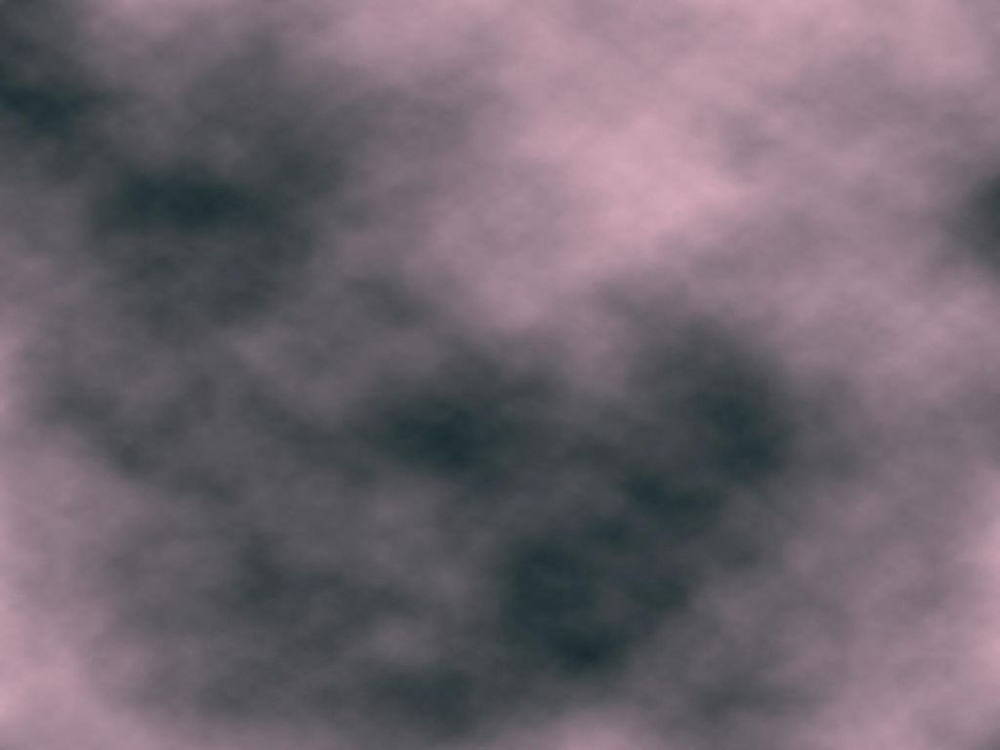

# Collasso di Jeans

Queste sono le equazioni usate da Jeans:
\[
\begin{aligned}
  \dot\rho + \vec{\nabla}\bigl(\rho\,\vec{v}\bigr) &=
  0\quad&\text{(c.\ della massa)} \\
  \dot{\vec{v}} + (\vec{v}\cdot\nabla)\vec{v} &=
  -\frac1{\rho} \vec{\nabla}p - \vec{\nabla}\phi
  &\text{(legge «di Newton»)} \\
  p &= \rho c_s^2&\text{(v.\ del suono)} \\
  \nabla^2\phi &= 4\pi G \rho&\text{(gravitazione)}.
\end{aligned}
\]

Le incognite $\rho$, $\vec{v}$, $p$ e $\phi$ sono funzione del
punto $\vec{r}$ e del tempo $t$. Per un gas ideale monoatomico vale
che $c_s = \sqrt{\gamma\frac{k_B T}{m}}$, con $\gamma = \frac53$.

# Derivazione di Jeans

-   Il sistema di equazioni è molto complesso da risolvere se non si adotta qualche semplificazione.

-   Linearizziamo il sistema, sostituendo
    \[
    \begin{aligned}
      \rho(\vec{r}, t) &= \textcolor{#682673}{\rho_0} + \textcolor{#267342}{\rho_1}(\vec{r}, t), \\
      p(\vec{r}, t) &= \textcolor{#682673}{p_0} + \textcolor{#267342}{p_1}(\vec{r}, t), \\
      \vec{v}(\vec{r}, t) &= \textcolor{#682673}{\vec{v}_0} + \textcolor{#267342}{\vec{v}_1}(\vec{r}, t) = 0 + \vec{v}_1(\vec{r}, t), \\
      \phi(\vec{r}, t) &= \textcolor{#682673}{\phi_0} + \textcolor{#267342}{\phi_1}(\vec{r}, t).
    \end{aligned}
    \]
    I termini $\textcolor{#682673}{\rho_0}$, $\textcolor{#682673}{p_0}$, $\textcolor{#682673}{\vec{v}_0}$ e $\textcolor{#682673}{\phi_0}$ sono costanti, e
    vale che $\textcolor{#682673}{\rho_0} \gg \textcolor{#267342}{\rho_1}$, $\textcolor{#682673}{p_0} \gg \textcolor{#267342}{p_1}$, etc.

# Derivazione di Jeans

-   Supponiamo che una porzione di plasma abbia questa densità:

    
{height=280px}

-   Stiamo imponendo che le variazioni di densità $\textcolor{#267342}{\rho_1}$ siano piccole rispetto alla densità media $\textcolor{#682673}{\rho_0}$.

# Derivazione di Jeans

Ignorando i termini di ordine superiore al primo, abbiamo che ad es.\ il termine $-\vec{\nabla} p/\rho$ diventa
\[
\begin{aligned}
  -\frac1\rho\vec{\nabla} p &= -\frac{\vec{\nabla}\textcolor{#267342}{p_1}}{\textcolor{#682673}{\rho_0} +
    \textcolor{#267342}{\rho_1}} \approx -\frac{\vec{\nabla}\textcolor{#267342}{p_1}}{\textcolor{#682673}{\rho_0}} \left(1 -
    \frac{\textcolor{#267342}{\rho_1}}{\textcolor{#682673}{\rho_0}}\right) = \\
  &= -\frac{\vec{\nabla}\textcolor{#267342}{p_1}}{\textcolor{#682673}{\rho_0}}
  + \frac{\textcolor{#267342}{\rho_1}}{\textcolor{#682673}{\rho_0}^2}\vec{\nabla} \textcolor{#267342}{p_1} \approx -\frac{\vec{\nabla}\textcolor{#267342}{p_1}}{\textcolor{#682673}{\rho_0}}.
\end{aligned}
\]
I restanti termini sono più semplici.

# Derivazione di Jeans

-   Applicando una divergenza alla c.d.\ «legge di Newton» e sostituendo, otteniamo
    \[
    \ddot{\textcolor{#267342}{\rho_1}} - c_s^2 \nabla^2\textcolor{#267342}{\rho_1} + 4\pi G \textcolor{#267342}{\rho_1} \textcolor{#682673}{\rho_0} = 0.
    \]

-   L'equazione è complessa da risolvere, ma è lineare: se $\rho_A$ e $\rho_B$ sono due soluzioni, anche $\alpha \rho_A + \beta \rho_B$ è soluzione.

# Derivazione di Jeans

Sfruttiamo la linearità dell'equazione per risolverla usando
l'analisi di Fourier. Scomponiamo quindi l'incognita in onde piane:
\[
\textcolor{#267342}{\rho_1}(\vec{r}, t) = \iiint_{\mathbb{R}^3}\text{d}\vec{k}\int_\mathbb{R}\text{d}\omega\,\tilde{\textcolor{#267342}{\rho_1}} (\vec{k}, \omega)\,e^{i(\vec{k}\cdot\vec{r} - \omega t)}.
\]

La funzione $\tilde{\textcolor{#267342}{\rho_1}}(\vec{k}, \omega)$ è la trasformata di
Fourier di $\textcolor{#267342}{\rho_1}(\vec{r}, t)$; quindi operazioni
differenziali su $\textcolor{#267342}{\rho_1}$ diventano algebriche su $\tilde{\textcolor{#267342}{\rho_1}}$:
\[
\nabla^2 \textcolor{#267342}{\rho_1} \rightarrow k^2 \cdot \tilde{\textcolor{#267342}{\rho_1}}, \qquad
\partial_t \textcolor{#267342}{\rho_1} \rightarrow \omega \cdot \tilde{\textcolor{#267342}{\rho_1}}.
\]

# Derivazione di Jeans

Ricordando che
\[
\left\|\vec{k}\right\| = \frac{2\pi}\lambda, \quad \omega = 2\pi\nu,
\]
il valore di $\lambda$ che compare nell'espressione di
$\textcolor{#267342}{\rho_1}$ corrisponde di volta in volta a una diversa
scala delle perturbazioni nell'immagine:

{height=240px}

# Derivazione di Jeans

Applicando quindi la trasformata di Fourier all'equazione di $\textcolor{#267342}{\rho_1}$, otteniamo che
\[
\omega^2 \cdot \tilde{\textcolor{#267342}{\rho_1}} = \bigl(k^2 c_s^2 - 4\pi G \textcolor{#682673}{\rho_0}\bigr)\cdot \tilde{\textcolor{#267342}{\rho_1}},
\]
ossia
  \[
\omega^2 = k^2 c_s^2 - 4\pi G \textcolor{#682673}{\rho_0},
\]
che è detta **relazione di dispersione** e lega tra loro $\omega$ e $k$ (ossia, $\lambda$ e $\nu$).

# Derivazione di Jeans

Risolvendo, abbiamo che
\[
\omega = \pm c_s \sqrt{k^2 - k_J^2},
\]
con
\[
k_J^2 \equiv \frac{4\pi G \textcolor{#682673}{\rho_0}}{c_s^2}.
\]
(in assenza di gravità, $k_J = 0$ e $\omega = \pm c_S \,k$: la
velocità del suono è sempre $c_s$).

Dallo studio di questa equazione si deduce come il sistema si evolve
nel tempo.

# Derivazione di Jeans

Se $k_J^2 < k^2$ allora l'onda di pressione si propaga nel mezzo
(onda acustica) con una velocità di fase data da
\[
v_f = \lambda\nu = \frac\omega{k} = c_s \sqrt{1 - \left(\frac{k_J}k\right)^2},
\]
inferiore alla velocità del suono $c_s$ perché $k_J \not= 0$ (è il
termine dovuto alla gravità). La gravità quindi «rallenta» la
propagazione dell'onda nel mezzo.

# Derivazione di Jeans

Se $k_J^2 > k^2$ allora $\omega$ è immaginario, e $\textcolor{#267342}{\rho_1}(\vec{r}, t) = A_g e^{i(\vec{k}\cdot\vec{r} - \omega t)}$ diverge come $e^{t/\tau_J}$ (collasso), con
\[
\tau_J = \frac1{k_J c_s} = \frac1{\sqrt{4\pi G \textcolor{#682673}{\rho_0}}} =
  \frac{2.3\times 10^4\,\text{yr}}{\sqrt{n_H/10^6\,\text{cm}^{-3}}},
\]
se $k\ll k_J$; risultato simile al tempo di *free-fall*:
\[
\tau_\text{ff} = \sqrt{\frac{3\pi}{32 G\textcolor{#682673}{\rho_0}}} =
  \frac{4.4\times 10^4\,\text{yr}}{\sqrt{n_H/10^6\,\text{cm}^{-3}}}.
\]

# Derivazione di Jeans

Siccome il collasso avviene se $k_J^2 > k^2$, ossia
\[
\frac{4\pi G \textcolor{#682673}{\rho_0}}{c_s^2} > \left(\frac{2\pi}{\lambda}\right)^2,
\]
otteniamo allora l'espressione di $R_J$:
\[
\lambda > c_s \sqrt{\frac\pi{G \textcolor{#682673}{\rho_0}}} \equiv R_J.
\]

Per un gas monoatomico si ha $R_J = \sqrt{\frac{5\pi k_B T}{3 G m \textcolor{#682673}{\rho_0}}}$.

# Massa di Jeans

Dalla densità $\textcolor{#682673}{\rho_0}$ e dal raggio di Jeans $R_J$ possiamo stimare
la massa minima per provocare un collasso gravitazionale con
\[
M_J = \frac43 \pi R_J^3 \textcolor{#682673}{\rho_0} = \frac{4\pi}{3\sqrt{\textcolor{#682673}{\rho_0}}}
\left(\frac{5\pi k_B T}{3 G m}\right)^{\frac32} \propto \sqrt{\frac{T^3}{\textcolor{#682673}{\rho_0}}}
\]
(«massa di Jeans»).

# Massa di Jeans

Numericamente vale che
\[
M_J \approx
0.32\,M_\odot\left(\frac{T}{10\,\text{K}}\right)^{\frac32}
\left(\frac{m_H}{\mu}\right)^{\frac32}\left(\frac{n_0}{10^6\,\text{cm}^3}\right)^{-\frac12}
\]
con $\mu$ peso molecolare medio.

I valori di $n$ e di $T$ nell'equazione sono abbastanza in linea con
quelli delle nubi nel ISM: ciò è rassicurante!

# Jeans' swindle

-   Abbiamo accennato a un problema fisico nei calcoli di Jeans. Il punto è che è irrealistico supporre che
    \[
    \nabla\textcolor{#682673}{\phi_0} = 0
    \]
    perché allora
    \[
    \nabla^2\textcolor{#682673}{\phi_0} = 0 \quad\Rightarrow\quad 4\pi G \textcolor{#682673}{\rho_0} = 0.
    \]

-   Senza l'assunzione $\nabla\phi = 0$, i calcoli si complicano, ma il risultato non cambia qualitativamente.

-   La soluzione corretta dipende però dal dettaglio della geometria della nube.

# Meccanismi di collasso delle nubi

# Massa di Jeans

-   Quando nubi molto massive iniziano a collassare, i parametri fisici cambiano e anche $M_J$.

-   In certi casi può avvenire che alcune regioni della nube perdano stabilità ed inizino a loro volta a collassare. Si ha una **frammentazione** della nube, con formazione di più stelle.

-   Questo è il probabile meccanismo di formazione degli ammassi aperti.

# Rotazione della nube

-   In generale, la nube in collasso sarà dotata anche di momento angolare, che noi abbiamo trascurato.

-   Se il momento angolare si conserva durante la contrazione, allora:
    \[
    \frac25 M R^2 \omega = \frac25 M R_0^2 \omega_0,
    \]
    (il momento d'inerzia è $I=\frac25 M R^2$ per una sfera piena) da
    cui
    \[
    \omega = \omega_0 \left(\frac{R_0}R\right)^2.
    \]

# Rotazione della nube

-   All'equatore l'accelerazione è
    \[
    a(R) = G\frac{M(R)}{R^2} - \omega^2 R = G\frac{M(R)}{R^2} -
    \omega_0^2 \left(\frac{R_0}R\right)^4 R.
    \]

-   La rotazione fermerà il collasso quando $a(R) = 0$, ossia
    \[
    G M(R) = (\omega_0 R_0)^2 \frac{R_0^2}R,
    \]
    il che avviene quando $\frac{R}{R_0} = \frac{(\omega_0 R_0)^2 R_0}{G M(R)}$.

# Rotazione della nube

-   Per valori tipici di $\omega_0 R_0 = 1\,\text{km/s} = 10^5\,\text{cm/s}$ e di $M_J$ e $R_J$ vale che
    \[
    \frac{R}{R_0} \approx 0.6.
    \]

-   Quindi quando il raggio si è ridotto della metà, la rotazione frena il collasso nella direzione $\perp$ all'asse di rotazione.

-   Nella direzione parallela all'asse, il collasso può proseguire indisturbato. La nube si appiattisce e forma un disco, dove molta della massa non raggiunge il centro e non forma la stella.

# Dove nascono le stelle?

-   Stimiamo il raggio di Jeans ($R_J \propto \sqrt{T/\rho}$) in due casi distinti:

    #.  Nube molecolare H$_2$: $T \sim 10\,\text{K}$, $n \sim 10^3\,\text{cm}^{-3}$.
    #.  Nube di HI: $T \sim 100\,\text{K}$, $n \sim 1\,\text{cm}^{-3}$.

-   Si ha che
    \[
    \frac{R_\text{J, HI}}{R_\text{J, H$_2$}} \sim
    2\sqrt{\frac{100\,\text{K}}{10\,\text{K}}\,\frac{10^3\,\text{cm}^{-3}}{1\,\text{cm}^{-3}}}
    = 200.
    \]

-   È quindi più facile formare stelle in **nubi molecolari**.

# Formazione stellare

-   Il collasso rilascia energia gravitazionale che può:

    #.  aumentare l'energia interna, modificando la pressione;
    #.  essere irradiata all'esterno se il tempo di raffreddamento è minore di $\tau_\text{ff}$.

-   Nel secondo caso la contrazione è isotermica. (Questa era l'ipotesi di Jeans, da cui nel caso di piccole oscillazioni deriva la relazione $p = \rho c_s^2$ che abbiamo usato la scorsa lezione).

# Formazione stellare

-   Ma all'aumento di $\rho$ corrisponde un aumento dello spessore
    ottico della nube, e a un certo momento il collasso cessa di essere
    isotermico, diventando adiabatico:
    \[
    T V^{\gamma - 1} = \text{costante} \quad\Rightarrow\quad T \propto
    \frac1{V^{\gamma - 1}} \propto \rho^{\gamma - 1}.
    \]

-   Di conseguenza,
    \[
    M_J \propto \sqrt{\frac{T^3}\rho} \propto \sqrt{\rho^{3\gamma - 4}}.
    \]

# Formazione stellare

\[
M_J \propto \sqrt{\rho^{3\gamma - 4}}.
\]

-   Se γ > 4/3 (es.\ gas ideale), $M_J$ aumenta all'aumentare della densità, e quindi il collasso potrebbe interrompersi prima che si siano innescate le reazioni nucleari all'interno della stella.

-   Quando ciò avviene, la massa di Jeans per una nube di 10² K è circa 0.2 $M_\odot$: quindi il processo permette di formare **una serie di masse dell'ordine di quella solare**, ma non molto inferiori.

# Fotoionizzazione

-   Se nel regime adiabatico l'energia non viene rilasciata all'esterno della nube, dove va a finire?

-   In parte è usata per aumentare la temperatura $T$, in parte per fotoionizzare le specie neutre (H, He, H₂).

-   Questo determina il percorso della protostella sul diagramma HR.

# Contrazione della nube

{height=500px}

Modello numerico del collasso da una nube a una protostella $M \sim 1\,M_\odot$.

# Luoghi di formazione stellare

Come già anticipato in precedenza, per individuare regioni H₂ si può usare CO come tracciante:

#.  Si stima la densità colonnare di CO dall'emissione delle righe rotazionali;
#.  Si deriva la densità colonnare di H$_2$ tramite un «X-factor»; vedi Bolatto, Wolfire \& Leroy, Annu. Rev. Astron. Astrophys. 2013. 51:207–68 per una review.

# Mappa di CO (Planck 2013)

{height=620px}

# Mappa di CO (Planck 2013)

{height=620px}

# Mappa di CO (Planck 2013)

{height=620px}

::: notes

L'unità di misura è K\,Km/s, che è detta *velocity
integrated emission* (VIE). È il prodotto della temperatura di
Rayleigh-Jeans per l'ampiezza spettrale espressa in unità di Km/s
(nell'ipotesi che lo spessore della linea spettrale sia dovuto
all'effetto Doppler causato dall'agitazione termica).

:::

# Mappa di CO (Planck 2013)

{height=620px}

# Cold cores

-   Abbiamo visto che la temperatura della polvere è dell'ordine di 100 K se abbastanza vicina a una stella giovane.

-   Nelle nubi di **gas** la schermatura delle regioni esterne può permettere l'esistenza di regioni interne più fredde. Si raggiungono temperature di ~10 K, con densità $n \sim 10^{4\div5}\,\text{cm}^{-3}$.

-   Anche queste regioni sono probabilmente **luoghi di formazione stellare** (ricordare che $M_J \propto T^{3/2}$).

# Cold cores

{height=520px}

Al centro di Barnard 68 («Black cloud») c'è un cold core.

# Regioni HII

# Regioni HII

-   Una stella massiccia emette nel visibile e nel UV.

-   Siccome per ionizzare HI occorre $E = h\nu > 13.6\,\text{eV}$ ($\lambda < 91.2\,\text{nm}$), le stelle OB hanno la possibilità di ionizzare HI.

-   Quando la maggior parte dell'idrogeno è ionizzato, si parla di **regioni HII**.

# Raggio di Strömgren

-   Le stelle OB riescono ad ionizzare HI solo in una regione di volume limitato. Stimiamo le dimensioni di questo volume.

-   Il tasso di ionizzazione è
    \[
    R_i = N_\text{UV},
    \]
    con $[R_i] = \text{ionizzazioni/s}$ e
    \[
    N_\text{UV} = \int_{13.6\,\text{eV}}^\infty N(\nu)\,\text{d}\nu
    \]
    ($N_\text{UV} = \text{fotoni/s}$, se efficienza è 100 %).

# Raggio di Strömgren

-   L'efficienza è verosimilmente del 100 %, perché per la ionizzazione la sezione d'urto è
    \[
    \sigma \sim 10^{-17}\,\text{cm}^2.
    \]

-   Per densità $n_H \sim 10^3\,\text{cm}^{-3}$ si ha che il cammino libero medio di un fotone è
    \[
    \lambda \sim \frac1{n_H\,\sigma} \sim 10^{14}\,\text{cm} = 6\,\text{AU},
    \]
    da confrontarsi con le dimensioni delle regioni HII (da 0.1 a 100 pc).

# Raggio di Strömgren

-   Il tasso di ricombinazione è
    \[
    R_\text{rec} = \alpha(T)\,n_e\,n_p\,V = \alpha(T)\,n_p^2\,\frac{4\pi}3 r_S^3,
    \]
    con $r_S$ detto **raggio di Strömgren** e $\alpha(T)$ coefficiente.

-   All'equilibrio $R_i = R_\text{rec}$, da cui
    \[
    r_S = \left(\frac3{4\pi\alpha}\right)^{\frac13}
    N_\text{UV}^{\frac13} n_p^{-\frac23}.
    \]
    Le regioni HII più dense sono più piccole (tipicamente, $\sim 20\,\text{pc}$).

# Raggio di Strömgren

Date le dimensioni $R$ della nube, possono valere due casi:

#.  Se $R > r_S$, la nube è *density bounded*: la nube HII transisce progressivamente nel mezzo HI che la circonda;
#.  Se $R < r_S$, la nube è *ionization bounded*: tutta la nube è ionizzata.

# Raggio di Strömgren

-   La temperatura tipica delle regioni HII è $\sim 10^4\,\text{K}$, contro i $\sim 100\,\text{K}$ dell'ambiente circostante. La densità invece non mostra discontinuità ($n \sim 10^3\,\text{cm}^{-3}$).

-   Nelle nubi sono presenti anche altri elementi, ciascuno con la propria energia di ionizzazione. Ad esempio:

    #.  He: $E_i = 24.6\,\text{eV}$, quindi le regioni HeII sono meno estese di HII;
    #.  C: $E_i = 11.3\,\text{eV}$, quindi qui vale il contrario.

# Rilevare le regioni HII

-   L'emissione di regioni HII è dovuta al brehmsstrahlung (diffusione free-free), con uno spettro
    \[
    T_e \propto \nu^{-\alpha},\quad\text{con $\alpha \approx 2.1$.}
    \]

-   Si osserva che l'emissione è concentrata sul piano Galattico.

# Rilevare le regioni HII

-   Un modo per distinguere lo spettro free-free da altre emissioni (es. spinning dust) è quello di correlarlo con emissione Hα
($n=3-2$, serie di Balmer).

-   Hα viene emessa nelle regioni di ionizzazione: quando un HII (protone) cattura un $e^-$, durante la diseccitazione c'è una certa probabilità ($\sim 50\,\%$) che avvenga la transizione $n=3-2$ (Hα). Quindi Hα segnala la presenza di ionizzazione.

::: notes

Quando p⁺ cattura e⁻, quest'ultimo è di solito a un livello energetico molto alto. Spesso l'elettrone ha tempo di raggiungere il ground state prima che l'atomo sia re-ionizzato dalla radiazione UV.

:::

# Rilevare le regioni HII

{height=620px}

# Rilevare le regioni HII

{height=620px}

---
title: "Astrofisica Generale II — 6"
author: Maurizio Tomasi ([maurizio.tomasi@unimi.it](mailto:maurizio.tomasi@unimi.it))
date: "12 Aprile 2025"
css:
- ./css/custom.css
...
