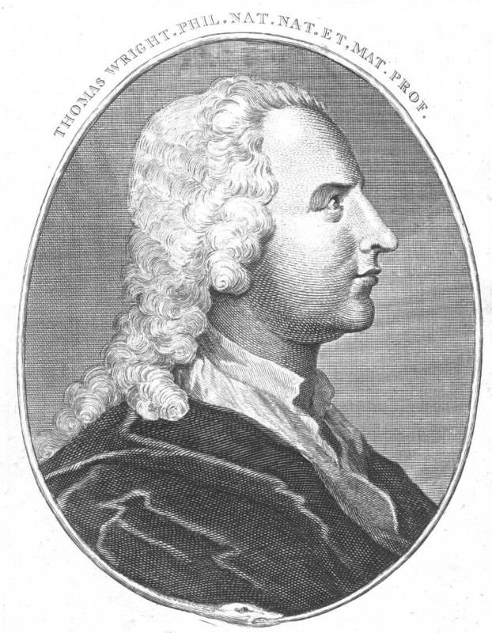
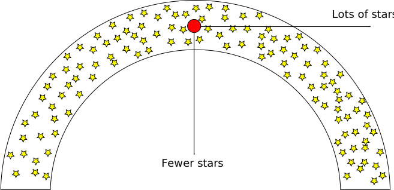
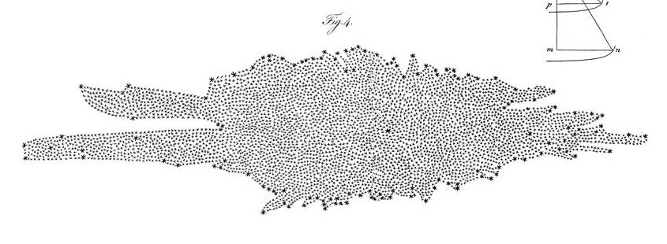

# Il centro galattico

# Studio del Centro Galattico

-   È impossibile osservare il CG ($R < 500\,\text{pc}$) nel visibile, a causa dell'estinzione della polvere. Le bande più usate sono due:

    #.  Nel *radio* è visibile l'emissione continua di gas (HII) e l'emissione di righe da nubi molecolari e molecole interstellari;
    #.  Nell'*infrarosso* è visibile la polvere (continuo) e gas neutri e ionizzati (righe).

-   A causa della distanza (8 kpc), le osservazioni sono generalmente di limitata risoluzione: ad es. Spitzer risolve solo strutture più grandi di 0.1 pc.

# Immagine multibanda del CG

{height=460px}

Dimensioni: 32'×16'. Giallo: near-IR (Hubble), rosso: IR
(Spitzer), blu: X ([Chandra](http://chandra.harvard.edu/photo/2009/galactic/)).

::: notes

Le dimensioni della regione nell'immagine (fate il conto!) sono circa $70\times 35\,\text{pc}$.

:::

# Il Centro Galattico nel Radio

{height=560px}

# Il buco nero centrale

-   Nel 2022 le osservazioni dell'*Event Horizon Telescope* (EHT) hanno dimostrato che al centro della nostra Galassia si trova un buco nero di $\sim10^6 M_\odot$, Sgr A* (a volte denominato CBH, *Central Black Hole*).

-   L'esistenza dei buchi neri supermassivi è stata osservata prima di essere predetta, contrariamente ai buchi neri stellari. (Ma la prima immagine di un CBH è stata ottenuta solo nel 2019, quando EHT ha pubblicato le osservazioni del CBH della galassia M87, di $\sim10^9 M_\odot$).

-   Le caratteristiche del CBH della nostra Galassia erano però già state dedotte dall'orbita delle stelle vicine a Sgr A*.

# Misurare la massa del CBH

-   Per la terza legge di Keplero, più una stella è vicina a Sgr A*, minore è il suo periodo orbitale $P$:

    \[
    \frac{P^2}{a^3} = \frac{4\pi}{M G},
    \]

    con $a$ semiasse maggiore dell'orbita e $M$ massa di Sgr A*.

-   Basta quindi osservare una stella vicina finché non completa un'orbita attorno a Sgr A*: dalla misura di $P$ e di $a$ si ottiene $M$.

# Misurare la massa del CBH

-   Risolvendo l'equazione della slide precedente per $a$, si ottiene

    \[
    a = \sqrt[3]{\frac{G M P^2}{4\pi}}.
    \]

-   Ipotizzando di poter osservare per ~20 anni i dintorni di Sgr A*, e che $M \approx 10^6 M_\odot$, allora compiranno almeno un periodo completo le stelle tali per cui

    \[
    a < \sqrt[3]{\frac{6.67\times 10^{-11}\,\frac{\text{m}^3}{\text{kg}\cdot\text{s}^2} \cdot 4\times 10^{36}\,\text{kg} \cdot \bigl(6.3\times 10^8\,\text{s}\bigr)^2}{4\pi}} \approx 2 \times 10^{14}\,\text{m}.
    \]

# Misurare la massa del CBH

-   Il limite diffrattivo di un telescopio è θ ~ λ/D, dove $\lambda$ è la lunghezza d'onda e $D$ è la dimensione dello specchio.

-   Per risolvere un moto $a = 10^{14}\,\text{m}$ a una distanza $R_0 = 8\,\text{kpc}$ e assumendo λ ~ 2 µm (filtro K), occorre quindi che

    \[
    \frac{\lambda}D = \frac{a}{R_0} \quad \Rightarrow \quad D = \frac{R_0\,\lambda}{a} \approx \frac{8\,\text{kpc}\cdot 2\,\text{µm}}{10^{14}\,\text{m}} \approx 500\,\text{cm},
    \]

    (Lo specchio più grande di Merate è il Ruths, da 134 cm!)

# Studio del buco nero centrale

-   Avere a disposizione uno specchio da 5 m non è sufficiente, perché c'è l'atmosfera che introduce molto disturbo e va corretto.

-   Le prime misure delle orbite del centro galattico non erano quindi **astrometriche** ma **spettroscopiche**: misuravano le velocità radiali.

-   Dalla distribuzione di velocità si possono comunque ottenere indicazioni importanti, confrontandole con simulazioni di orbite intorno a un corpo massivo.

-   Potete vederne un esempio in [Eckart, Genzel (1996): *Observations of stellar proper motions near the Galactic Centre*](https://www.nature.com/articles/383415a0) (purtroppo è dietro un *paywall*)

# Prime misure

-   Grazie all'impiego di ottiche adattive e all'uso di grandi telescopi, come il Keck alle Hawaii (10 m!), negli anni 2008–2009 è stato possibile misurare le prime orbite.

-   Queste misurazioni vennero fatte dai gruppi di Reinhard Genzel (Max Planck Institut, Germania) e di Andrea Ghez (Università di Los Angeles, USA).

-   Genzel e Ghez hanno vinto il premio Nobel nel 2020 (25% ciascuno del premio), insieme a Roger Penrose (Università di Oxford, 50% del premio), che ha sviluppato i modelli matematici che descrivono i buchi neri

---

{width=960px}

---

{width=960px}

---

{width=840px}

---

{width=960px}

---

<!-- https://www.youtube.com/watch?v=rxJgebvqzXA -->

<video width="1280" height="720" controls>
  <source src="Animation of stellar orbits around the Galactic Center (2019).mp4" type="video/mp4">
Your browser does not support the video tag.
</video>

::: notes

Le righe continue indicano che sono presenti anche dati spettroscopici
(dal 2001), e quindi velocità lungo la linea di vista.

:::

---

# Osservazione del CBH

-   Le osservazioni di Genzel e di Ghez hanno portato a stimare una massa $M_\text{CBH} \approx 4\times 10^6\,M_\odot$.

-   Questa corrisponde a un raggio di Schwartzschild pari a

    \[
    \begin{align*}
    r_s &= \frac{2 G M_\text{CBH}}{c^2} \approx \frac{2 \cdot 6.67\times 10^{-11}\,\frac{\text{m}^3}{\text{kg}\cdot\text{s}^2} \cdot 1.6\times 10^{37}\,\text{kg}}{9.0\times 10^{16}\,\text{m/s}} =\\
    &\approx 2.4\times 10^{10}\,\text{m} = 0.16\,\text{AU}.
    \end{align*}
    \]

-   Il CBH ovviamente non è visibile, ma ci si aspetta che sia visibile l'inviluppo di gas caldo per $r \gtrsim 3 r_s$

# Event Horizon Telescope

-   Usiamo di nuovo la relazione $\lambda / D \sim 3r_s / R_0$ per stimare le dimensioni del telescopio necessarie a vedere il disco di gas caldo:

    \[
    D = \frac{R_0\,\lambda}{3 r_s} \approx \frac{8\,\text{kpc}\cdot 2\,\text{µm}}{5\,\text{AU}} \approx 660\,\text{m}.
    \]

    Questo è assolutamente impossibile!

-   L'Event Horizon Telescope è una collaborazione che ha sfruttato l'interferometria per ottenere un'immagine del CBH. Come hanno fatto?

# Interferometria

-   L'interferometria è una tecnica che consiste nel raccogliere il segnale di diversi telescopi e combinarlo in fase.

-   La risoluzione ottenibile è sempre θ ~ λ/D, ma in questo caso *D* è la distanza tra telescopi!

-   Purtroppo la coerenza di fase richiede che eventuali difetti delle guide ottiche siano molto inferiori alla lunghezza d'onda, il che lo rende indicato solo per osservazioni nelle microonde e nel radio.

-   Questo è però un problema!

# Interferometria per il CBH

-   Se aumentiamo λ, aumentano anche le dimensioni *D* necessarie a ottenere la risoluzione desiderata! EHT ha fatto le misure con λ = 1.3 mm, quindi

    \[
    D = \frac{R_0\,\lambda}{3 r_s} \approx \frac{8\,\text{kpc}\cdot 1\,\text{m}}{5\,\text{AU}} \approx 4\times 10^5\,\text{m} = 430\,\text{km}.
    \]

-   Per EHT è stato quindi necessario operare telescopi che coprissero una buona parte delle terre emerse!

---

# CBH di M87 (10 aprile 2019)

{width="440px"}

Perché il buco nero di M87 è stato misurato prima?

# CBH a confronto

-   Il CBH di M87 è 1000 volte più lontano di Sagittarius A* (16 Mpc contro 8 kpc).

-   Però non si trova sul piano galattico, quindi l'oscuramento delle polveri è inferiore (anche perché è una galassia ellittica).

-   Inoltre il buco nero è 1000 più massivo, il che vuol dire che $r_s$ è 1000 volte maggiore:

    #.   Il diametro apparente è lo stesso;
    #.   Il periodo orbitale del gas è $P \propto r_s^{3/2} / M^{1/2}$, quindi $P' = 10^3 P$: il gas impiega diversi giorni anziché decine di minuti a orbitare, e l'immagine risulta meno sfuocata.

# Sagittarius A* (12 maggio 2022)

# *Easter lecture* di Genzel

<iframe width="560" height="315" src="https://www.youtube.com/embed/xPOjQyGoREE" title="YouTube video player" frameborder="0" allow="accelerometer; autoplay; clipboard-write; encrypted-media; gyroscope; picture-in-picture; web-share" allowfullscreen></iframe>

[Testing the Massive Black Hole Paradigm in the Galactic Centre](https://www.youtube.com/watch?v=xPOjQyGoREE)  (Bologna, 2022)

# Osservare la Via Lattea

# Aspetto esterno della Via Lattea

{height=480px}

Abbiamo l'evidenza che esistano galassie con bracci avvolti in
spirale. È così anche per la Via Lattea?

# Aspetto esterno della Via Lattea

Studiando nubi molecolari giganti si intuisce che anche la Via
Lattea possieda strutture simili.

{height=480px}

# Aspetto esterno della Via Lattea

{height=500px}

# Spitzer 2008

{height=500px}

Come siamo arrivati a scoprire che la via Lattea apparirebbe davvero così ad un osservatore esterno?

# [Thomas Wright](https://en.wikipedia.org/wiki/Thomas_Wright_(astronomer)) (1711–1786)

<table>
<tbody>
<tr>
<td>
-   Matematico, astronomo, architetto e progettista di giardini

-   Nel libro *An original theory or new hypothesis of the Universe* (1750) espone un'originale teoria cosmo-teologica:

    -   Molti sistemi solari;
    -   Stelle invisibili;
    -   Distribuzione a simm.\ sferica.
</td>
<td>

</td>
</tr>
</tbody>
</table>

---

{ height=660px }

---

Il modello spiega la forma apparente della Via Lattea. Inoltre ipotizza che
tutte le stelle abbiano la medesima luminosità: quelle più distanti
sono dunque invisibili.

---

-   Nel lavoro *Allgemeine Naturgeschichte und Theorie des Himmels* (1755), Immanuel Kant cita esplicitamente Wright.

-   Si basa però su una recensione del lavoro di Wright che fraintende il senso dell'immagine seguente:

{width=440px}

# [William Herschel](https://en.wikipedia.org/wiki/William_Herschel) (1738–1822)

<table>
<tbody>
<tr>
<td>
-   Musicista convertito all'astronomia.

-   Lui e i fratelli Alexander e Caroline sono stati formidabili costruttore di telescopi, che costruivano per sé stessi e per la nobiltà.

-   A differenza di Wright, il suo modello è strettamente connesso alle osservazioni (che faceva lui stesso).
</td>
<td>
{width=880px}
</td>
</tr>
</tbody>
</table>

---

-   Propone una struttura piatta per la Via Lattea (*On the construction of the Heavens*, 1802)

-   Assume che le stelle siano distribuite con densità numerica $n$ costante, e dalla misura della densità colonnare $n_\text{col}$ calcola la profondità $l = n_\text{col}/ n$.

-   La forma è basata su conteggi di stelle in 675 regioni di cielo (alcuni punti sono media di più osservazioni). Il Sole si trova approssimativamente al centro.

# [Jacobus Kapteyn](https://en.wikipedia.org/wiki/Jacobus_Kapteyn) (1851–1922)

<table>
<tbody>
<tr>
<td>
-   In *First attempt at a theory of the arrangement and motion of the sidereal system* (1922) usa le parallassi e criteri statistici per stimare la forma della Via Lattea.

-   Sottostima molto l'arrossamento, e il suo modello è accurato solo ad alte latitudini Galattiche.
</td>
<td>
{width=880px}
</td>
</tr>
</tbody>
</table>

---

# [Harlow Shapley](https://en.wikipedia.org/wiki/Harlow_Shapley) (1885–1972)

<table>
<tbody>
<tr>
<td>
-   Stima la distanza degli ammassi globulari usando le RR Lyrae.

-   Non corregge per l'assorbimento interstellare

-   Intuisce la struttura della Via Lattea e la posizione del Sole.
</td>
<td>
{width=880px}
</td>
</tr>
</tbody>
</table>

# Conclusione

# Conclusione

-   Vi raccomando di pensare **subito** a dei commenti liberi relativi a queste lezioni da inserire nei questionari della didattica!

-   Domani ci sarà la lezione *jolly* su come si scrive un testo scientifico. Vi chiederei di iniziare un quarto d'ora prima, alle 8,45, in modo da essere sicuri di finire alle 10,30.

-   A partire da settimana prossima, la dott.ssa Mariachiara Rossetti (INAF di Milano) terrà una serie di lezioni sull'astrofisica galattica.

---
title: "Astrofisica Generale II — 7"
author: Maurizio Tomasi ([maurizio.tomasi@unimi.it](mailto:maurizio.tomasi@unimi.it))
date: "18 Aprile 2025"
css:
- ./css/custom.css
...
