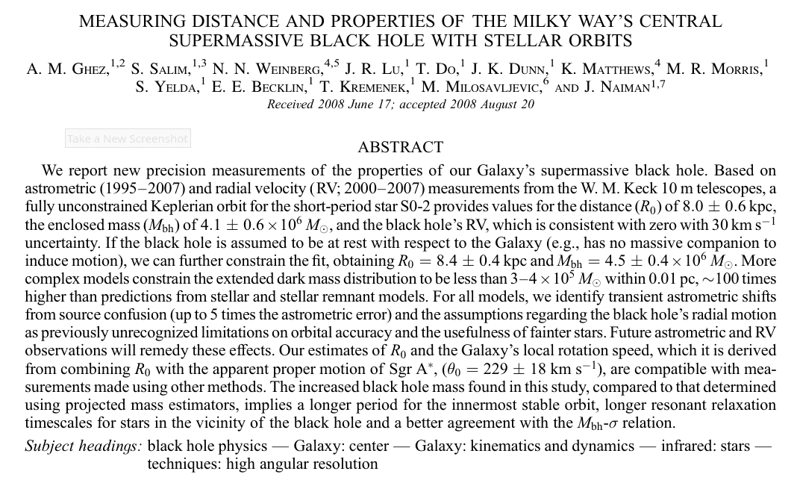
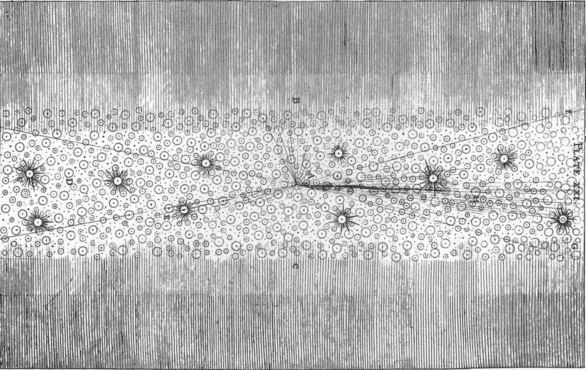
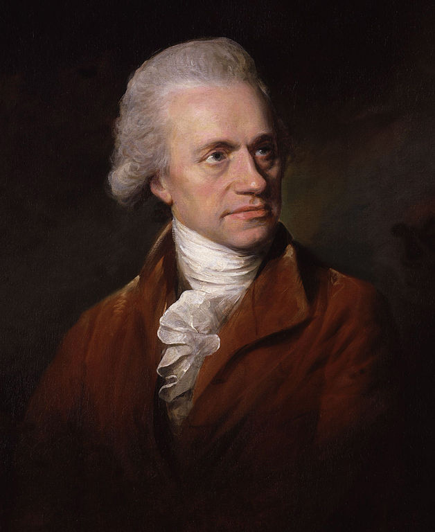
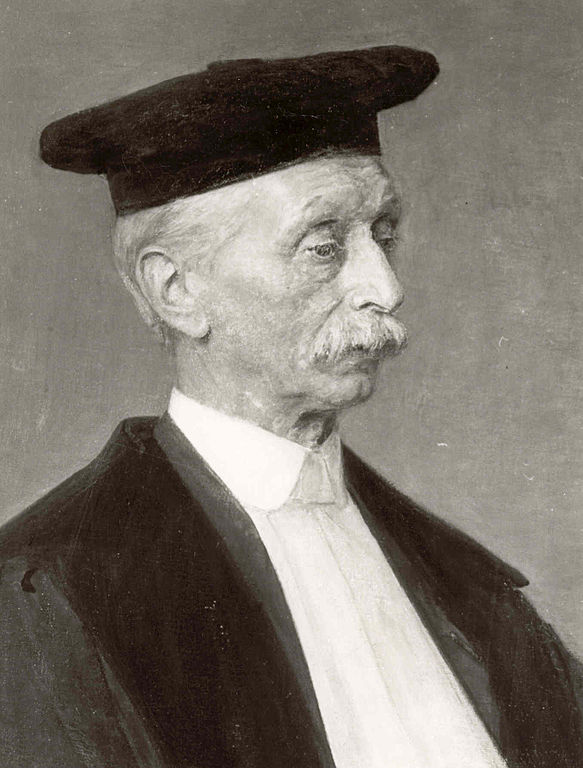
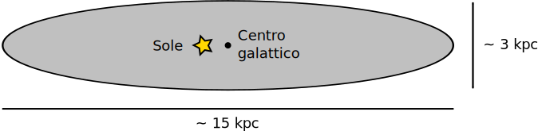

# The Galactic Center

# What is the Galactic Center?

-   It’s the center of the halo.

-   We can define the center by averaging the position in 3D space of Globular Clusters (GC)

-   It is located ~8 kpc away from us.

# Study of the Galactic Center

-   It is impossible to observe the GC ($R < 500\,\text{pc}$) in the visible, due to dust extinction. The most used bands are:

    1.  The *radio* band: we see the continuous emission of gas (HII) and the line emission from molecular clouds and interstellar molecules;
    2.  The *infrared* band: we see dust (continuum) and neutral and ionized gas (lines).

-   Due to the distance (8 kpc), observations are generally of limited resolution: e.g., Spitzer only resolves structures larger than 0.1 pc.

# Multiband Image of the GC

{height=460px}

Size: 32'×16'. Yellow: near-IR (Hubble), red: IR
(Spitzer), blue: X ([Chandra](http://chandra.harvard.edu/photo/2009/galactic/)).

::: notes

The size of the region in the image (do the math!) is about $70\times 35\,\text{pc}$.

:::

# The Galactic Center in Radio

{height=560px}

# The Central Black Hole

-   In 2022, observations by the *Event Horizon Telescope* (EHT) demonstrated that at the center of our Galaxy lies a black hole of $\sim10^6 M_\odot$, Sgr A* (sometimes called CBH, *Central Black Hole*).

-   The existence of supermassive black holes was observed before being predicted, unlike stellar black holes. (But the first image of a CBH was only obtained in 2019, when EHT published the observations of the CBH of the galaxy M87, of $\sim10^9 M_\odot$).

-   The characteristics of the CBH of our Galaxy had, however, already been deduced from the orbit of stars near Sgr A*.

# Measuring the Mass of the CBH

-   According to Kepler's third law, the closer a star with mass $m$ is to Sgr A* (mass $M$), the shorter its orbital period $P$, assuming that $m \ll M$:

    \[
    \frac{P^2}{a^3} = \frac{4\pi}{M G},
    \]

    with $a$ being the semi-major axis of the orbit and $M$ the mass of Sgr A*.

-   It is therefore sufficient to observe a nearby star until it completes an orbit around Sgr A*: from the measurement of $P$ and $a$, $M$ is obtained.

# Measuring the mass of the CBH

-   Solving the equation from the previous slide for $a$, we obtain

    \[
    a = \sqrt[3]{\frac{G M P^2}{4\pi}}.
    \]

-   Assuming we can observe the surroundings of Sgr A* for ~20 years, and that $M \approx 10^6 M_\odot$, then stars for which

    \[
    a < \sqrt[3]{\frac{6.67\times 10^{-11}\,\frac{\text{m}^3}{\text{kg}\cdot\text{s}^2} \cdot 4\times 10^{36}\,\text{kg} \cdot \bigl(6.3\times 10^8\,\text{s}\bigr)^2}{4\pi}} \approx 2 \times 10^{14}\,\text{m}.
    \]
    will complete at least one full period.

# Measuring the mass of the CBH

-   The diffraction limit of a telescope is θ ~ λ/D, where $\lambda$ is the wavelength and $D$ is the size of the mirror.

-   To resolve a motion $a = 10^{14}\,\text{m}$ at a distance $R_0 = 8\,\text{kpc}$ and assuming λ ~ 2 µm (K filter), we therefore need

    \[
    \frac{\lambda}D = \frac{a}{R_0} \quad \Rightarrow \quad D = \frac{R_0\,\lambda}{a} \approx \frac{8\,\text{kpc}\cdot 2\,\text{µm}}{10^{14}\,\text{m}} \approx 500\,\text{cm},
    \]

    (The largest mirror in Merate is the Ruths, at 134 cm!)

# Studying the central black hole

-   Having a 5 m mirror is not enough, because the atmosphere introduces a lot of disturbance and needs to be corrected.

-   The first measurements of the orbits of the galactic center were therefore not **astrometric** but **spectroscopic**: they measured radial velocities.

-   Important information can still be obtained from the velocity distribution by comparing it with simulations of orbits around a massive body.

-   You can see an example in [Eckart, Genzel (1996): *Observations of stellar proper motions near the Galactic Centre*](https://www.nature.com/articles/383415a0) (unfortunately it is behind a *paywall*)
# First measurements

-   Thanks to the use of adaptive optics and large telescopes, such as the Keck in Hawaii (10 m!), in the years 2008–2009 it was possible to measure the first orbits.

-   These measurements were made by the groups of Reinhard Genzel (Max Planck Institut, Germany) and Andrea Ghez (University of Los Angeles, USA).

-   Genzel and Ghez won the Nobel Prize in 2020 (25% each of the prize), together with Roger Penrose (University of Oxford, 50% of the prize), who developed the mathematical models that describe black holes

---

{width=960px}

---

{width=960px}

---

{width=840px}

---

{width=960px}

---

<!-- https://www.youtube.com/watch?v=rxJgebvqzXA -->

<video width="1280" height="720" controls>
  <source src="Animation of stellar orbits around the Galactic Center (2019).mp4" type="video/mp4">
Your browser does not support the video tag.
</video>

::: notes

The solid lines indicate that spectroscopic data are also present
(since 2001), and therefore velocities along the line of sight.

:::

---

# Observation of the BH

-   The observations of Genzel and Ghez led to an estimated mass $M_\text{BH} \approx 4\times 10^6\,M_\odot$.

-   This corresponds to a Schwarzschild radius equal to

    \[
    \begin{align*}
    r_s &= \frac{2 G M_\text{BH}}{c^2} \approx \frac{2 \cdot 6.67\times 10^{-11}\,\frac{\text{m}^3}{\text{kg}\cdot\text{s}^2} \cdot 1.6\times 10^{37}\,\text{kg}}{9.0\times 10^{16}\,\text{m/s}} =\\
    &\approx 2.4\times 10^{10}\,\text{m} = 0.16\,\text{AU}.
    \end{align*}
    \]

-   The BH is obviously not visible, but it is expected that the hot gas envelope will be visible for $r \gtrsim 3 r_s$

# Event Horizon Telescope

-   We again use the relation $\lambda / D \sim 3r_s / R_0$ to estimate the size of the telescope needed to see the hot gas disk:

    \[
    D = \frac{R_0\,\lambda}{3 r_s} \approx \frac{8\,\text{kpc}\cdot 2\,\text{µm}}{5\,\text{AU}} \approx 660\,\text{m}.
    \]

    This is absolutely impossible!

-   The Event Horizon Telescope is a collaboration that has used interferometry to obtain an image of the BH. How did they do it?

# Interferometry

-   Interferometry is a technique that consists of collecting the signal from different telescopes and combining it in phase.

-   The achievable resolution is always θ ~ λ/D, but in this case *D* is the distance between telescopes!

-   Unfortunately, phase coherence requires that any defects in the optical guides be much smaller than the wavelength, which makes it suitable only for observations in the microwave and radio bands.

-   However, this is a problem!

# Interferometry for the BH

-   If we increase λ, the size *D* needed to obtain the desired resolution also increases! EHT made the measurements with λ = 1.3 mm, so

    \[
    D = \frac{R_0\,\lambda}{3 r_s} \approx \frac{8\,\text{kpc}\cdot 1.3\,\text{mm}}{5\,\text{AU}} \approx 4\times 10^5\,\text{m} = 430\,\text{km}.
    \]

-   For EHT it was therefore necessary to operate telescopes that covered a good portion of the Earth's surface!

---

# BH of M87 (April 10, 2019)

{width="440px"}

Why was M87's black hole measured first?

# Comparing BHs

-   M87's BH is 1000 times farther away than Sagittarius A* (16 Mpc vs. 8 kpc).

-   However, it is not located on the galactic plane, so the dust obscuration is lower (also because it is an elliptical galaxy).

-   Furthermore, the black hole is 1000 times more massive, which means that $r_s$ is 1000 times larger:

    1.  The apparent diameter is the same;
    2.  The orbital period of the gas is $P \propto r_s^{3/2} / M^{1/2}$, so $P' = 10^3 P$: the gas takes several days instead of tens of minutes to orbit, and the image is less blurred.

# Sagittarius A* (May 12, 2022)

# Genzel's *Easter lecture*

<iframe width="560" height="315" src="https://www.youtube.com/embed/xPOjQyGoREE" title="YouTube video player" frameborder="0" allow="accelerometer; autoplay; clipboard-write; encrypted-media; gyroscope; picture-in-picture; web-share" allowfullscreen></iframe>

[Testing the Massive Black Hole Paradigm in the Galactic Centre](https://www.youtube.com/watch?v=xPOjQyGoREE)  (Bologna, 2022)

# Observing the Milky Way

# Shape of the Milky Way

{height=480px}

We have evidence that galaxies with spiral arms exist. Is this also true for the Milky Way?

# Shape of the Milky Way

By studying giant molecular clouds, we get a sense that the Milky Way also has similar structures.

{height=480px}

# Spitzer 2008

{height=500px}

How did we come to discover that the Milky Way would actually appear this way to an external observer?

# [Thomas Wright](https://en.wikipedia.org/wiki/Thomas_Wright_(astronomer)) (1711–1786)

<table>
<tbody>
<tr>
<td>
-   Mathematician, astronomer, architect, and garden designer

-   In his book *An Original Theory or New Hypothesis of the Universe* (1750) he expounds an original cosmo-theological theory:

    -   Many solar systems;
    -   Invisible stars;
    -   Spherically symmetric distribution.
</td>
<td>

</td>
</tr>
</tbody>
</table>

---

{ height=660px }

---

Wright’s model explains the apparent shape of the Milky Way. Moreover, he hypothesizes that all the stars share the same luminosity, so that the farthest ones are invisible.

---

-   In his work *Allgemeine Naturgeschichte und Theorie des Himmels* (1755), Immanuel Kant quotes Wright.

-   Unfortunately, his interpretation was based on a review of Wright’s oeuvre that misunderstands the meaning of this image:

{width=440px}

# [William Herschel](https://en.wikipedia.org/wiki/William_Herschel) (1738–1822)

<table>
<tbody>
<tr>
<td>
-   Musician with a strong passion for astronomy.

-   He and his siblings Alexander and Caroline have been formidable telescope-makers, which they built for their own use and for aristocrats.

-   Unlike Wright, Herschel’s model is strictly linked to observations (done by himself).
</td>
<td>
{width=880px}
</td>
</tr>
</tbody>
</table>

---

-   He suggested a flat structure for the Milky Way (*On the construction of the Heavens*, 1802)

-   He assumed that stars are distributed with constant numeric density $n$. By measuring their column density $n_\text{col}$, he could derive the depth $l = n_\text{col}/ n$.

-   Shape derived from stellar counts in 675 regions of the celestial sphere (some points are an average over multiple observations). The Sun is in the middle.

# [Jacobus Kapteyn](https://en.wikipedia.org/wiki/Jacobus_Kapteyn) (1851–1922)

<table>
<tbody>
<tr>
<td>
-   In *First attempt at a theory of the arrangement and motion of the sidereal system* (1922), he used parallaxes and statistics to estimate the shape of the Milky Way.

-   He severely underestimated stellar reddening, so that his model is accurate only at high Galactic latitudes.
</td>
<td>
{width=880px}
</td>
</tr>
</tbody>
</table>

---

# [Harlow Shapley](https://en.wikipedia.org/wiki/Harlow_Shapley) (1885–1972)

<table>
<tbody>
<tr>
<td>
-   He estimated the distance of GCs using RR Lyrae stars.

-   He did not correct for interstellar absorption.

-   He understood the structure of the Milky Way and the position of the Sun.
</td>
<td>
{width=880px}
</td>
</tr>
</tbody>
</table>

---
title: "Astrofisica Generale II — 7"
author: Maurizio Tomasi ([maurizio.tomasi@unimi.it](mailto:maurizio.tomasi@unimi.it))
date: "3 Aprile 2025"
css:
- ./css/custom.css
...
