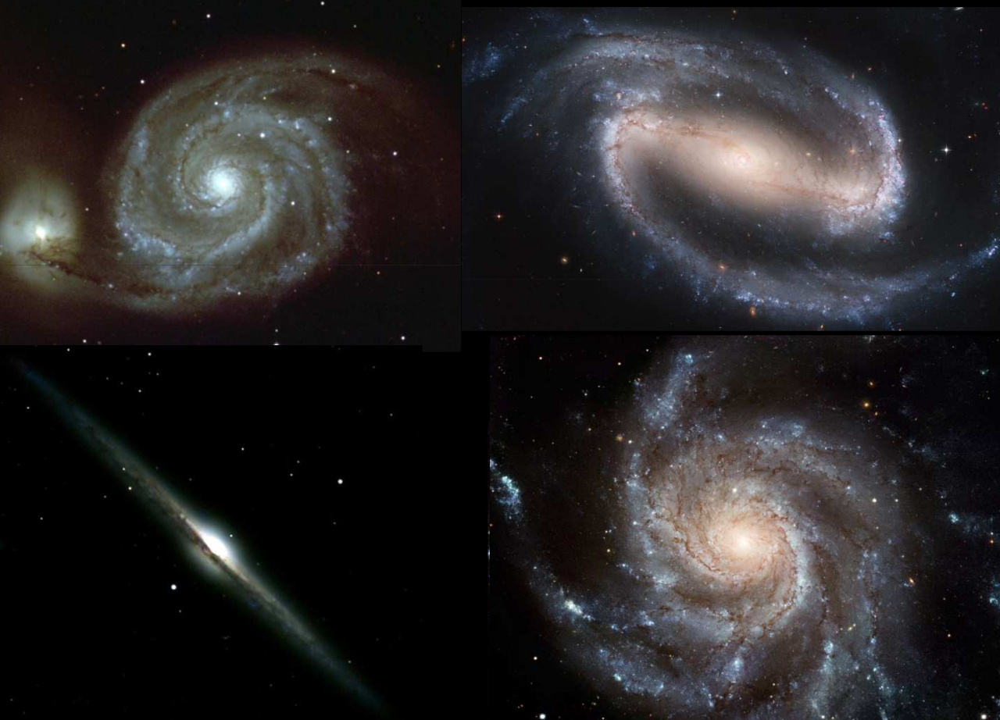

{height=660px}

# Aspetto esterno della Via Lattea

{height=480px}

Abbiamo l'evidenza che esistano galassie con bracci avvolti in
spirale. È così anche per la Via Lattea?
  

# Aspetto esterno della Via Lattea

Studiando nubi molecolari giganti si intuisce che anche la Via
Lattea possieda strutture simili.

{height=480px}

  

# Aspetto esterno della Via Lattea

{height=500px}

  

# Aspetto esterno della Via Lattea

{height=500px}

(Spitzer, 2008)
  

# Rotazione della Via Lattea

# Curva di rotazione galattica

In un sistema Kepleriano (es.\ Sistema Solare) il periodo orbitale
$T$ è legato al raggio dell'orbita $R$ dalla Terza legge:
\[
T \approx \frac{2\pi}{\sqrt{G M_\odot}}\,R^{3/2}
\]
(in un corpo rigido, $T$ non dipende da $R$). Siccome $v = 2\pi
R/T$, allora
\[
v \propto \frac1{\sqrt{R}}.
\]
E nel caso della Via Lattea?

\note{Nella prima equazione usiamo la massa del Sole perché stiamo
  studiando proprio il caso del Sistema Solare.}
  

# Curva di rotazione galattica

-   In una Galassia la materia non è concentrata in un punto, ma è distribuita in una sfera di densità non uniforme.

-   Siccome lo studio del potenziale di una sfera non uniforme richiede di solito metodi numerici, limitiamoci al caso in cui assumiamo $\rho$ uniforme: a posteriori si vede che il risultato è qualitativamente corretto.
  

# Curva di rotazione galattica

-   Per una particella di massa $m$ in orbita con raggio $R$ vale che
    \[
    G \frac{M(R)\,m}{R^2} = \frac{m v^2(R)}{R} \quad \Rightarrow \quad M(R) = \frac{v^2(R)\,R}G.
    \]
    Se possiamo misurare $v(R)$, deduciamo $M(R)$.

-   Se la massa è tutta al centro, $M(R)$ non dipende da $R$ e si ottiene la terza legge di Keplero. (Dimostratelo! Basta imporre $M(R) = M$ e $v(R) =
  2\pi R/T$, poi si risolve per $T$).

# Moto proprio del Sole

-   La velocità del Sole ha due componenti:

    #.  Una parte è dovuta alla rotazione Galattica;
    #.  Una parte è dovuta all'interazione gravitazionale con gli oggetti ad esso vicini.

-   Definiamo il *local standard of rest* (LSR) come il sistema di riferimento centrato nel Sole che si muove per effetto della sola rotazione Galattica.

-   Rispetto al LSR, il Sole si muove con $v = 20\,\text{km/s}$ nella direzione
    \[
    \ell = 56^\circ, \quad b = 23^\circ.
    \]
  

# Velocità radiale

{height=480px}

::: notes

Il disegno mostra la misura dello spostamento Doppler per due stelle, indicate con **1** e **2**. Il colore rosso è riferito al Sole, il colore verde a ciascuna delle due stelle.

:::

# Velocità radiale

{height=480px}

# Velocità radiale

{height=240px}

Vale che
\[
\begin{aligned}
  v_r &= {\color{#008000} v(R)} \cos(90^\circ -
  {\color{#008000} \theta}) - {\color{#6A5ACD} v_0}
  \cos(90^\circ -
  {\color{#6A5ACD} \ell}) \\
  &= {\color{#008000} v(R)} \sin{\color{#008000} \theta} -
  {\color{#6A5ACD} v_0} \sin{\color{#6A5ACD} \ell}.
\end{aligned}
\]

# Velocità radiale

{height=240px}

Dalla legge dei seni:
\[
\frac{\sin(180^\circ - {\color{#008000}
    \theta})}{\color{#6A5ACD} R_0} =
\frac{\sin{\color{#6A5ACD} \ell}}{\color{#008000} R}
\quad\Rightarrow\quad \frac{\sin{\color{#008000}
    \theta}}{\color{#6A5ACD} R_0} =
\frac{\sin{\color{#6A5ACD} \ell}}{\color{#008000} R}.
\]

# Velocità radiale

{height=240px}

Il risultato finale è
\[
\begin{aligned}
  v_r &= \left( {\color{#008000} v(R)} \frac{\color{#6A5ACD}
    R_0}{\color{#008000} R} - {\color{#6A5ACD} v_0}\right)
  \sin{\color{#6A5ACD}\ell} \\
  &= \bigl( {\color{#008000} \omega(R)} - {\color{#6A5ACD} \omega_0}\bigr) {\color{#6A5ACD} R_0}
  \sin{\color{#6A5ACD}\ell}.
\end{aligned}
\]

# Velocità radiale

{height=240px}

La rotazione della Galassia produce anche un moto trasversale
che induce un moto proprio delle stelle. Si può vedere come
esercizio che
\[
v_T = \bigl({\color{#008000} \omega(R)} - {\color{#6A5ACD}
  \omega_0}\bigr) {\color{#6A5ACD}
  R_0}\cos{\color{#6A5ACD}\ell} - {\color{#008000}
  \omega(R)}\,{\color{#1E90FF} d}.
\]

# Quadranti galattici

  

# Moto di rivoluzione del Sole

La convenzione scelta dall'International Astronomical Union
(IAU) per $R_0$ e $v_0$ è
\[
R_0 = 8.5\,\text{kpc}, \quad v_0 = 220\,\text{km/s}.
\]

Ciò significa che il periodo dell'orbita solare è
\[
T = \frac{2\pi R_0}{v_0} = 2.4 \times 10^8\,\text{yr} \approx
\frac1{20}\,T_\odot \approx \frac1{40}\,T_{\text{MW}},
\]
e che la massa entro un raggio $R_0$ è
\[
M_0 = \frac{v_0^2 R_0}G = 10^{11}\,M_\odot.
\]

# Curva di rotazione

-   È necessario studiare l'emissione di righe per misurare $v_r$. Una buona riga è l'emissione a 21 cm di H.

-   Sono necessarie due assunzioni:

    #.  Supponiamo che le orbite siano circolari;
    #.  Supponiamo che H sia presente in tutta la Galassia (soprattutto in prossimità del *subcentral point*!).

# Curva di rotazione

Se le ipotesi sono verificate, si segue questo metodo:

#.  Fissata $\ell$, si stima il massimo spostamento Doppler misurato in quella direzione;
#.  Si assegna quello spostamento Doppler a materiale nel *subcentral point*, così che $R = R_{\text{min}} = R_0\,\cos(90^\circ - \ell) = R_0\,\sin\ell$;
#.  Se $v_\text{max}$ è la massima velocità radiale, allora
  \[
  \omega(R_0\sin\ell) = \frac{v_\text{max}}{R_0\sin\ell} + \omega_0.
  \]

# Curva di rotazione

-   Il metodo sfrutta la particolarità del *subcentral point* per stabilire il valore di $R$ associato con $v_r$.

-   Ci sono alcuni limiti:

    #.  Se non c'è idrogeno nel *subcentral point*, $v_{\text{max}}$ stimato sarà minore di quello vero;
    #.  Orbite non circolari rendono le ipotesi non vere.

    Alcuni di questi sono superabili ripetendo la misura nel I e IV quadrante.

# Curva di rotazione

Altri problemi:

#.  Se $\ell \approx 0$, lo spostamento Doppler non è misurabile;
#.  Se $\ell \approx 90^\circ$, allora $\omega(R_0) \approx \omega$
#.  Il metodo funziona solo quando $R < R_0$ (I e IV quadrante), altrimenti non c'è *subcentral point* e bisogna stimare $v$ e $d$ separatamente, per poi ricavare $R$.

---

{height=660px}

---

{height=660px}

---

{height=660px}

# Compito per casa

Recuperate l'articolo di Chemin, Renaud \& Soubiran (il preprint è disponibile al sito
[http://arxiv.org/abs/1504.01507](http://arxiv.org/abs/1504.01507)) e leggetelo.

# Curva di rotazione

-   Nei quadranti II e III è possibile osservare l'emissione di CO in nubi molecolari per stimare $v_r$.

-   Se queste nubi molecolari contengono stelle, si può stimare la distanza $d$ delle stelle con la parallasse spettroscopica. Da $d$ si ricava poi $R$.

# Distanze e curva di rotazione

Una volta nota la curva di rotazione è possibile stimare le distanze di oggetti ignoti:

#.  Si misura $\ell$ e $v_r$;

#.  Si usa la formula
    \[
    \omega = \frac{v_r}{R_0\,\sin\ell} + \omega_0;
    \]

#.  Dalla conoscenza della curva $\omega(R)$ si determina $R$.

# Distanze e curva di rotazione

Il metodo ha due problemi:

-   Non funziona se la velocità orbitale è inferiore a quella casuale indotta dagli oggetti vicini;
-   Se $R < R_0$, per ogni oggetto ci sono *due* distanze possibili (tranne per il *subcentral point*; inoltre questo non è vero se $R > R_0$).

# Curva di rotazione

{height=560px}

# Curva di rotazione

{height=560px}

# Curve di rotazione e materia oscura

-   La curva dell'immagine precedente resta costante a grandi $R$.

-   Questo è in disaccordo con l'ipotesi Kepleriana che $v \propto 1/\sqrt{R}$ (vera se tutta la materia è racchiusa entro un certo raggio $R$).

-   Ciò significa che una parte significativa della massa della Via Lattea si trova a grandi distanze del centro.

# Caratteristiche della materia oscura

-   Da $v(R)$ si deduce che una parte significativa della massa della Via Lattea è nelle regioni esterne. Eppure la luminosità della Via Lattea decresce molto rapidamente per $R > R_0$!

-   Ci sono varie evidenze osservative (altre galassie, cluster di galassie, CMB, \ldots) che portano a ipotizzare l'esistenza di *materia oscura non barionica*.

-   Questa materia oscura è stata probabilmente decisiva per creare la buca di potenziale in cui si è formata la Via Lattea.

---

{height=620px}

::: notes

Non fanno una stima della curva di rotazione per $R < 4.5\,\text{kpc}$ proprio a causa dell'articolo di Chemin (che correttamente citano).
  
:::

---

{height=620px}

::: notes

Le piccole barre di errore per $r > 8.5\,\text{kpc}$ sono dovute all'uso di Red Clump Giants (RCG), un tipo di stelle (con helium-core burning), recentemente salito alla ribalta come eccellente candela standard (ma il loro uso era stato proposto da Cannon nel 1970!). Gli autori hanno usato un catalogo di 16 000 RCG (cataloghi LAMOST e SDSS-III/APOGEE). Vedi anche la tabella nella slide successiva.
  
:::

---

{height=520px}

L'uso di 16 000 Red Clump Giants per determinare le distanze porta a barre di errore confrontabili tra i casi $r < 8.5\,\text{kpc}$ e $r > 8.5\,\text{kpc}$.

::: notes

HKG: halo K giants. Possono anch'esse essere usate come candele standard. Il fatto che le RCG siano state usate solo per $r > 8.5\,\text{kpc}$ è dovuto alle caratteristiche delle due survey che sono state usate dagli autori.
  
:::

# Il centro galattico

# Studio del Centro Galattico

-   È impossibile osservare il CG ($R < 500\,\text{pc}$) nel visibile, a causa dell'estinzione della polvere. Le bande più usate sono due:

    #.  Nel *radio* è visibile l'emissione continua di gas (HII) e l'emissione di righe da nubi molecolari e molecole interstellari;
    #.  Nell'*infrarosso* è visibile la polvere (continuo) e gas neutri e ionizzati (righe).

-   A causa della distanza (8 kpc), le osservazioni sono generalmente di limitata risoluzione: ad es. Spitzer risolve solo strutture più grandi di 0.1 pc.

# Immagine multibanda del CG

{height=460px}

Dimensioni: 32'×16'. Giallo: near-IR (Hubble), rosso: IR
(Spitzer), blu: X ([Chandra](http://chandra.harvard.edu/photo/2009/galactic/)).

::: notes

Le dimensioni della regione nell'immagine (fate il conto!) sono circa $70\times 35\,\text{pc}$.

:::

# Il Centro Galattico in IR

{height=560px}

# Il Centro Galattico nel Radio

{height=560px}

# Il buco nero centrale

-   L'ipotesi più accreditata che spieghi la dinamica delle stelle in prossimità del centro galattico è che sia presente un buco nero centrale (CBH) supermassivo.

-   Le caratteristiche del CBH possono essere dedotte dalla stessa orbita delle stelle in sua prossimità (esse risentono più della presenza di CBH che della rotazione galattica).

# Studio del buco nero centrale

-   A quale distanza dal buco nero la dinamica delle stelle inizia ad essere dominata dalla sua presenza, anziché dal moto collettivo Galattico e da altri influssi?

-   Possiamo stabilire un semplice criterio *osservativo* per misurare questa distanza, supponendo che essa sia la distanza $r_\text{GC}$ a cui l'energia potenziale tra una stella e il buco nero sia almeno uguale alla media dell'energia cinetica di tutte le stelle a una distanza $r_\text{GC}$.

# Studio del buco nero centrale

Eguagliando energia cinetica ed energia potenziale si ha
\[
\frac{G M_* M_{\text{CBH}}}r = \frac12 M_*\,v_{\text{RMS}}^2,
\]
da cui
\[
r_\text{GC} \approx 4 \left(\frac{M_{\text{CBH}}}{10^7\,M_\odot}\right) \left(\frac{v_{\text{RMS}}}{100\,\text{km/s}}\right)^{-2}\,\text{pc}.
\]
Quindi $r_\text{GC} \propto v_{\text{RMS}}^{-2}$.

::: notes

L'RMS è calcolato su tutte le stelle attorno al CBH che hanno
la medesima distanza $r_\text{GC}$.
:::

---

{height=460px}

Siccome le velocità sono dell'ordine di 100 km/s e le distanze inferiori di 1 pc, l'equazione per $r_\text{GC}$ ci dice che la loro dinamica è determinata dal CBH, e non dal campo esterno.

---

---

{height=660px}

---

