
{height=520px}

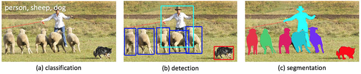

# Esempi di riviste astronomiche

| 

 | 

 | 

 |

---

La parola finale è quella dell'editor!

# Preprint

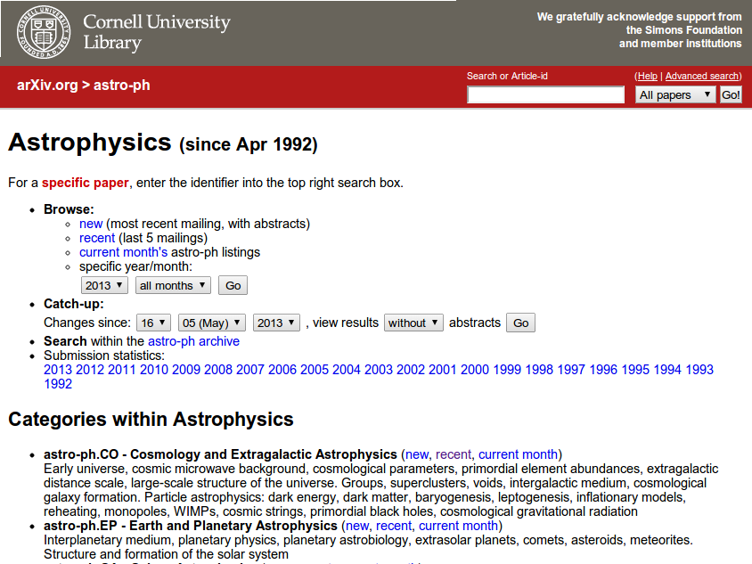

# Mailing list

# Le parti più importanti

-   Nessuno inizia a leggere il testo di un articolo senza prima aver almeno dato un'occhiata a:

    #.   Titolo;
    #.   Abstract;
    #.   Grafici e tabelle;
    #.   Introduzione e conclusioni.

-   Sono quindi le parti da curare maggiormente! (Alcuni consigliano anzi di iniziare a preparare queste)

# Scelta del titolo

-   Il titolo deve chiarire nel migliore modo possibile l'argomento del lavoro

-   È possibile scegliere un titolo simpatico che «catturi» l'attenzione:

    #. [*Life in the fast lane: a direct view of the dynamics, formation, and evolution of the Milky Way's bar*](https://academic.oup.com/mnras/article/490/4/4740/5587738) (MNRAS, 2019)

    #. [*When a Period Is Not a Full Stop: Light Curve Structure Reveals Fundamental Parameters of Cepheid and RR Lyrae Stars*](https://academic.oup.com/mnras/article-abstract/491/4/4752/5645255) (MNRAS, 2020)

    Notate però che in entrambi i casi si precisi di cosa si parla!

# Abstract troppo astratto!

> In questo lavoro vengono presentati le interessanti proprietà di una particolare classe di operatori sugli spazi di Hilbert. La loro invarianza rispetto a certe trasformazioni mostra l'esistenza di interessanti proprietà simmetriche. Vengono anche mostrate interessanti applicazioni in alcuni domini della fisica.

(Van Leunen, *A handbook for scholars*)

# Esempio da seguire

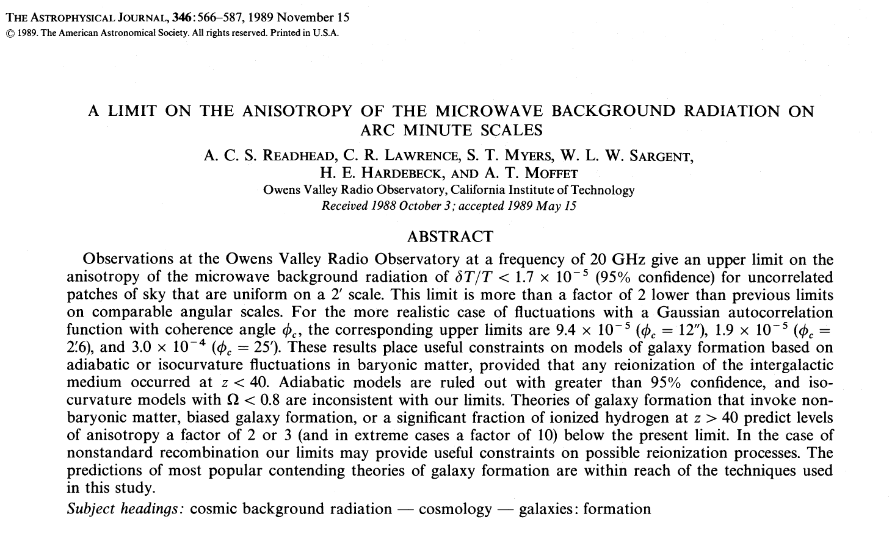{height=580px}

# Andare diretti al punto!
  

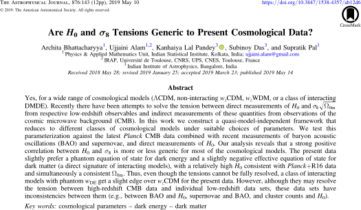{height=580px}

# Evitare la forma impersonale/passiva
  

{height=520px}

# Esempio di introduzione

{height=580px}

  
# Esempio da seguire

# Lista degli autori

-   È sempre più vero che in astronomia si lavora in grandi collaborazioni.
  
-   Quando pubblicate, includete nella lista degli autori tutte quelle persone che:

    #.   Hanno fornito un contributo, ma solo se questo consiste in qualcosa di **originale**, **creativo**, e scientificamente valido;
    #.   Vi hanno dato il loro consenso esplicito.

# Lista degli autori

-   Includete negli *acknowledgements* («ringraziamenti») tutti gli altri: chi vi ha corretto l'inglese, chi vi ha sistemato una figura, l'officina che vi ha costruito un pezzo…

-   In questa lista ricadono anche eventuali enti finanziatori (e i referee, se i loro commenti hanno aiutato a migliorare l'articolo!).
  

# Bibliografia

-    Fondamentale!
-    Se usate LaTeX, potete gestire la bibliografia con BibTeX.
-    Per ogni lavoro che fate (o tesi!) tenete una lista di articoli letti, ed aggiornatela costantemente.

# Gestione delle bibliografie

-    [CiteULike](http://www.citeulike.org);
-    [Connotea](http://www.connotea.org);
-    [Bibsonomy](http://www.bibsonomy.org);
-    [Mendeley](https://www.mendeley.com/) (se proprio dovete…);
-    [JabRef](http://jabref.sourceforge.net/) (quello che uso di solito io);
-    [Zotero](https://www.zotero.org/);
-    [Papers](https://www.papersapp.com/) (Windows, Mac).

# Scrittura del testo

-    Evitare errori di sintassi («un pò», «invecie», «perchè», «daccordo»…);
-    Se scrivete in inglese, attenzione agli «italicismi» («we propose in this paper a method…»).

{height=280px}

# Grafici da non imitare!

{height=680px}

# Grafici da non imitare!

Il grafico precedente ha più problemi:

#.   Gli assi Y non sono omogenei: il grafico degli *alumni* (laureati) mostra le differenze con l'anno precedente!
#.   L'asse delle X non è omogeneo!

# Grafici da non imitare!

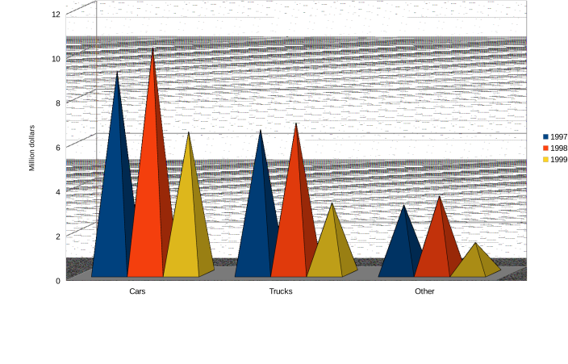{height=680px}

# Grafici da non imitare!

Il grafico precedente ha almeno tre problemi:

#.   L'uso del 3D è gratuito e fuorviante (il dato sulle automobili del 1998 supera la tacca del 10 oppure no?);
#.   Il dato del 1999 è limitato al primo semestre!

# Grafici da non imitare!

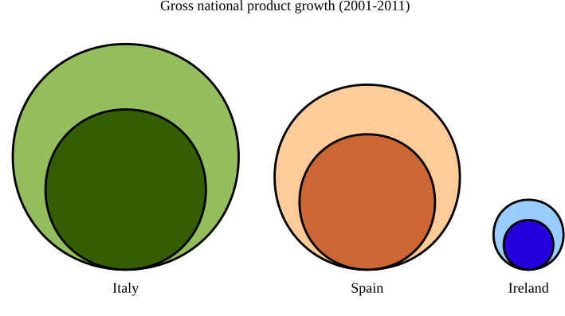{height=620px}

# Grafici

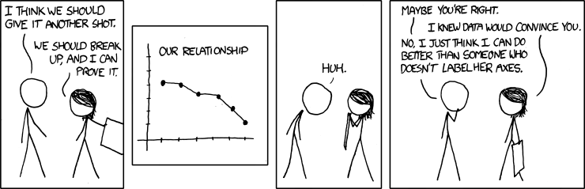

# Grafici

[http://nautil.us/issue/19/illusions/five-ways-to-lie-with-charts](http://nautil.us/issue/19/illusions/five-ways-to-lie-with-charts)

# Strumenti per creare grafici

#.   [GNUplot](http://www.gnuplot.info/) (programma per creare grafici);
#.   [GNU R](http://www.r-project.org/) (linguaggio di programmazione con ottime capacità di creare grafici: vedi [The R Graph Gallery](https://r-graph-gallery.com/));
#.   [Python+Matplotlib](http://matplotlib.org/) (meglio però usare librerie più sofisticate di Matplotlib, come [Seaborn](https://seaborn.pydata.org/));
#.   [Mathematica](http://www.wolfram.com/mathematica/) (linguaggio di programmazione, a pagamento);
#.   [Inkscape](http://inkscape.org/) (diagrammi e grafica vettoriale);
#.   [Asymptote](http://asymptote.sourceforge.net/) (linguaggio di programmazione per la grafica);
#.   Microsoft Excel, LibreOffice Calc… (yuk!).

# Uso dei colori

-    L'uso dei colori permette di rendere più chiaro un grafico.
-    I colori vanno però scelti oculatamente!
-    Attenzione alle persone con disturbi nella percezione del colore (es., daltonici)

---

---

# Generazione di schemi di colori

-    Colourlovers: [https://www.colourlovers.com/](https://www.colourlovers.com/)
-    Colormind (online): [http://colormind.io/](http://colormind.io/)
-    Gpick (solo Linux): [https://www.gpick.org/](https://www.gpick.org/)
-    Mappe di colore in Julia: [https://github.com/peterkovesi/PerceptualColourMaps.jl](https://github.com/peterkovesi/PerceptualColourMaps.jl)

---

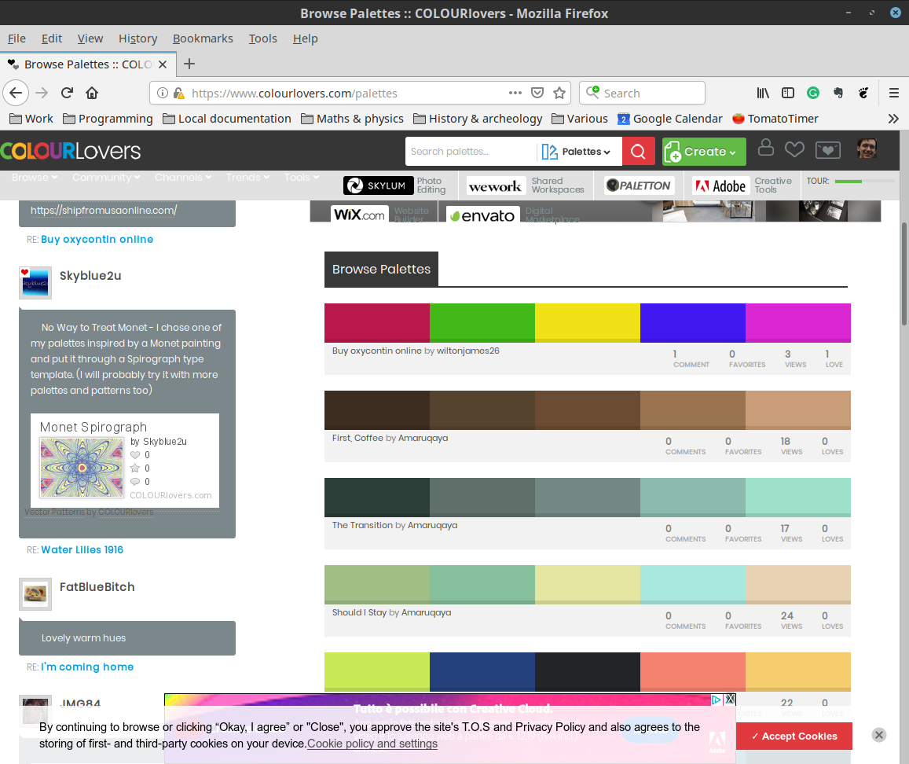{height=680px}

# Mappe di colore percettive

{height=420px}

  
Slides: [https://peterkovesi.com/papers/ColourMapsForColourBlindIAMG2017.pdf](https://peterkovesi.com/papers/ColourMapsForColourBlindIAMG2017.pdf), vedi anche [*Good colour maps: How to design them*](https://arxiv.org/abs/1509.03700)

# Tesi di laurea e dottorato

# Passi per scrivere una tesi

#.   Decidere la lista dei capitoli.
#.   Per ogni capitolo, decidere la lista delle sezioni (argomenti).
#.   Scegliere quali grafici e tabelle includere.
#.   Scrivere il testo.

# Cose da **non** fare

-    Iniziare subito a scrivere il testo suddiviso in capitoli;
-    Usare parole inutili: «essenzialmente», «prettamente», «sostanzialmente»…
-    Essere vaghi (evitare «grande», «piccolo», «trascurabile» senza quantificare);
-    Usare troppa enfasi letteraria;
-    Mentire/nascondere dati.

# Esempio (accaduto realmente!)

::: incremental

-   «In questa tesi ho svolto un'analisi di tipo prettamente statistico…»

-   «Perché dici “prettamente”?»

-   «In questa tesi ho svolto un'analisi di tipo statistico…»

-   «Perché dici `di tipo'?»

-   «In questa tesi ho svolto un'analisi statistica…»

:::

# Uso del passivo e dell'impersonale

-    Si possono usare, ma solo se necessario;
-    Impediscono di capire chi abbia fatto cosa;
-    «È stata calcolata la mediana» → «Ho calcolato…»;
-    «Si è considerata qui solo la prima serie di dati» → «Ho considerato…».

# Esempio

> I procured a triangular glass prism, to try therewith the celebrated phenomena of colours. And for that purpose, having darkened my laboratory, and made a small hole in my window shade, to let in a convenient quantity of the sun's light, I placed my prism at the entrance, that the light might be thereby refracted to the opposite wall…

Newton, «Optiks» (1672)

---

Si simula ora il rumore bianco generando un vettore di 100000 elementi casuali distribuiti normalmente aventi media nulla e deviazione standard che descresce all’aumentare del conteggio. La deviazione risulta essere 100 000 nel primo elemento del vettore e 1 nell'ultimo elemento. Si applica il procedimento adottato nel paragrafo X.Y sottraendo un elemento del vettore con il successivo.

Ho creato un vettore ${x_i}_{i=1}^N$, con $N=10^5$, in cui ciascun elemento $x_i$ è un numero pseudo-casuale distribuito normalmente. La media è sempre nulla ($\left<x_i\right> = 0\ \forall i$), mentre la deviazione standard risulta essere \[\sigma^2(x_i) = 10^5/i.\]

---

> Questa lettera è più lunga delle altre perché non ho avuto agio di farla più breve.

Blaise Pascal, *Les Provinciales*, XVI

# Presentazioni

# Quando preparare una presentazione

-    Discussione di una tesi;
-    Seminario (anche interno al proprio gruppo);
-    Partecipazione a una conferenza.

# Disclaimer

-  Quanto si dirà ora **non vale** per le slide usate in un corso (come quelle che state guardando in questo momento).

-  Le slide dei corsi sono fatte per essere lette e rilette più volte dagli studenti. Qui si parla invece di slide a supporto di un talk, che di solito non vengono distribuite.

# Come preparare una presentazione

-    Capire il tipo di uditorio;
-    Stabilire il messaggio;
-    Decidere gli argomenti;
-    Abozzare su carta l'aspetto e l'ordine delle slide;
-    Creare le slide al computer;
-    Provare a voce alta fino all'esaurimento.

# Alcuni consigli

-    Evitare di mettere troppi elementi
-    Testo sintetico!
-    Usare i grafici…;
-    … ma solo se significativi;
-    Tabelle: quasi mai una buona idea, meglio un grafico.

# Alcuni consigli

-    Provare molte volte ad alta voce;
-    Provare con un uditorio di fronte;
-    Non parlare troppo in fretta;
-    Parlare a voce alta;
-    Guardare negli occhi l'uditorio;
-    Fare pause di respiro;
-    Non leggere il testo delle slide.

---

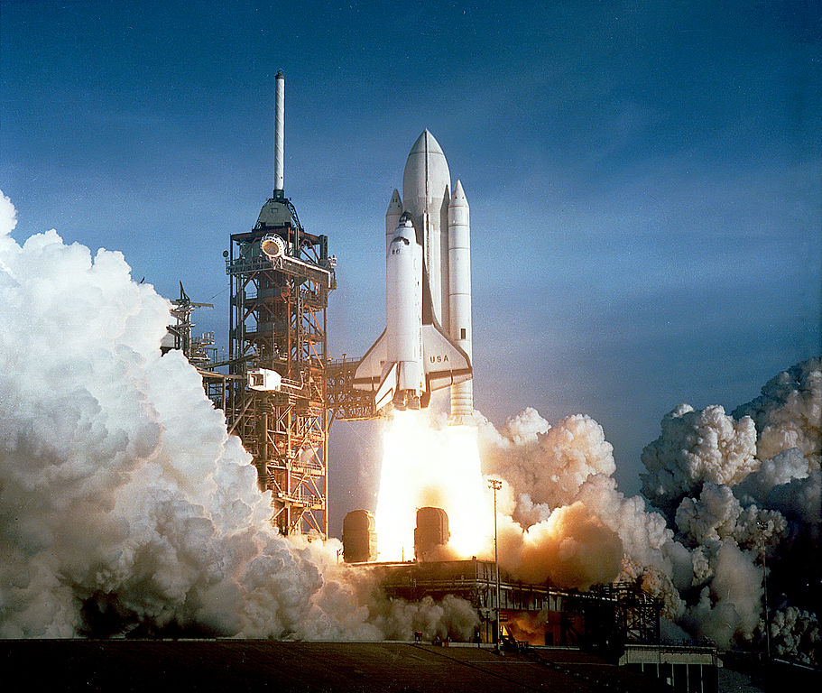{height=520px}

Lancio dello Shuttle Columbia, 12 Aprile 1981

# L'incidente (1 Febbraio 2003)

-    82 s dopo il lancio (16 Gennaio) si staccò schiuma isolante;
-    Il pezzo fece un buco nell'ala sinistra;
-    In fase di rientro l'elevato calore penetrò nel buco distruggendo l'ala.

{height=420px}

---

1 Febbraio 2003

---

{height=620px}

# Dettagli sul fatto

-    In 4 lanci precedenti si era verificato il distacco di schiuma isolante, ma in nessun caso c'erano state conseguenze;
-    Durante la missione, l'equipaggio era stato avvisato del distacco, ma senza presentarlo come un problema significativo (nessuno lo pensava).

---

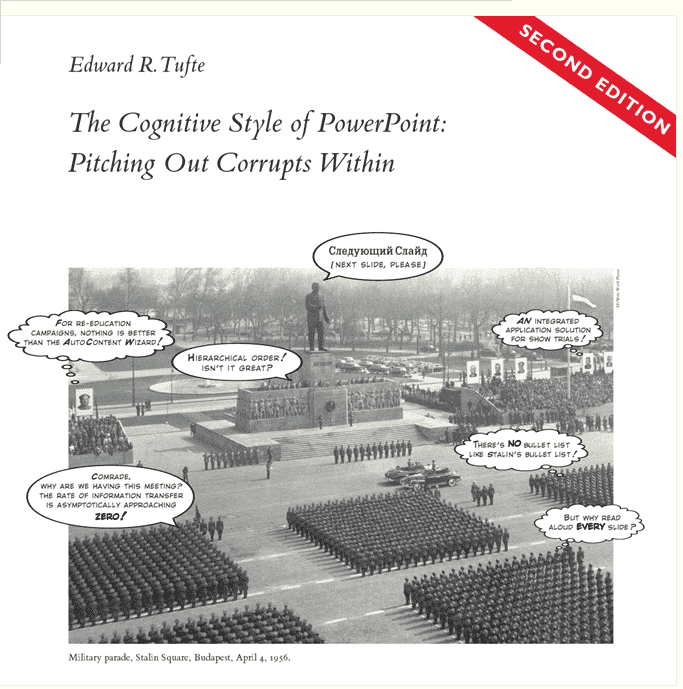{height=680px}

---

{height=680px}

---

{height=680px}

---

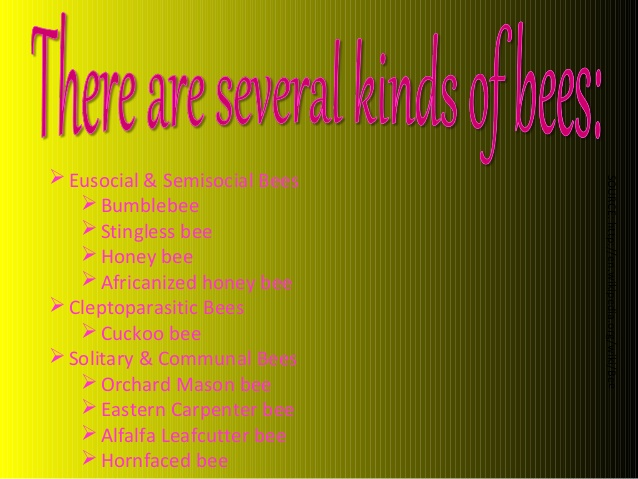{height=680px}

---

{height=680px}

---

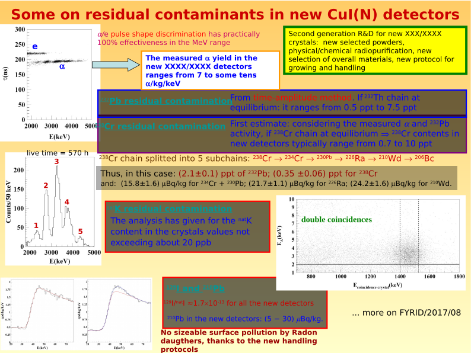{height=680px}

