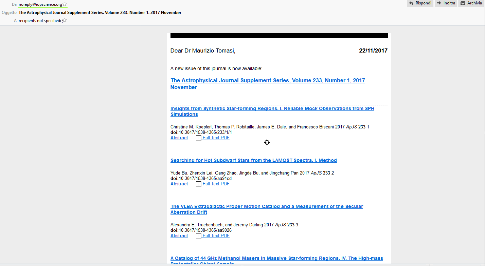
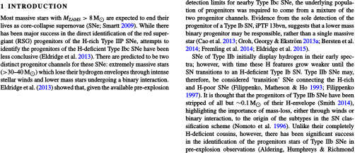
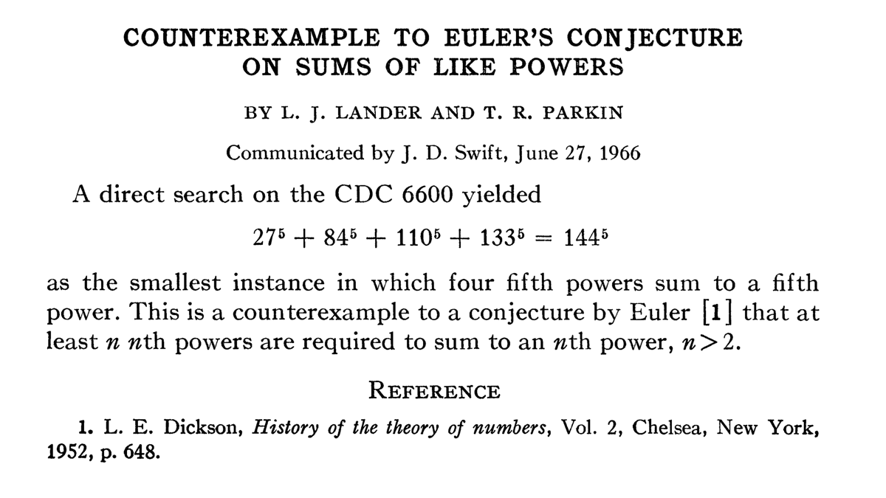
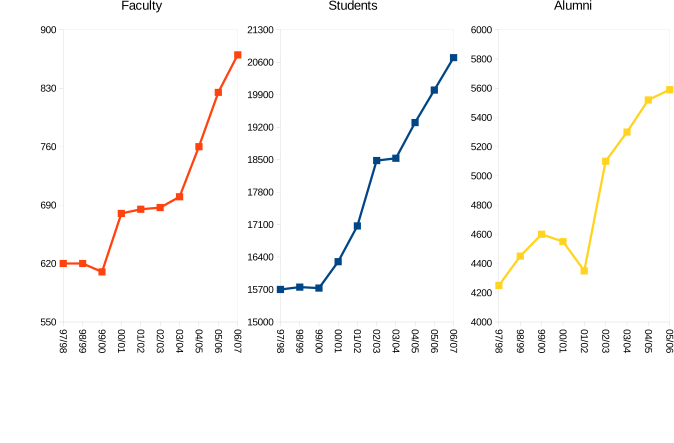
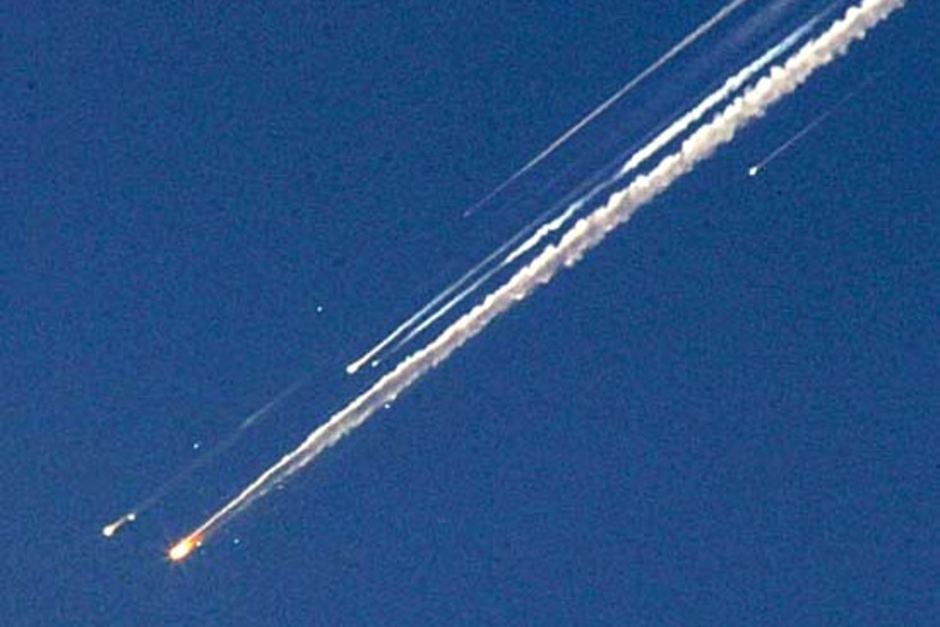
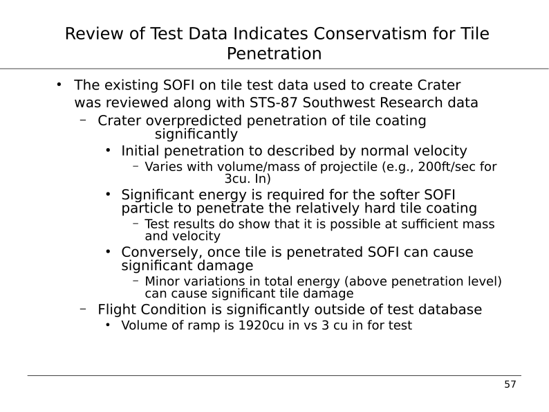
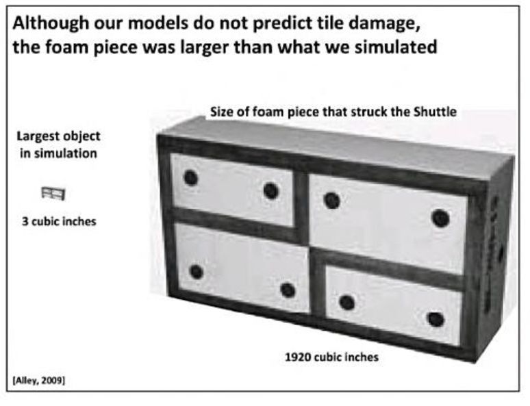
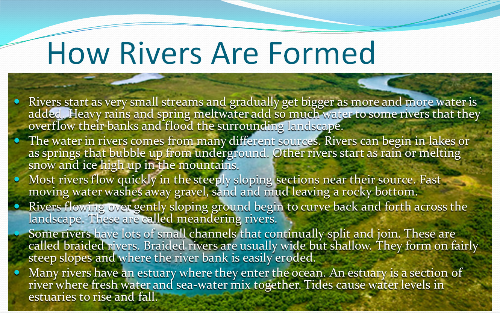

# Articoli scientifici

# Cos'è un articolo?

#.   Descrizione di un risultato scientifico, innovativo e solido.
#.   Solitamente pubblicato su riviste *peer reviewed*, su *proceedings* (accompagnando una presentazione) o in monografie.
#.   Da due pagine fino a qualche decina (rari sopra le 100 pagine).

---

{height=520px}

# Esempi di riviste astronomiche

-   [Astronomy & Astrophysics](https://www.aanda.org/) (“AA”, europea)
-   [Monthly Notices of the Royal Astronomical Society](https://academic.oup.com/mnras) (“MNRAS”, inglese)
-   [The Astrophysical Journal](https://iopscience.iop.org/journal/0004-637X) (“ApJ”, statunitense)

---

# Quando scrivere un articolo?

-   Vedi l'articolo [What makes a good research proposal?](https://tratt.net/laurie/blog/2022/what_makes_a_good_research_proposal.html), è applicabile anche qui.

---

{width=30%}

-   La parola finale è **quella dell'editor**, che può decidere di ignorare alcune review.
-   Il processo può prendere anche più di un anno, a meno che non sia una rivista di *Letters* (esempio: [The Astrophysical Journal Letters](https://iopscience.iop.org/journal/2041-8205)).
-   Interessante discussione: <https://news.ycombinator.com/item?id=38462269>

---

<video width="640" height="480" controls>
  <source src="Peter Ueda - Assistant professor vs Editor.mp4" type="video/mp4">
Your browser does not support the video tag.
</video>

# Preprint

# Mailing list

# Le parti più importanti

-   Nessuno inizia a leggere il testo di un articolo senza prima aver almeno dato un'occhiata a:

    #.   Titolo;
    #.   Abstract;
    #.   Grafici e tabelle;
    #.   Introduzione e conclusioni.

-   Sono quindi le parti da curare maggiormente! (Alcuni consigliano anzi di iniziare a preparare queste)

# Titolo, autori e abstract

---

{width=960px}

# Scelta del titolo

-   Il titolo deve chiarire nel migliore modo possibile l'argomento del lavoro

-   È possibile scegliere un titolo simpatico che «catturi» l'attenzione:

    #. [*Life in the fast lane: a direct view of the dynamics, formation, and evolution of the Milky Way's bar*](https://academic.oup.com/mnras/article/490/4/4740/5587738) (MNRAS, 2019)

    #. [*When a Period Is Not a Full Stop: Light Curve Structure Reveals Fundamental Parameters of Cepheid and RR Lyrae Stars*](https://academic.oup.com/mnras/article-abstract/491/4/4752/5645255) (MNRAS, 2020)

    Notate però che in entrambi i casi si precisi di cosa si parla!

# Titolo troppo astratto!

{width=45%}

Dall'abstract si capisce che si sta proponendo una nuova convenzione per calcolare le correzioni bolometriche… &#129300;

# Ottimo titolo

{width=820px}

Il titolo contiene già le conclusioni del lavoro: non si può ancora essere confidenti che alcuni tipi di stelle di sequenza principale (con $M \approx 0.6\,M_\odot$) ospitino pianeti dove il rapporto tra silicati e acqua sia 1:1.

# Lista degli autori

-   È sempre più vero che in astronomia si lavora in grandi collaborazioni.

-   Quando pubblicate, includete nella lista degli autori tutte quelle persone che:

    #.   Hanno fornito un contributo, ma solo se questo consiste in qualcosa di **originale**, **creativo**, e scientificamente valido;
    #.   Vi hanno dato il loro consenso esplicito.

# Persone oltre agli autori

-   Includete negli *acknowledgements* («ringraziamenti») tutti gli altri: chi vi ha corretto l'inglese, chi vi ha sistemato una figura, l'officina che vi ha costruito un pezzo…

-   In questa lista ricadono anche eventuali enti finanziatori (importante citarli, se vi dimenticate di farlo potrebbero togliervi il finanziamento o non rinnovarvelo!)

-   Se i referee hanno dato un aiuto significativo nel migliorare l'articolo, ringraziate anche loro (*We thank the anonymous reviewer for their insightful comments…*)

# Abstract

-   L'*abstract* deve essere un riassunto dell'articolo

-   Mettetevi il cuore in pace: una buona fetta dei vostri lettori si limiterà a leggere **solo** l'abstract del vostro lavoro…

-   È importante inserire queste informazioni:

    #.   Cosa avete fatto;
    #.   Se non è ovvio, spiegate perché è importante;
    #.   Come l'avete fatto;
    #.   Quali sono i vostri risultati.

# Abstract troppo astratto!

> In questo lavoro vengono presentati le interessanti proprietà di una particolare classe di operatori sugli spazi di Hilbert. La loro invarianza rispetto a certe trasformazioni mostra l'esistenza di interessanti proprietà simmetriche. Vengono anche mostrate interessanti applicazioni in alcuni domini della fisica.

(Van Leunen, *A handbook for scholars*)

# Esempio da seguire

{width=960px}

# Testo dell'articolo

# Esempio di introduzione

{height=580px}

  
# Esempio da seguire

# Bibliografia

-    Fondamentale!
-    Se usate LaTeX, potete gestire la bibliografia con BibTeX.
-    Per ogni lavoro che fate (o tesi!) tenete una lista di articoli letti, ed aggiornatela costantemente.

# Gestione delle bibliografie

-    [CiteULike](http://www.citeulike.org);
-    [Connotea](http://www.connotea.org);
-    [Bibsonomy](http://www.bibsonomy.org);
-    [Mendeley](https://www.mendeley.com/) (se proprio dovete…);
-    [JabRef](http://jabref.sourceforge.net/) (quello che uso di solito io);
-    [Zotero](https://www.zotero.org/);
-    [Papers](https://www.papersapp.com/) (Windows, Mac).

# Scrittura del testo

-   È la parte che (quasi) tutti temono di più!

-   Assicuratevi di avere un piano chiaro del testo, prima di mettervi a scrivere una frase dopo l'altra. Alcune opzioni per iniziare:

    -   Scrivete la lista delle sezioni;
    -   Decidete innanzitutto quali grafici e tabelle includere

-   Potete usare LLMs come ChatGPT o Microsoft Bing per suggerirvi la struttura; vedete ad esempio [https://twitter.com/MushtaqBilalPhD/status/1621379333943083009](https://twitter.com/MushtaqBilalPhD/status/1621379333943083009). Attenzione: i LLMs producono contenuti spesso sbagliati, è solo la **struttura** del testo che è utile!

# Scrittura del testo

Se temete il blocco dello scrittore, potete provare a produrre un *vomit draft*:

1. Scrivete di getto tutto il testo che avete in mente, senza curarvi dei dettagli, della forma e neanche dell'accuratezza dei contenuti;
2. Non è consentito tornare indietro a correggere gli errori (neppure di battitura!);
3. Inventate pure numeri là dove sentite che un numero ci starebbe bene;
4. Una volta buttato giù questo testo, mettetevi a sistemarlo.

---

Citazione da [John Swartzwelder](https://www.newyorker.com/culture/the-new-yorker-interview/john-swartzwelder-sage-of-the-simpsons), sceneggiatore dei *Simpsons*:

<blockquote>

Since writing is very hard and rewriting is comparatively easy and rather fun, I always write my scripts all the way through as fast as I can, the first day, if possible, putting in crap jokes and pattern dialogue—“Homer, I don’t want you to do that.” “Then I won’t do it.” Then the next day, when I get up, the script’s been written. It’s lousy, but it’s a script. The hard part is done. It’s like a crappy little elf has snuck into my office and badly done all my work for me, and then left with a tip of his crappy hat. All I have to do from that point on is fix it. So I’ve taken a very hard job, writing, and turned it into an easy one, rewriting, overnight. I advise all writers to do their scripts and other writing this way. And be sure to send me a small royalty every time you do it.

</blockquote>

L'idea è efficace perché consente di superare il «blocco della pagina bianca»: è più facile correggere un testo che scriverne uno da zero!

# Il testo

-   Evitare errori di sintassi («un pò», «invecie», «perchè», «daccordo»…);

-   Se scrivete in inglese, attenzione agli «italicismi» («we propose in this paper a method…»).

{height=280px}

# Grafici da non imitare!

{height=680px}

# Grafici da non imitare!

Il grafico precedente ha più problemi:

#.   Gli assi Y non sono omogenei: il grafico degli *alumni* (laureati) mostra le differenze con l'anno precedente!
#.   L'asse delle X non è omogeneo!

# Grafici da non imitare!

{height=680px}

# Grafici da non imitare!

Il grafico precedente ha almeno tre problemi:

#.   L'uso del 3D è gratuito e fuorviante (il dato sulle automobili del 1998 supera la tacca del 10 oppure no?);
#.   Il dato del 1999 è limitato al primo semestre!

# Grafici da non imitare!

{height=620px}

# Grafici

[http://nautil.us/issue/19/illusions/five-ways-to-lie-with-charts](http://nautil.us/issue/19/illusions/five-ways-to-lie-with-charts)

# Strumenti per creare grafici

#.   [GNUplot](http://www.gnuplot.info/) (programma per creare grafici; fate riferimento al libro di Janert, [GNUplot in action](https://www.manning.com/books/gnuplot-in-action-second-edition));
#.   [GNU R](http://www.r-project.org/) (linguaggio di programmazione con ottime capacità di creare grafici: vedi [The R Graph Gallery](https://r-graph-gallery.com/));
#.   [Python+Matplotlib](http://matplotlib.org/) (meglio però usare librerie più sofisticate di Matplotlib, come [Seaborn](https://seaborn.pydata.org/));
#.   [Mathematica](http://www.wolfram.com/mathematica/) (linguaggio di programmazione, a pagamento);
#.   [Inkscape](http://inkscape.org/) (diagrammi e grafica vettoriale);
#.   [Asymptote](http://asymptote.sourceforge.net/) (linguaggio di programmazione per la grafica);
#.   Microsoft Excel, LibreOffice Calc… (yuk!).

# Uso dei colori

-    L'uso dei colori permette di rendere più chiaro un grafico.
-    I colori vanno però scelti oculatamente!
-    Attenzione alle persone con disturbi nella percezione del colore (es., daltonici)

---

---

# Generazione di schemi di colori

-    Colourlovers: [https://www.colourlovers.com/](https://www.colourlovers.com/)
-    Colormind (online): [http://colormind.io/](http://colormind.io/)
-    Gpick (solo Linux): [https://www.gpick.org/](https://www.gpick.org/)
-    Mappe di colore in Julia: [https://github.com/peterkovesi/PerceptualColourMaps.jl](https://github.com/peterkovesi/PerceptualColourMaps.jl)

---

{height=680px}

# Mappe di colore percettive

{height=420px}

  
Slides: [https://peterkovesi.com/papers/ColourMapsForColourBlindIAMG2017.pdf](https://peterkovesi.com/papers/ColourMapsForColourBlindIAMG2017.pdf), vedi anche [*Good colour maps: How to design them*](https://arxiv.org/abs/1509.03700)

# Tesi di laurea e dottorato

# Cose da **non** fare

-    Iniziare subito a scrivere il testo suddiviso in capitoli;
-    Usare parole inutili: «essenzialmente», «prettamente», «sostanzialmente»…
-    Essere vaghi (evitare «grande», «piccolo», «trascurabile» senza quantificare);
-    Usare troppa enfasi letteraria;
-    Mentire/nascondere dati.

# Esempio (accaduto realmente!)

::: incremental

-   «In questa tesi ho svolto un'analisi di tipo prettamente statistico…»

-   «Perché dici “prettamente”?»

-   «In questa tesi ho svolto un'analisi di tipo statistico…»

-   «Perché dici “di tipo”?»

-   «In questa tesi ho svolto un'analisi statistica…»

:::

# Uso del passivo e dell'impersonale

-    Si possono usare, ma solo se necessario;
-    Impediscono di capire chi abbia fatto cosa;
-    «È stata calcolata la mediana» → «Ho calcolato…»;
-    «Si è considerata qui solo la prima serie di dati» → «Ho considerato…».

# Esempio

> I procured a triangular glass prism, to try therewith the celebrated phenomena of colours. And for that purpose, having darkened my laboratory, and made a small hole in my window shade, to let in a convenient quantity of the sun's light, I placed my prism at the entrance, that the light might be thereby refracted to the opposite wall…

Newton, «Optiks» (1672)

---

Si simula ora il rumore bianco generando un vettore di 100000 elementi casuali distribuiti normalmente aventi media nulla e deviazione standard che descresce all’aumentare del conteggio. La deviazione risulta essere 100 000 nel primo elemento del vettore e 1 nell'ultimo elemento. Si applica il procedimento adottato nel paragrafo X.Y sottraendo un elemento del vettore con il successivo.

Ho creato un vettore $\{x_i\}_{i=1}^N$, con $N=10^5$, in cui ciascun elemento $x_i$ è un numero pseudo-casuale distribuito normalmente. La media è sempre nulla ($\left<x_i\right> = 0\ \forall i$), mentre la deviazione standard risulta essere \[\sigma^2(x_i) = 10^5/i.\]

---

> Questa lettera è più lunga delle altre perché non ho avuto agio di farla più breve.

Blaise Pascal, *Les Provinciales*, XVI

# Presentazioni

# Quando preparare una presentazione

-    Discussione di una tesi;
-    Seminario (anche interno al proprio gruppo);
-    Partecipazione a una conferenza.

# Disclaimer

-  Quanto si dirà ora **non vale** per le slide usate in un corso (come quelle che state guardando in questo momento).

-  Le slide dei corsi sono fatte per essere lette e rilette più volte dagli studenti, e magari anche stampate. Qui si parla invece di slide a supporto di un talk, che di solito non vengono distribuite.

# Come preparare una presentazione

-    Capire il tipo di uditorio;
-    Stabilire il messaggio;
-    Creare le slide;
-    Provare a voce alta fino all'esaurimento.

# Alcuni consigli

-    Evitare di mettere troppi elementi in una sola slide;
-    Testo sintetico!
-    Usare i grafici…;
-    … ma solo se significativi;
-    Tabelle: quasi mai una buona idea, meglio un grafico.

# Alcuni consigli

-    Provare molte volte ad alta voce (non ripetendo a mente!);
-    Provare con un uditorio di fronte, anche non specialistico (fidanzati/e, nonni, zie, animali da compagnia…);
-    Parlare con voce abbastanza forte, non bisbigliando né andando troppo in fretta (facile quando si è agitati!);
-    Guardare negli occhi l'uditorio;
-    Fare pause di respiro;
-    Non leggere il testo delle slide (mettere testo sintetico aiuta molto!).

# Slide del titolo

-   Molti studenti la “usano” per leggere asetticamente il titolo e poi passare subito alla slide successiva
-   Può però essere un ottimo strumento per introdurre già l'argomento
-   Attenzione alla differenza tra “professore” e “dottore” nei titoli dei vostri relatori! Nel dubbio, chiedete loro qual è la forma corretta.

---

{width=880px}

---

{width=880px}

---

{width=880px}

---

# Una pessima presentazione: il disastro del Columbia

---

{height=520px}

Lancio dello Shuttle Columbia, 12 Aprile 1981

# L'incidente (1 Febbraio 2003)

-    82 s dopo il lancio (16 Gennaio) si staccò schiuma isolante;
-    Il pezzo fece un buco nell'ala sinistra;
-    In fase di rientro l'elevato calore penetrò nel buco distruggendo l'ala.

{height=420px}

---

1 Febbraio 2003

---

{height=620px}

# Dettagli sul fatto

-    In 4 lanci precedenti si era verificato il distacco di schiuma isolante, ma in nessun caso c'erano state conseguenze;
-    Durante la missione, l'equipaggio era stato avvisato del distacco, ma senza presentarlo come un problema significativo (nessuno lo pensava).

---

{height=680px}

---

{height=680px}

---

{height=680px}

---

{height=680px}

---

{height=680px}

---

{height=680px}

---
title: Come preparare un testo scientifico
author: Maurizio Tomasi ([maurizio.tomasi@unimi.it](mailto:maurizio.tomasi@unimi.it))
date: "19 Aprile 2024"
css:
- ./css/custom.css
...
